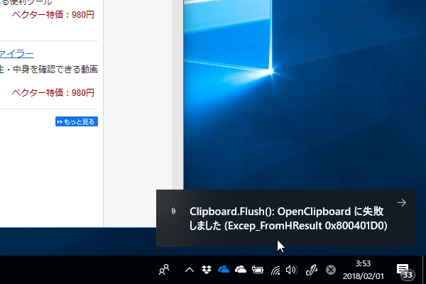

昨日は午後6時あたりで気絶して、翌1時ぐらいまでぐっすり寝た。最近は3時間ぐらいの浅い眠りで、細切れに目が覚めてしまい、人々が活動する時間に眠くなってしまうのが辛かったのだけど、昨晩は久しぶりに気持ちよく寝られた。寝転んで、意識が落ちて、目を開けたら、いつのまにか7時間経っていた。

丸一日、なにも食べてなかったので、腹が減る。冷凍しておいたご飯を温めて、レトルトのカレーに少し手を加えてぶっかける。電子レンジが回ってるあいだに、冷蔵庫の残り物で手早くサラダを作り、お湯を沸かして簡単なスープを作る。自分だけのためだと適当に済ませがちだけど、できるだけ五味を整え、温かいものを増やすようにしてる。冷蔵庫が空になったので、さすがに今日は買い出しに行かなければならない。

世間では月食が話題だったみたいだけど、自分の間では眠れたのが話題だった。少し仕事をして、昼に軽く午睡をとれば、生活サイクルを戻せるかもしれない。

<h3>いなばのタイカレーセット買ったった</h3>

今月後半はマンガにちょっと使っただけでほとんど支出がなかったので、ご褒美というか、買い物欲発散のためにちょっといいモノを買ってしまった。

<a href="http://www.amazon.co.jp/exec/obidos/ASIN/B0719RSW7H/bestylesnet-22/">いなば タイシリーズ5種アソート(チキンとタイカレーグリーン2個/チキンとタイカレーイエロー2個/チキンとタイカレーレッド3個/ガパオチキンバジル2個/バターチキンカレー3個)</a>
<ul><li>出版社/メーカー: いなば食品</li><li>メディア: 食品&飲料</li><li><a href="http://d.hatena.ne.jp/asin/B0719RSW7H/bestylesnet-22" target="_blank">この商品を含むブログを見る</a></li></ul>

いなばのタイカレーセット……尊い。

 

<ul>
<li>チキンとタイカレーグリーン2個</li>
<li>チキンとタイカレーイエロー2個</li>
<li>チキンとタイカレーレッド3個</li>
<li>ガパオチキンバジル2個</li>
<li>バターチキンカレー3個</li>
</ul>
の合計10個で、お会計は 1,620円。1個135円か……スーパーだとおいくらなのかは知らんが、普通に安いと思う。割と好きなので、たまに思い出しては買っていたのだけど、一度にこんなに買うことはなかった。ずらっと並んださまは壮観だ。父ちゃんが出張から帰ってきたら一緒に食べ比べしてやろうと思う。

<h3>クリップボードエラー</h3>

「Microsoft Edge」には「Create Link」に相当する拡張機能がたぶんないので、日ごろは愚作「Clipper」を使っている。

<iframe src="https://hatenablog-parts.com/embed?url=https%3A%2F%2Fwww.microsoft.com%2Fja-jp%2Fstore%2Fp%2Fclipper%2F9wzdncrdf8kz" title="Clipper を入手 - Microsoft ストア ja-JP" class="embed-card embed-webcard" scrolling="no" frameborder="0" style="display: block; width: 100%; height: 155px; max-width: 500px; margin: 10px 0px;"></iframe><cite class="hatena-citation"><a href="https://www.microsoft.com/ja-jp/store/p/clipper/9wzdncrdf8kz">www.microsoft.com</a></cite>

ところが、最近クリップボードのエラーをよく見かけるようになった。

実は v2 ではこれのせいでクリップボードへコピーされない（エラーも表示されない）という症状があり、v3 でいろいろ改善を試みたつもりだったが、頻度は確かに減ったけど、完全に解消されたわけではないみたい。

んで、当該部分のコードを見てみたんだけど……

<pre class="code lang-cs" data-lang="cs" data-unlink>private void CopyToClipboardAndClose()
{
var package = new DataPackage();
package.RequestedOperation = DataPackageOperation.Copy;
package.SetText(Preview);

void Notify(string message)
{
var template = ToastNotificationManager.GetTemplateContent(ToastTemplateType.ToastText01);
template.GetElementsByTagName(&quot;text&quot;).First().AppendChild(template.CreateTextNode(message));
ToastNotification toast = new ToastNotification(template);
ToastNotificationManager.CreateToastNotifier().Show(toast);
};

try
{
Clipboard.SetContent(package);
}
catch (Exception e)
{
Notify($&quot;Clipboard.SetContent(): {e.Message}&quot;);
}

try
{
Clipboard.Flush();
}
catch (Exception e)
{
Notify($&quot;Clipboard.Flush(): {e.Message}&quot;);
}

Close();
}
</pre>
よくわからんローカル関数もあるし、try 句が2個あるのもちょっとわからんし（どこでエラーが起こったのか知りたかったのかもしれない）、なんかいろいろだめだな。当時の俺、なぜこれでいいと思った／(^o^)＼

とにかく、プルダウンメニューで書式を選択するユーザーインターフェイスもステップ数が増えていまいちだと思っていたので、時間を見つけていろいろ修正して、マイナーバージョンアップを出そうと思う。ついでに塩漬けのストアアプリも完成させてしまいたい。

