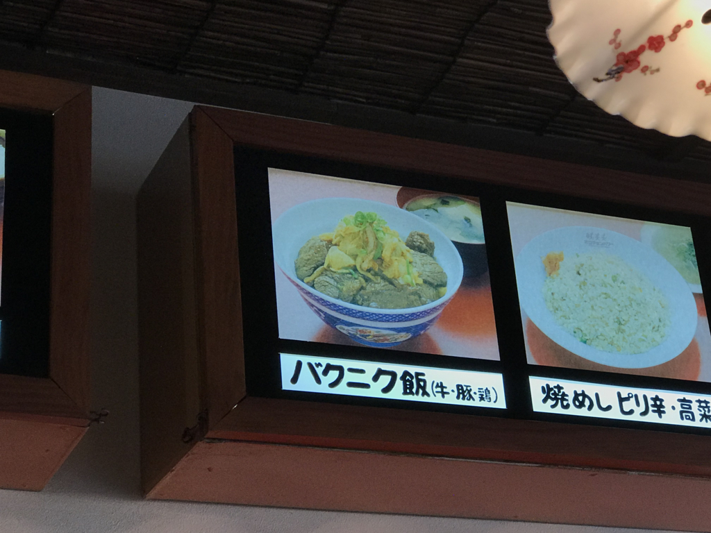
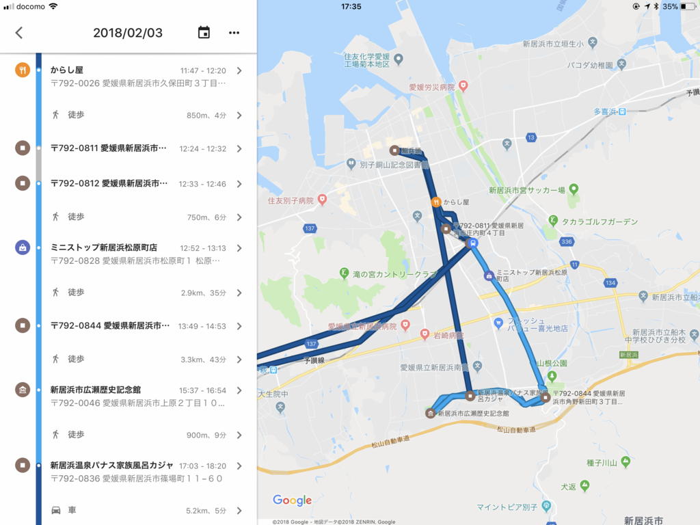
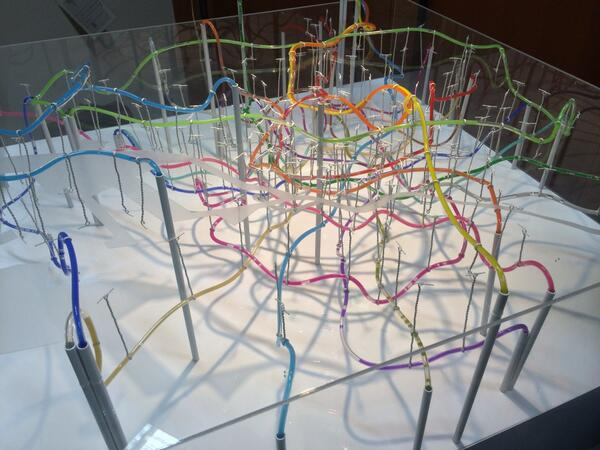
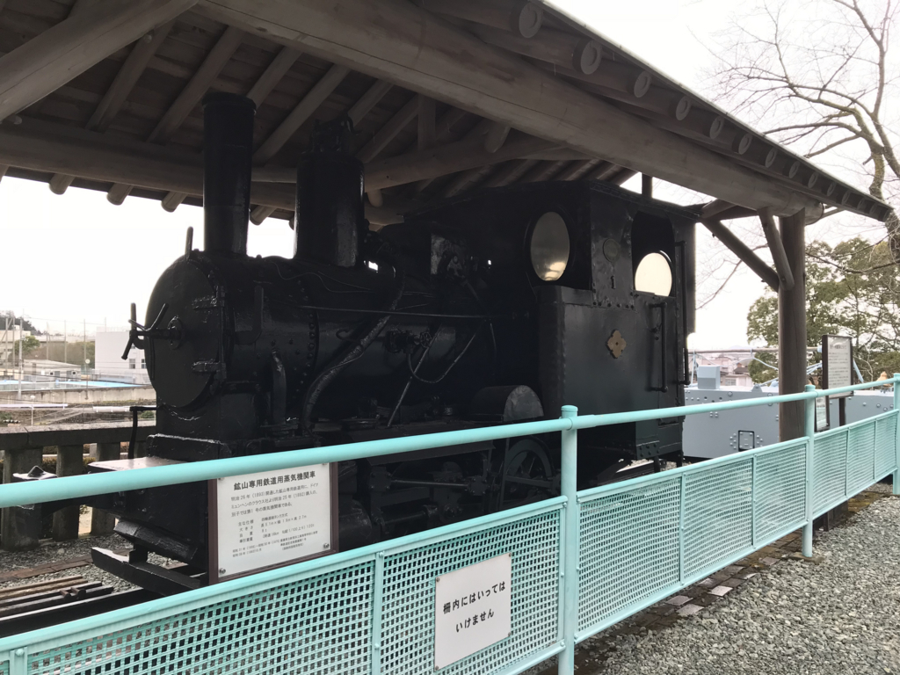
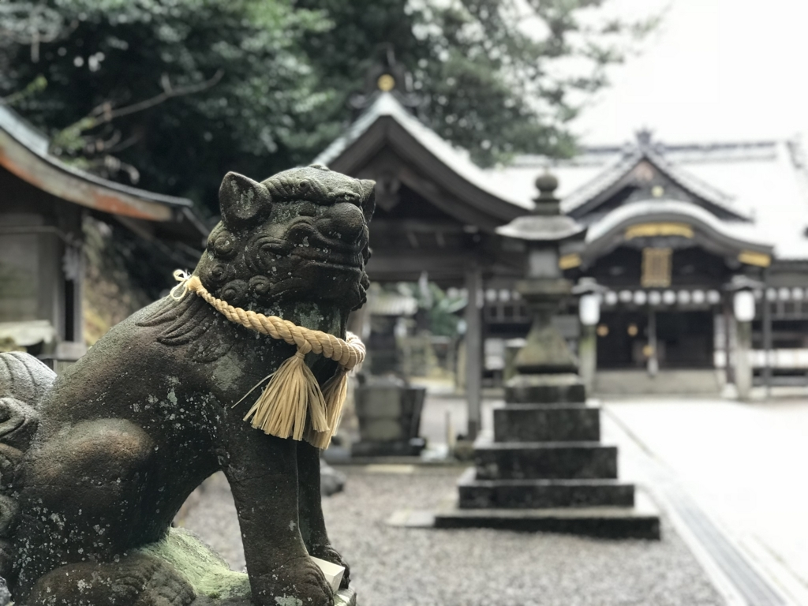
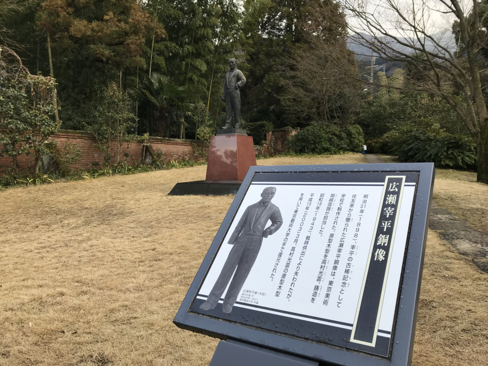
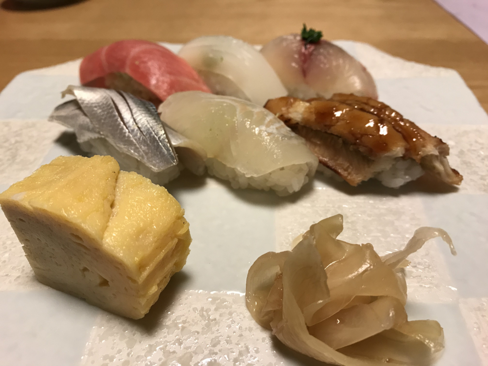

土曜日は新居浜に行ってきました。

<h3>JR 新居浜駅</h3>

新居浜市は東予地方（愛媛県東部）最大の町で、人口は12万人ぐらい（松山、今治に次いで愛媛大３位）。江戸時代に開かれた別子銅山で栄え、長く「住友の心臓」として同財閥と日本の近代化を支えました。今はもう別子銅山は稼働していませんが、今でもその流れを汲んだ非鉄金属工業が産業の屋台骨になっています。あと、毎年10月に行われる新居浜太鼓祭りは四国三大祭りとしても有名（自分はニュースでしか見たことないけど）。

松山からは特急しおかぜ・いしづちで１時間半程度で、昼前に着きました。駅がキレい……松山駅がかわいそうになるぐらい（ぇ

<h3>からし屋</h3>

けど、駅前は割と何もなくて、新しい家々が立ち並ぶ住宅街といった趣。旧国鉄の駅は汽車の煤煙を避けるため郊外に作られることが少なくありません。きっと、新居浜も JR の駅から離れたところが中心地なんだろうな。

とくにアテもなく、ご飯屋さんを探し彷徨っていると、新居浜警察署の方に出ました。この辺りには飲み屋さんや食べ物屋さんが結構ある感じ。同行の R さんと相談して、ちょっと面白そうな「からし屋」というお店に入ってみました。

ここの名物は、オロチョンラーメンというモツともやしとニラのラーメンでした。カラダがあったまる……。定食のメニューも充実しているみたいで、新居浜に住んでいあたら通ったかもしれません。

とくにこの「バクニク飯」っていうのが超気になる。今度はこれ食べてみよ。

<h3>山根公園・別子銅山記念館</h3>

ご飯を食べて元気になったので、Google マップで「別子銅山記念館」を検索。2時間に一本のバスを逃したみたいなので、てけてけと歩いていきました。知らない街を歩くのはちょっと楽しい――けど、まさか1時間以上歩く羽目になるとは思わなんだ。雨がパラパラと降ってきたので、途中のコンビニで傘とコーヒーを買って休憩したりしながらのんびり行ったのですが……疲れた。

別子銅山記念館は、山根公園という広い公園の一角にあります。「山根」という地名の通り、ここはちょうど「山の付け根」。ここから急に地形が険しくなっていきます。ここから先は鉱山の世界。

あとで知ったのですが、別子銅山が盛んな頃は、ここ、山根公園に山のみんなが集まって運動会をしたりしていたみたい。ただのグラウンドじゃないんだな。

別子銅山記念館の入場料はタダですが、写真撮影は禁止です（残念！　個人的には、坑道全体の立体模型が印象的でした。

最近、東京の地下鉄網を色付きのチューブで立体再現した地図が話題になりましたが、ちょうどそれのスゴい版みたいな。別子銅山の坑道は全長700キロメートル。最深部は海抜マイナス1,000メートルにおよび、「日本で人間が到達した一番深いところ」なのだそうです。地熱で気温・湿度も半端ない。

外には山の神・オオヤマヅミを祭った神社と、鉱山鉄道をけん引した汽車が展示されています。

<h3>内宮神社</h3>

そのあとは、川を渡って内宮神社に参拝。長い階段がおじさんには厳しい……。

階段のわきには「マイナンバーお守り」やら「スマホ封じ」やらのノボリがたっていてちょっと不安だったのですが、なかはいい感じの神社でした。建物が立派なのはもちろん、掃除も行き届いていて、氏子の愛を感じる。

そのまま西の方へ歩いて住宅街へ降る途中、どうやら鉄道のあとのような空き地も見かけました。

<h3>重要文化財広瀬邸・広瀬歴史記念館</h3>

次の目的地は、Google マップでみかけた広瀬歴史記念館です。広瀬が人名なのか地名なのかも知らない、完全に予備知識ゼロの状態で行ったのですが、ここは新居浜に来たならぜひ訪れておくべき場所だなーと思いました。

ここには幕末から明治初期にかけて活躍した住友の偉い人・広瀬宰三さんの屋敷と、彼を記念した博物館があります。別子銅山記念館も結構勉強になりましたが、こっちは広瀬宰三にフォーカスしてより深く紹介した感じ。広瀬宰三の人柄を伝えるビデオコーナーや、鉱物に触れるコーナーもあって、より身近に別子銅山を感じることができます。

お屋敷も庭もしゅごい……こういう家に住んでみたいもんだ。

<h3>温泉</h3>

10km 近く和服＋草履で歩いたので、結構足がパンパンに。広瀬邸のそばに温泉があったのは好都合でした。手ぶらでも800円ちょっとで入れるのは大変リーズナブルだと思う。

<h3>鮨兵頭</h3>

晩御飯は、地元の K さんの案内で<b>回らないお寿司屋さん</b>に行きました。K 氏いわく、新居浜で一番よいとの由。

<iframe src="https://hatenablog-parts.com/embed?url=https%3A%2F%2Fr.gnavi.co.jp%2Fr7setkds0000%2F" title="ぐるなび - 鮨兵頭 （新居浜/寿司屋）" class="embed-card embed-webcard" scrolling="no" frameborder="0" style="display: block; width: 100%; height: 155px; max-width: 500px; margin: 10px 0px;"></iframe><cite class="hatena-citation"><a href="https://r.gnavi.co.jp/r7setkds0000/">r.gnavi.co.jp</a></cite>

お勧めするだけあって、ご飯もお酒も最高でした。

写真も撮らずに、ひたすらもくもく食べちゃいました。次回はカウンターに座って、おまかせで握ってほしいな……いくらかかるんだろ？ｗ

この日はかなり新居浜を堪能したつもりでしたが、マイントピアをはじめ、まだまだ見るべきところは残っているみたい。機会を見つけてまた行きたいなーと思いました。

