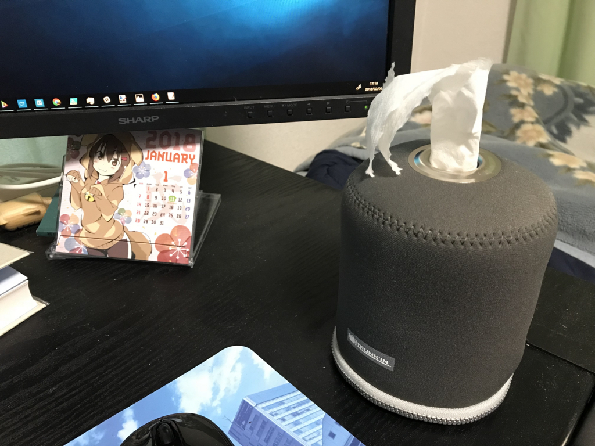
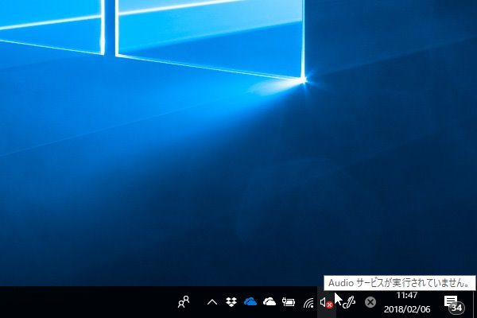
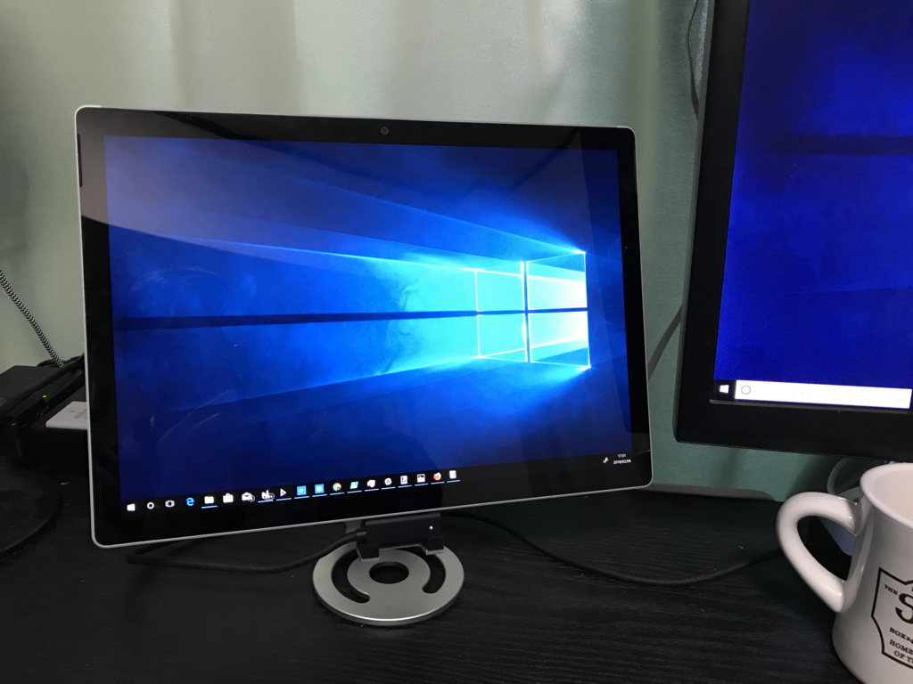

キャンプで使うかもしれないと思い、トイレットペーパーホルダーを発注。Amazon が1週間ぐらいかかるというのでのんびり構えていたのですが、なんと翌日に到着してびっくりした……

<a href="http://www.amazon.co.jp/exec/obidos/ASIN/B002DGT0H8/bestylesnet-22/">TRUNKIN ロールペーパーバック CARON GREY 61261</a>
<ul><li>出版社/メーカー: TRUNK'IN</li><li>メディア: ホーム&キッチン</li><li><a href="http://d.hatena.ne.jp/asin/B002DGT0H8/bestylesnet-22" target="_blank">この商品を含むブログを見る</a></li></ul>

ロゴスの方が安かったのだけど（プライム対象だから送料もかからないし）、評判がよかったのでちょっと高めのこっちをチョイス。仕事机の上に置いて今日一日使っていたのですが、なかなか便利かも。引っ張ったらシュルシュルとトイレットペーパーが出てくる。

レビューではトイレットペーパーの芯を抜いて装着しなきゃいけないのが面倒くさいという話でしたが、個人的にはあまり気にならなかったかも。思い切ってトイレットペーパーを潰し、芯を折りたたむようにして捩じり引けば、にゅるんと出てきました。まぁ、芯にくっついたペーパーが若干無駄になっちゃいましたけど、これぐらいのことはキニシナイ。

というわけで結構気に入ったのですが、キャンプで重宝するのはトイレットペーパーよりむしろキッチンペーパーかなと思うので、キッチンペーパータイプも買ってみようかと思う。

<h3>Surface Book 2 のトラブル</h3>

この前初期化した Surface Book 2 ですが、トラブルがやまない……。

 

<ul>
<li>ディスクリート GPU が認識されなくなる（スリープするタイミングで？　トップとベースを再接続したりすると直る）</li>
<li>エクスプローラーのコンテキストメニューが出なくなる（<s>内蔵 GPU のみだと発生しない？</s> 追記（2017/02/07）：発生した）</li>
<li>タスクトレイのオーディオアイコンにバツ印が出る（音は鳴る。アイコンをクリックして修復すれば治るが、再発する）</li>
</ul>
というわけで、日ごろはトップ（タブレット部分）だけで使っていたりします。ベースとの接続部分に Surface コネクターが刺さるんだな……知らなかった。

とりあえず、持ち運ぶ時と Civ 6 で遊ぶ時だけベースをつないで遊んでいるんですが、<b>こんな使い方で 33 万円払う価値あったか？</b> Surface Pro の一番高いモデルを買っておけばいい気もしてきたぜ……タブレット部分だけ使うなら Pro でも変わらんし、あいつならスタンドがなくても自立するしな。まぁ、<b>持ち運びのときはクラムシェルがいいな！</b>ってのはあまり譲りたくない部分なので、Pro は Pro でニーズを完全に満たしてくれるわけじゃないのだけど。

とりあえず、直ってくれればなんも問題ないわけで。今度の連休でもう一回クリーンアップして、ダメならサポートに相談してもらおうかな～とか思っています。父ちゃんに奪われた Surface Pro 3 を返してもらって、代替の仕事環境を構築しないと、今使ってる Book 2 を交換修理に出すこともできないから、それまではだましだまし使っていくつもり。

