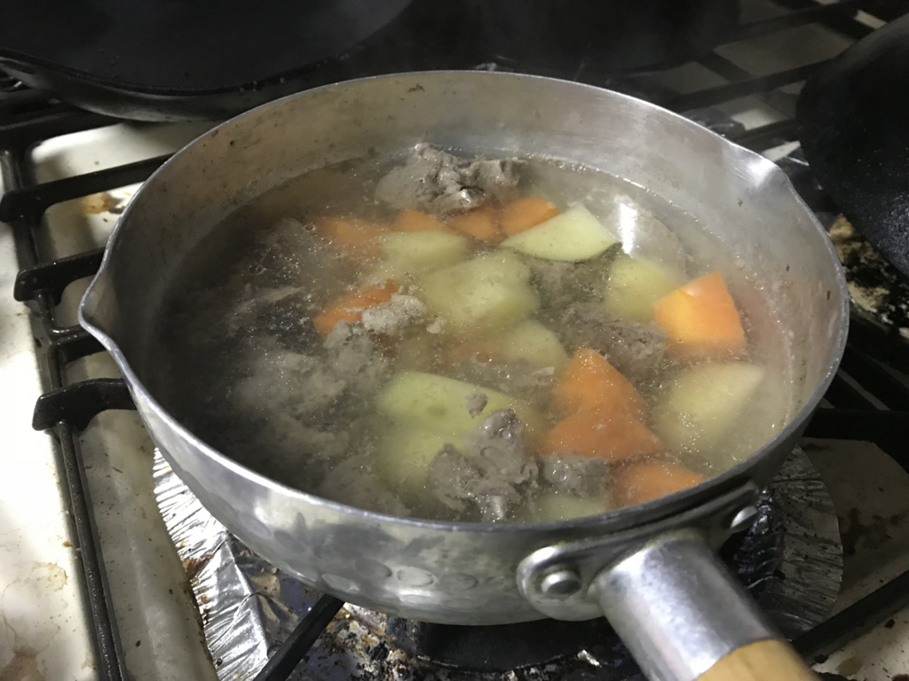
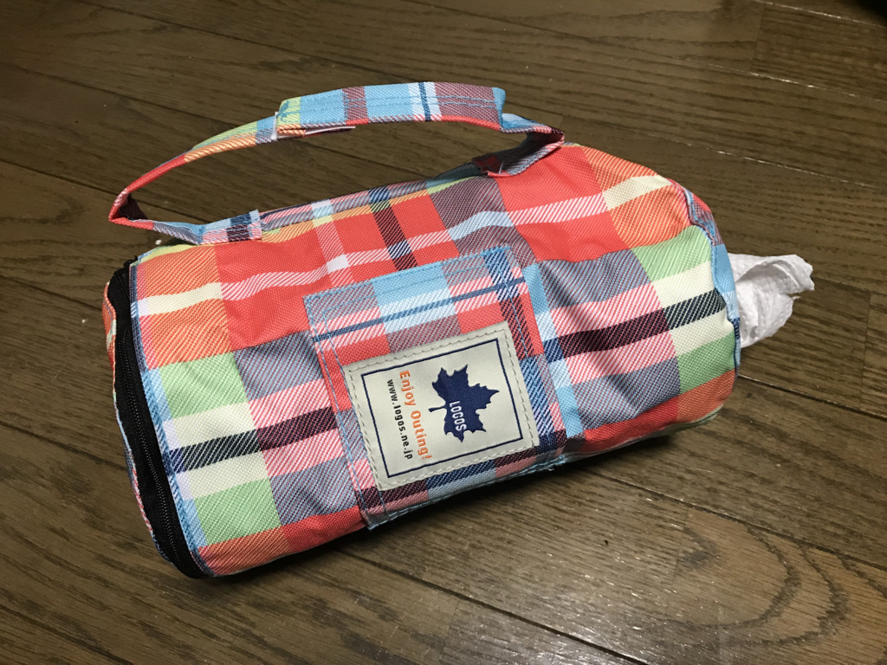

うちの冷凍庫の奥底には、真四角の肉の塊がある。マジで真四角で、何の肉かわからない。

ずっと気になってたんだが、今日は気が向いたので自然解凍してみた。どうやら牛スジ肉らしい。朝に出して、おやつ時にみてみると、赤い肉汁を流している。箸でつつくと、ほろほろと崩れて、見慣れたスジ肉に分裂した。

今は、とりあえず灰汁をとりながら煮込んでいる。こいつをどう料理しようか。牛スジの煮込みでもいいかなと思ったけど、暇にあかせてニンジンやらジャガイモやらを切って投入してしまったので、カレーかシチューになるんだろうな。まぁ、ブログを書きながら弱火で放っておくつもり。

今回の件で思いを新たにしたけど、<b>肉を冷凍するときは、ちゃんと1回分ずつ小分けしておくべきだ</b>。何度言ってもうちの親父はそれをしてくれなくて、ちょっとイラっとする。本人にしてみれば「肉を買って冷凍してやったから、出張中に食えや」って感じなんだろうけど、そもそも二人暮らしなのにこんなに肉買うなや。冷凍したからって永遠にもつわけじゃねえぞ。氷漬けになったマンモス肉は食えたらしいが、そんなチャレンジせんでええやろ。

とにかく、謎肉の正体が牛スジ肉だと分かったのは収穫だった。次にスーパー行くときは、スジ肉料理にあうものを買う。とりあえずコンニャクとか。

<h3>今日もキャンプ道具が増えた</h3>

昨日の配達に間に合わなかったキャンプ道具が、追加で到着。今日はクッキングペーパーホルダーを手に入れた。昨日あたりに紹介したトイレットペーパーホルダーのデカいバージョン。

<a href="http://www.amazon.co.jp/exec/obidos/ASIN/B01AL8SIXG/bestylesnet-22/">ロゴス クッキングツール チェッカー キッチンペーパーホルダー (レッド) 81285057</a>
<ul><li>出版社/メーカー: ロゴス(LOGOS)</li><li>メディア: スポーツ用品</li><li><a href="http://d.hatena.ne.jp/asin/B01AL8SIXG/bestylesnet-22" target="_blank">この商品を含むブログを見る</a></li></ul>

トイレットペーパーに比べると芯を抜くのがちょっと大変で難儀したけど、まぁ、言うほど大したことない感じ。少しぶかぶかだけど、内側からシュルシュルとクッキングペーパーが取り出せて、スゴく便利だと思う。これはキャンプで役立ちそうだ。

芯を抜くとき、接着されていたペーパーが一緒に飛び出してしまったけど、これは無理してホルダーにツッコまず、スパッと切って巻き直し、台所で使った。こういうのはあまり神経質にならず、「シカタナイ」の精神であきらめ、他の用途に転用することを考えた方が建設的だと思う。

