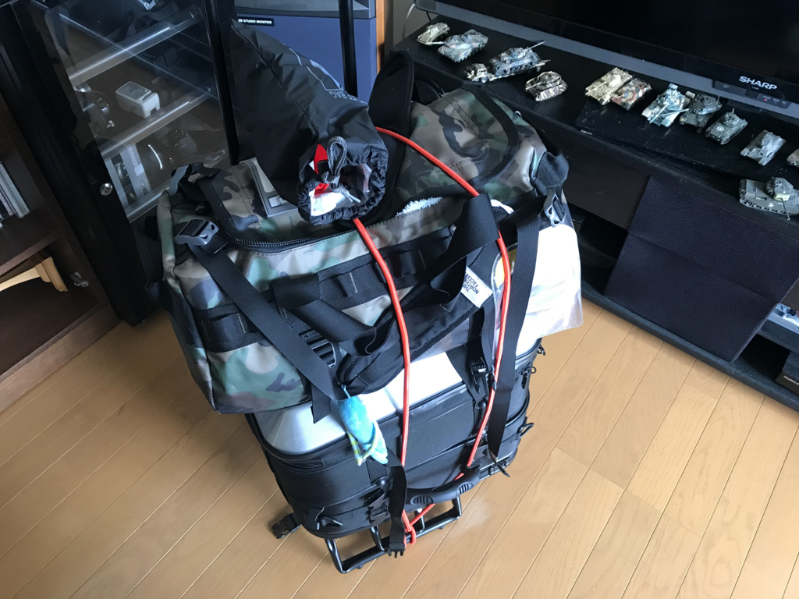
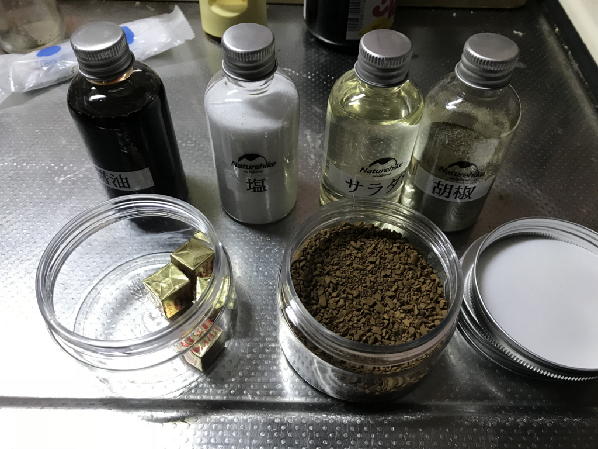
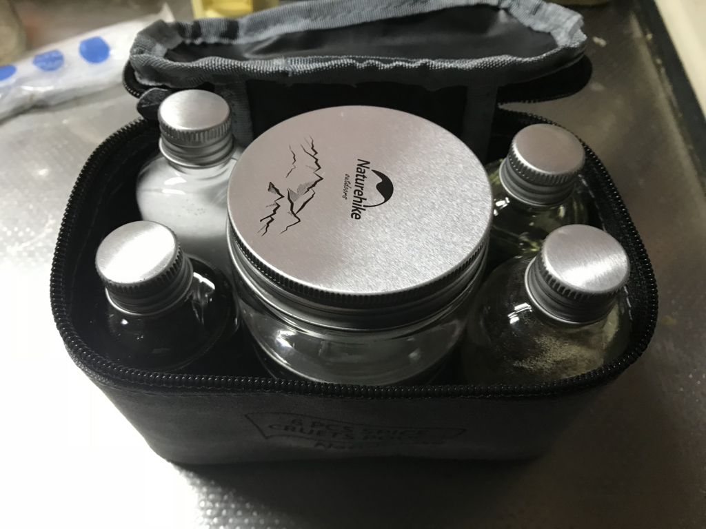

今日は Amazon からの荷物を受け取るために自宅待機。キャンプ道具を1階まで運ぶためのキャリア（ほかにも使いどころはあろうかと思う）やら、安いスタッフバッグ（モノ入れ）などを買った。

<a href="http://www.amazon.co.jp/exec/obidos/ASIN/B000OVJ1EG/bestylesnet-22/">キャンパーズコレクション パワーキャリーカート60 ブラック BMC-31KD(BK)</a>
<ul><li>出版社/メーカー: キャンパーズコレクション</li><li>発売日: 2012/04/05</li><li>メディア: スポーツ用品</li><li>購入: 8人 クリック: 61回</li><li><a href="http://d.hatena.ne.jp/asin/B000OVJ1EG/bestylesnet-22" target="_blank">この商品を含むブログを見る</a></li></ul>

キャリーカートは……剛性重視で選んでみたけど、ちょっとゴツすぎたかな？　重いかもしれない（重量：3.5kg）。でもパイプがしっかりしていて長持ちしそうだし、タイヤがゴツいので多少の不整地でもゴロゴロ引き回せそうで結構気に入った。

<a href="http://www.amazon.co.jp/exec/obidos/ASIN/B000AR5X0K/bestylesnet-22/">イスカ(ISUKA) スタッフバッグキット(4マイセット) 357000</a>
<ul><li>出版社/メーカー: イスカ(ISUKA)</li><li>発売日: 2011/09/14</li><li>メディア: スポーツ用品</li><li>購入: 2人 クリック: 18回</li><li><a href="http://d.hatena.ne.jp/asin/B000AR5X0K/bestylesnet-22" target="_blank">この商品を含むブログを見る</a></li></ul>

スタッフバッグは何かっていいのかわからなかったので、とりあえず安いやつにした。着替えを入れて、ナイフなどの小物を入れて……2枚余ったけど、まぁ、使いどころはほかにもあるじゃろ。防水のヤツとかもあるみたいだけど、何リットルのものが自分に合うのかわからなかったので、とりあえず経験を積みながら見極めていくことにする。

ついでに安い漏斗を買ったので、キャンプ用の調味料を詰めた。

<a href="http://www.amazon.co.jp/exec/obidos/ASIN/B073PQ7WMT/bestylesnet-22/">Naturehikeアウトドアクッキングギアオイルビネガーディスペンサーボトルセットバーベキュー設備ソースクレットセット6キャリングバーベキューのためのポータブルオイルボトルジャーのディスペンス</a>
<ul><li>出版社/メーカー: Naturehike</li><li>メディア: その他</li><li><a href="http://d.hatena.ne.jp/asin/B073PQ7WMT/bestylesnet-22" target="_blank">この商品を含むブログを見る</a></li></ul>

この前かったセットには、細長い瓶×4と大きめの背が低い瓶×2が入っていたので、

<ul>
<li>大きい瓶①：コーヒー</li>
<li>大きい瓶②：ブイヨン、角砂糖（家になかったので今度スーパーで買う）などなど</li>
<li>小さい瓶①：醤油</li>
<li>小さい瓶②：サラダ油</li>
<li>小さい瓶③：胡椒</li>
<li>小さい瓶④：塩</li>
</ul>
みたいな感じに詰めて、テプラで名前を付けた。

小さい瓶は、よくある卓上七味の瓶とほぼ同じサイズなので、状況によって入れ替えればいいかな。瓶はプラスチック製？かなにかで軽く、液体が漏れないような処理はとくになされてないから少し不安かもしれない。これもおいおい、いい感じの容器に入れ替えていけばいいかなと思う。

あとは台所を掃除。ガス台をちょっとキレイにして、調味料の配置を変えた。中途半端に封を切ってあるものは一つにまとめ（うちの父ちゃんは使い切らないのにすぐ新しいの買ってきて開ける！）、よく使うものは前に、そうじゃないのは少し後ろに。間違えやすそうなものにはテプラで名前を付けた。よく使う希釈の割合も、テプラで貼っておけばいいかもしれないな……まぁ、さすがにめんどくさいか。

<h3>ばいくの すまほほるだーを ちゅうもんした！</h3>

<iframe src="https://hatenablog-parts.com/embed?url=http%3A%2F%2Fblog.daruyanagi.jp%2Fentry%2F2015%2F05%2F11%2F171113" title="バイク：デイトナ 聴くだけブルートゥースをヘルメットに付けてみた - だるろぐ" class="embed-card embed-blogcard" scrolling="no" frameborder="0" style="display: block; width: 100%; height: 190px; max-width: 500px; margin: 10px 0px;"></iframe><cite class="hatena-citation"><a href="http://blog.daruyanagi.jp/entry/2015/05/11/171113">blog.daruyanagi.jp</a></cite>

フルフェイスヘルメットにつけていた「聴くだけブルートゥース２」のスピーカーで耳を切ったので、シコシコとインナーを外してスピーカーを取り除いた。うー、もうちょっとスピーカーが薄くならないかな……メガネもしなきゃいけないし、ヘルメットの内側を削らないとスピーカーがちゃんとおさまらない。

Amazon で Bluetooth スピーカー内蔵のヘルメットを探してみたけど、中国製かな？　なんかちゃちそうなのしかなかった……なんで国産でそういう製品を出してくれないんだろう。安全上の理由があるのかもしれないけれど、安全ってなにもコケたときの頭の防御だけじゃないじゃない。スマホのナビが耳で聞ければ、不案内な土地でキョロキョロしたり、迷ったりしなくて済むし、安全に大いに貢献すると思う。そういう発想で商品を開発してほしいなぁ……その点、中国はフリーダムでチャレンジングな商品をいっぱい繰り出してくるよね。こっちは頭をちゃんと守ってくれるのか不安で手を出せていないけれど、こういうところで負けてるんだろうなってちょっと感じた。

クラウドファンディングで協賛したスマートヘルメット、早く来ないかな……待ち遠しいわ。

<iframe src="https://hatenablog-parts.com/embed?url=http%3A%2F%2Fblog.daruyanagi.jp%2Fentry%2F2017%2F09%2F14%2F024053" title="バイクヘルメットの未来を買った。 - だるろぐ" class="embed-card embed-blogcard" scrolling="no" frameborder="0" style="display: block; width: 100%; height: 190px; max-width: 500px; margin: 10px 0px;"></iframe><cite class="hatena-citation"><a href="http://blog.daruyanagi.jp/entry/2017/09/14/024053">blog.daruyanagi.jp</a></cite> 

<h3>でんせつの まうすを てにいれた！</h3>

<a href="http://www.amazon.co.jp/exec/obidos/ASIN/B077Y8PCQ8/bestylesnet-22/">マイクロソフト マウス 有線/USB接続 Classic IntelliMouse  HDQ-00008</a>
<ul><li>出版社/メーカー: マイクロソフト</li><li>発売日: 2018/01/26</li><li>メディア: Personal Computers</li><li><a href="http://d.hatena.ne.jp/asin/B077Y8PCQ8/bestylesnet-22" target="_blank">この商品を含むブログを見る</a></li></ul>

Microsoft Classic IntelliMouse も到着したので、デスクトップ PC に挿した。あの IntelliMouse  の復刻版！　懐かしい使い心地でいい感じ。

<a href="http://www.amazon.co.jp/exec/obidos/ASIN/B00DFQWGYE/bestylesnet-22/">マイクロソフト ワイヤレス Bluetooth マウス  人間工学 高精細読み取りセンサー Sculpt Comfort Mouse (ブルートラック)  H3S-00007</a>
<ul><li>出版社/メーカー: マイクロソフト</li><li>発売日: 2013/07/05</li><li>メディア: Personal Computers</li><li><a href="http://d.hatena.ne.jp/asin/B00DFQWGYE/bestylesnet-22" target="_blank">この商品を含むブログ (11件) を見る</a></li></ul>

最近は Sculpt Comfort Mouse という Bluetooth マウスを愛用していたのだけど、長時間使っているとたまに接続が切れる。有線だとその心配はないからいいよね。あと、電池が入ってない分、有線マウスは軽い。Classic IntelliMouse は Sculpt Comfort Mouse に比べて大振りなのと、やっぱり線が邪魔に感じる時があるのは欠点だけど……甲乙つけがたいな。

<a href="http://www.amazon.co.jp/exec/obidos/ASIN/B0098BDPWC/bestylesnet-22/">マイクロソフト マウス 有線/USB接続/5ボタン/人間工学デザイン グレー Comfort Mouse 4500 4FD-00029</a>
<ul><li>出版社/メーカー: マイクロソフト</li><li>発売日: 2012/10/12</li><li>メディア: Personal Computers</li><li><a href="http://d.hatena.ne.jp/asin/B0098BDPWC/bestylesnet-22" target="_blank">この商品を含むブログを見る</a></li></ul>

でも、Comfort Mouse 4500 に比べると断然 Classic IntelliMouse の方がいい。Comfort Mouse 4500 は Bluetooth が使えない事態を想定したバックアップとして購入したのだけど、Microsoft 製だというので信用して選んだのが大間違い。クソ オブ クソだった。ホイールにクリクリ感がなく、スクロールしすぎる。かといって細かいスクロール操作を試みると、回転とは逆の向きにスクロールする（戻ってくる感覚）ときがある。本当に超スーパークソ、そびえたつ東京ウンコツリーだった。

Microsoft さんにおかれましては、Classic IntelliMouse みたいなマウスをずっと作り続けてほしいと思う。性能的なアップデートは適宜してほしいけれど、しょうもない人間工学デザインとか、ツボを外した低価格化とか絶対やめてほしい。「伝説のマウス」なんて持ち上げるつもりはないけど、これが安心して使えるマウスなんだ。俺から安心を奪わないでほしい――廃版になったら困るから、スペアを購入しておこう。

