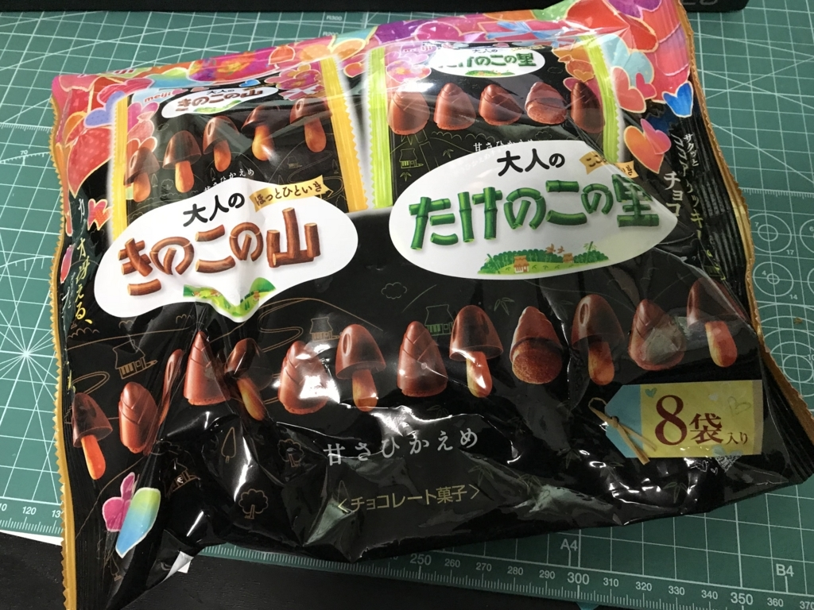
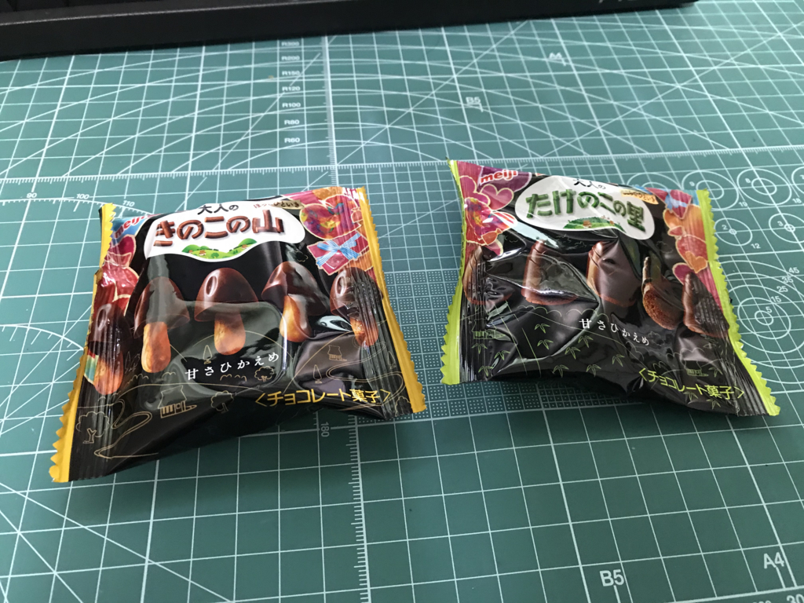
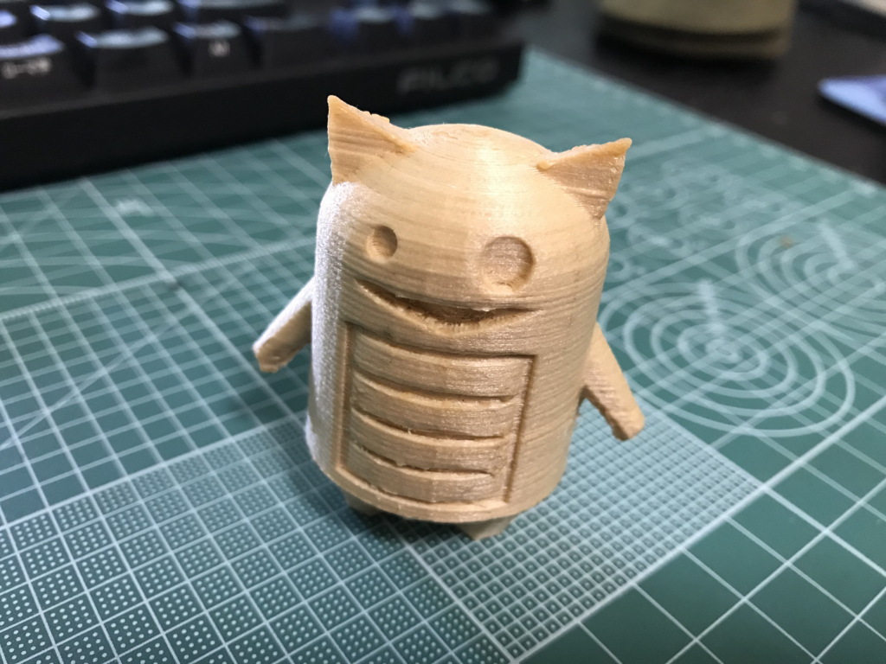

（きょうのまとぅやまきゃっすぅ！ふろむ　べらんだ）

今日は朝から仕事。3時ぐらいにようやく一息付けたので、近所のスーパーまで買い物に行った。10日ぶり（！？）の買い出しだけど、週末は大阪に行くので、ちょっと抑え目。野菜少々（キャベツ1/4玉 120円！！）、お肉少々、卵1パック、牛乳、ビール6本、白菜が高くなっても値段の上がらないキムチさまなどなどを購入したけど、5000円ぐらいで収まった。

あと、バレンタインデーなのでチョコレートも買った（自分で作るやつはもらったけど、さすがに今日は作る元気ない……）。「きのこの山」と「たけのこの里」のパック。大人向けというだけあって、ちょっと甘さ控えめで、たいへんよろしい。

ちなみに、僕は断然<b>「たけのこ」派</b>だ。

このアソートで食べ比べて改めて実感したけど、たけのこはスナックとチョコレートが分かちがたく結びつき、かつ互いに高めあっている。比翼の鳥、連理の枝、消しゴム鉛筆とでも表現すべきか。

それに比べ、きのこのまとまりに欠けることよ。たけのこが霊峰・富士を思わせる美しい円錐をなしているのに対し、こちらのなりは卑猥に堕している。きのこを模す必然性もなければ、感性を揺さぶる美しさもない。

試しに二つを混ぜて目をつぶって口にしてみたが、違いは明白だ。芳醇な重厚なマリアージュを感じさせる方がたけのこで、歯で軽く粉砕され・食感に統一がなく・烏合のごとき味覚の分裂を呈しているのがきのこ。この違いはあまりにも大きい。

しかし、ダメな子ほどかわいいというのもまた事実。チョコだけなめとって、スナックだけ口の中でもてあそんだりできるのはきのこならではであって、たまにはきのこを食べてあげるのも悪くはないと思った。

<h3>だるやなぎぬいぐるみ</h3>

だるやなぎのぬいぐるみはかねてから作ってみたいと思っていたけれど、なかなか先立つものが工面できず、計画を実行することができないでいた。でも、今年は税金の還付を今年の国民年金の支払いでガッツリ削られても、多少は残りそう。de:code に行くのを我慢して、少し足し前をすれば、予算10万円ぐらいはひねり出せそう。

要件は――

<ul>
<li>大きさ：20cm 程度</li>
<li>数量：できるだけ多く（50個は無理かなぁ……でも30個はほしいかも）</li>
<li>納期：今年中だったらいいや（ぉ</li>
</ul>
みたいな感じ。

<ul>
<li>クラウドワークスでコンペする</li>
<li>小ロット生産を受け付けてるぬいぐるみ屋さんに見積もりをお願いする</li>
</ul>
で迷ってるんだけど、後者であれば30万もあれば100個ぐらい作れるみたい。とはいえそんなに出せないから（商売で儲けるわけじゃないし！）、もうちょい削りたいところ。どこかいいところがあればいいんだけどなー。まぁ、これも大阪から帰ってからゆっくり取り組むことにしようかと思う。だれか、いいアイデアもってたらこっそり漏らしてくりゃれ。

