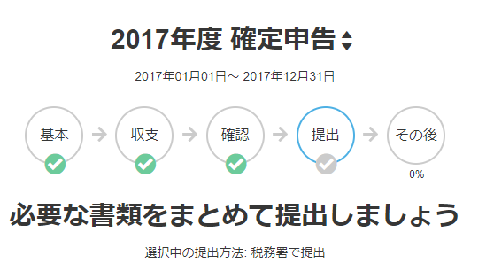
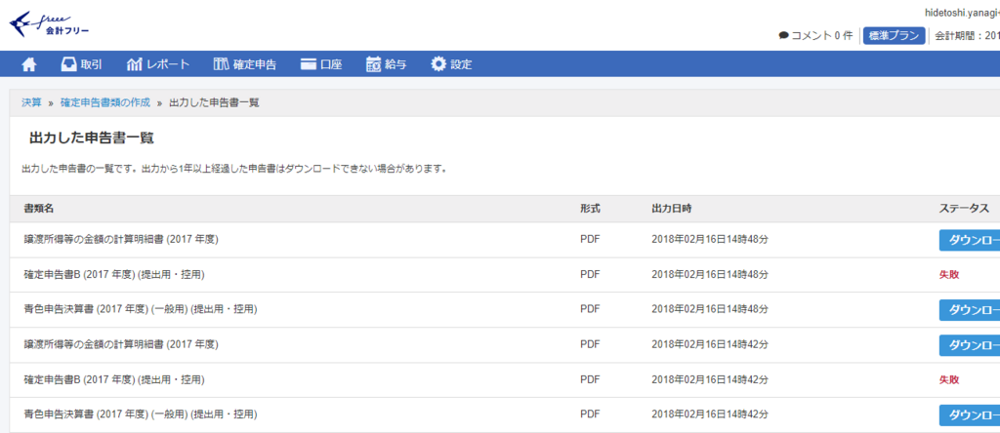
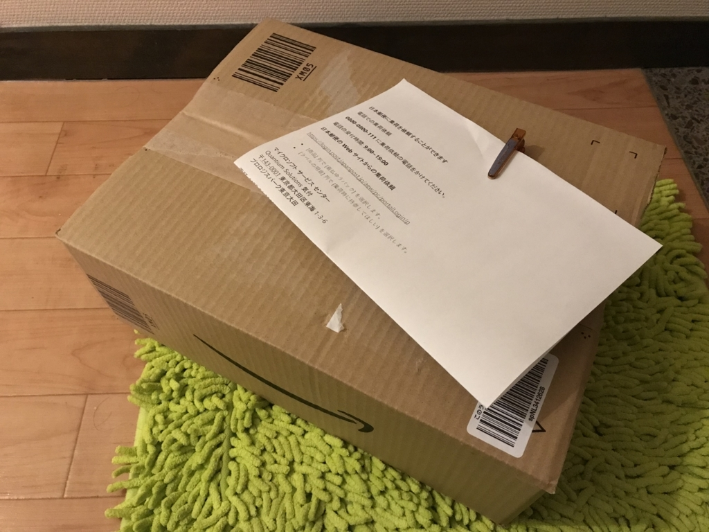

昨日はお昼過ぎに仕事を切り上げて、確定申告を頑張った。今年は新たに注意すべきことはとくにないかな？　減税があるから来年あたりから電子申告にチャレンジしなきゃいけないけれど、今年はいいじゃろう。まだマイナンバーカードも作ってないし（

必要なデータは先日入力してあるから、今日はそれ以降に出てきた領収書を入力して、データのチェックを行うだけ。今年も freee で楽々だぜ！――と思っていたのですが。

確定申告書B がでてこなかった／(^o^)＼　はじめてチャットのサポートを申し込んで、事情を話したところ、同様のエラーが報告されていて、エンジニアが対処中なのでちょい待って、とのことだったので、確定申告は来週に持ち越しやね。スタートダッシュできなかったのは残念だけど、まぁ、あと1カ月あるから問題ない（フラグの建立

で、サポートついでに一つ反省しなきゃいけない。

<blockquote class="twitter-tweet" data-conversation="none" data-lang="ja">
ってか、修理リクエスト出したのに自動返信メール以外のリアクションがないんだけど……
&mdash; ヴァイオレット・ダルーガーデン (@daruyanagi) <a href="https://twitter.com/daruyanagi/status/964116809128411137?ref_src=twsrc%5Etfw">2018年2月15日</a></blockquote>

Surface Book 2 のサポートを依頼したあと音沙汰がないのを Twitter で愚痴ってたんだけど、これは完全に自分のミスだった。Surface Book 2 の修理は

<ul>
<li>郵便局に持ち込んでゆうパックで着払いで送る</li>
<li>郵便局に引き取りに来てもらってゆうパックで着払いで送る</li>
</ul>
の２パターンが選べて、今回は後者を選択した（Surface 3 のときは前者を選択した）。自分はてっきり Microsoft が引き取りの手続きまでしてくれるんだと思い込んでいたのだけど、実はこれ、自分で手配しなくちゃいけなかったんだ。自動返信メールにそう書いてあった。つまり、

<ul>
<li>ゆうパックで着払いで送る</li>
</ul>
だけが要件だったわけだな。こういうミスをした背景には――基本的にはメールをちゃんと読まない自分が悪いんだが――以前、Nikon 1 V1 の修理を Nikon にお願いした時の対応がいたれりつくせりだったってのが大きい。

<iframe src="https://hatenablog-parts.com/embed?url=http%3A%2F%2Fblog.daruyanagi.jp%2Fentry%2F2012%2F09%2F07%2F102100" title="お亡くなりになった Nikon 1 V1 が復活 - だるろぐ" class="embed-card embed-blogcard" scrolling="no" frameborder="0" style="display: block; width: 100%; height: 190px; max-width: 500px; margin: 10px 0px;"></iframe><cite class="hatena-citation"><a href="http://blog.daruyanagi.jp/entry/2012/09/07/102100">blog.daruyanagi.jp</a></cite>

このときは、梱包材付きでクロネコヤマトがハコをもってきてくれて、そのばでカメラを入れて返送するだけで OK だったんだ。なので、そこまでやってくれるんだとばかり思いこんでしまったのだけど……単に Nikon とクロネコのサービスが神対応なだけだったんだな。反省、反省。着払いで済むのはうれしいけれど、適当な段ボールと、梱包材を用意しないといけないのは結構面倒だよね……。

というわけで、無駄に時間を食ってしまったけど、うちの Surface Book 2 は今日、瀬戸内海をわたってサービスセンターに旅立っていきました。きちんとカラダを直して戻ってきてほしいデス。

日付は変わって、土曜日は大阪に行く予定。全然準備していないから、今から用意しないと。

