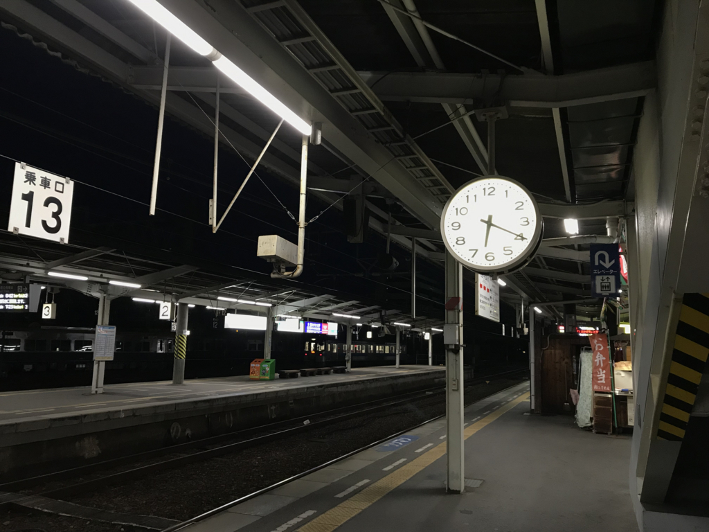
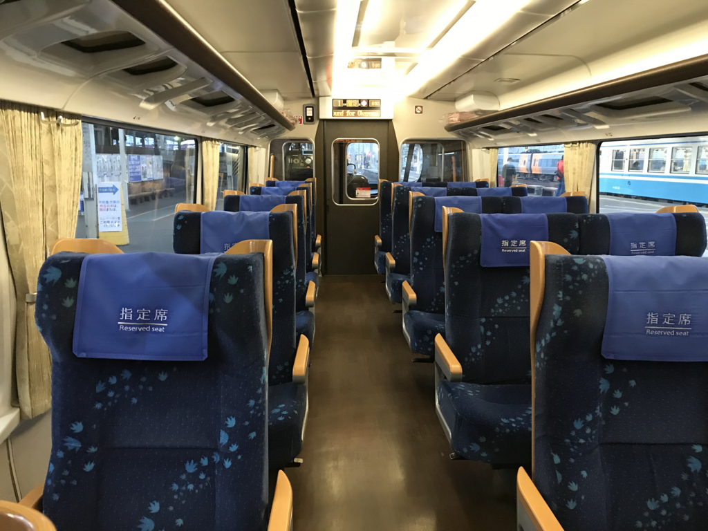
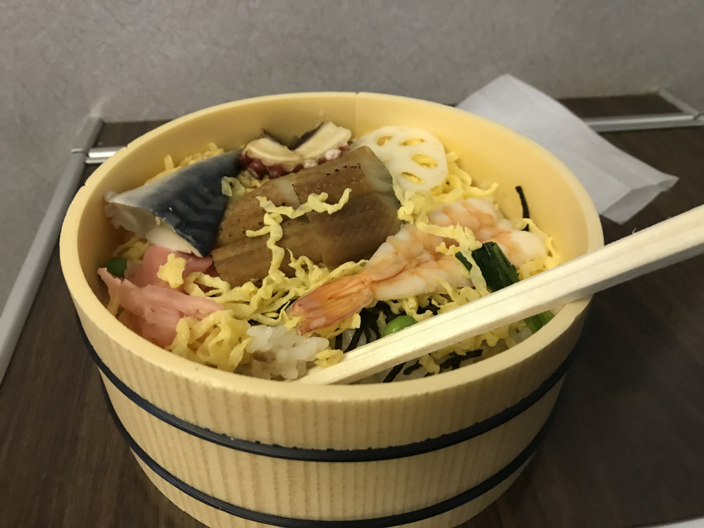
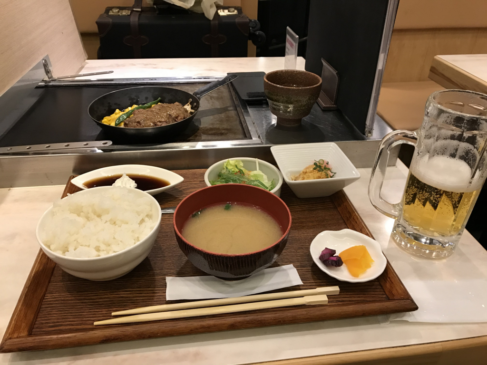

朝の5時に家をでて、大阪へ向かう。今日は「Windows Insider Meetup in Japan 3」に参加する予定。とくに用事があったというわけではないのだけど、たまには話聞いとかないとねー、みたいな。というわけで、今日は一日 Windows Insider Preview 縛りってことで、このブログ記事も Windows 10 Build 17101 をいれた Surface 3（S mode）で書いている。

<iframe src="https://hatenablog-parts.com/embed?url=https%3A%2F%2Fblogs.windows.com%2Fjapan%2F2018%2F01%2F17%2Fwindows-insider-meetup-3%2F" title="Windows Insider Meetup 3 開催決定！情シス編も" class="embed-card embed-webcard" scrolling="no" frameborder="0" style="display: block; width: 100%; height: 155px; max-width: 500px; margin: 10px 0px;"></iframe><cite class="hatena-citation"><a href="https://blogs.windows.com/japan/2018/01/17/windows-insider-meetup-3/">blogs.windows.com</a></cite> 

<h3>電車に乗り遅れる</h3>

帰りは関空からの Peach を予約したのだけど、行きはなにも準備してなかったので JR 死国で松山から大阪まで向かう。

6:20 ぐらいの電車に乗ろうと思って、家を 5:30 にでて、スーツケースを引きずりながら 2km あまりの道のりをとぼとぼと歩いた……のだけど！　6時台は10分過ぎの発車だった／(^o^)＼

そのまま飛び乗って切符を車内で買えば乗れたと思うけれど、無理しても仕方ない。おとなしく一本見送って、次の特急に乗ることにした。次は 20 分過ぎ発車なので、1時間10分待ちである。

それでやけを起こしたというわけではないんだけど、今回はグリーン車に乗ってみることにした。特急しおかぜは、最後尾の車両の半分だけグリーン車なんだな。運賃は大阪まで 15,000 円ぐらい。普通に乗ると 1,1070 円ぐらいなので、結構強気な価格だと思う。今回は ANA をケチって Peach にしたぶんを奮発したと思えば、とくに損をした気もしない（？

そのかわり、席が4列→3列になる。とくに一人席は快適……岡山までの4時間弱、瀬戸大橋すらみずに爆睡してしまった。ちょっと高いかなって気はするけど、十分ペイする快適さだな。ただ、岡山からの新幹線の指定席の方がよっぽど快適なのが泣けるけど。

朝ごはんの松山鮨もおいしゅうございました。

お昼ご飯はサーロインステーキランチでパワーを補充。午後から頑張って隅っこでおとなしく聞いとくぜ！

