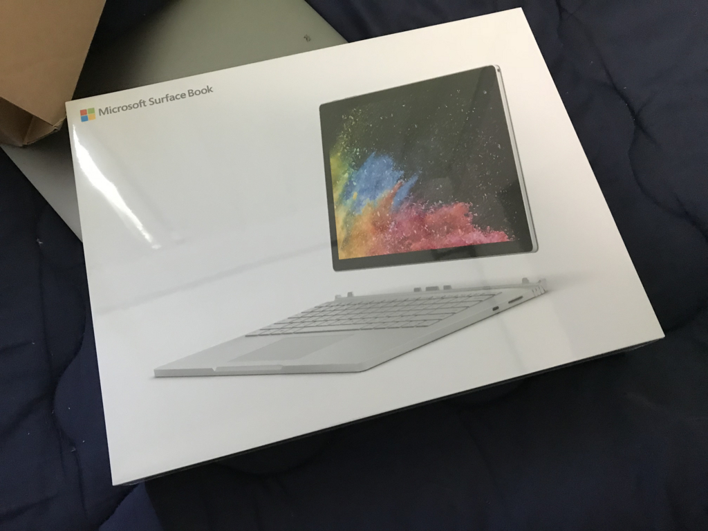
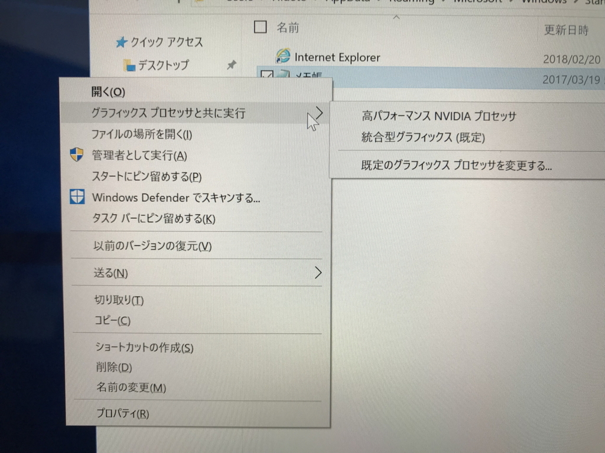
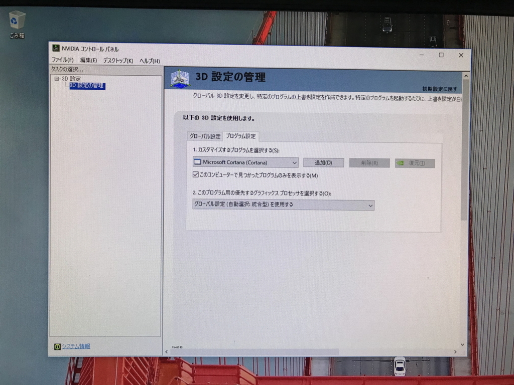

金曜日に送り出した Surface Book 2 が月曜日に発送され、火曜日に帰還しました。3営業日で帰ってくるの、ちょっとスゴいかもしれない。おそらく「リファービッシュ品」というやつでしょうが、新品と見まがうばかりのピッカピカと交換されていました＼(^o^)／

とりあえず、問題点チェック。

<ul>
<li>ノイズが発生する：すっごく耳をすませば聞こえるものの、以前よりは段違いに静かに。</li>
<li>dGPU が認識されなくなる：親方！　実行ファイルのコンテキストクリックメニューに［グラフィックス プロセッサと共に実行］が！</li>
<li>NVIDIA コントロールパネルが起動しない：しゅごい！　ちゃんと起動する！</li>
<li>長時間利用しているとシェルのコンテキストメニューが出なくなる：実はこれ、代わりに使っていたデスクトップ PC でも発生したので、常用アプリのせいの疑いが濃厚になった。とりあえず EmEditor のコンテキストメニューを切って様子を見ている。</li>
</ul>
みたいな感じ。

これが Surface Book 2 の真の姿やったんやな。正常な動作がどんなものかわかってないと、正常かどうかを判断できないってやつ……先代が動いてたと思っていたのは、「どうにか動いていた」だけやったんや。反省反省。

あと、充電器なしで発送したのに、帰ってきたパッケージには充電器が入ってたんだけど（手元でダブってる！）、サポートに連絡してみたところ、とりあえずは返さなくてもよいとのこと。でも、あとで「返してね」って言われたら返さなきゃいけないらしい（まぁ、大人の事情ってやつで、あげたとは言いにくいんだろう）ので、売ったりはしない方がよさげ。とりあえず手元で使わせてもらうことにする……けど、日ごろはドック使ってるから充電器余ってるし、Surface Book 2 は USB-C 充電ができるので出先ではそっちでなんとかするわけで、それほど必要ないよな。ちょっと邪魔だわ……。

とりあえず、対応は早かったし、帰ってきた端末は快調だしで、大満足。仕事環境も3画面間環境に戻れたし、これからバリバリ使うやでー( *´艸｀)

