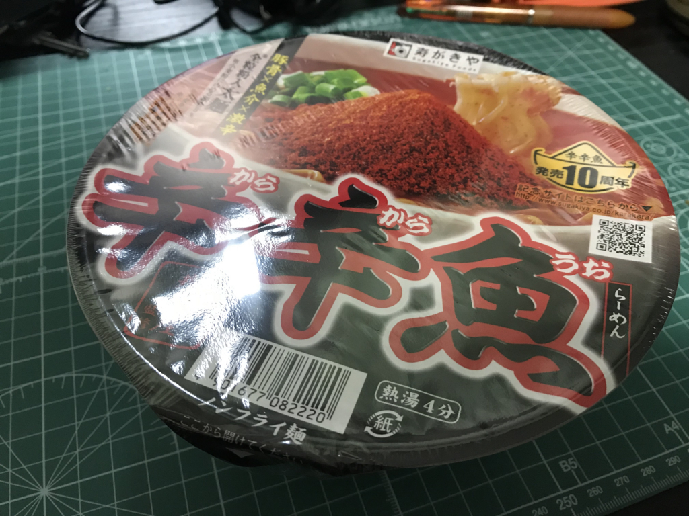
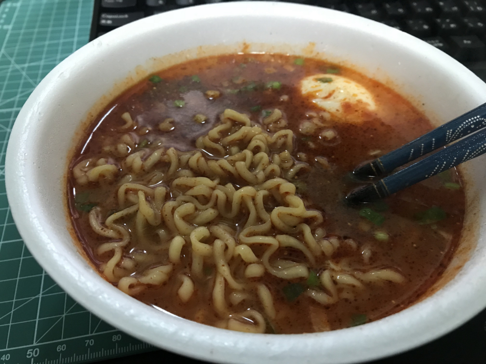
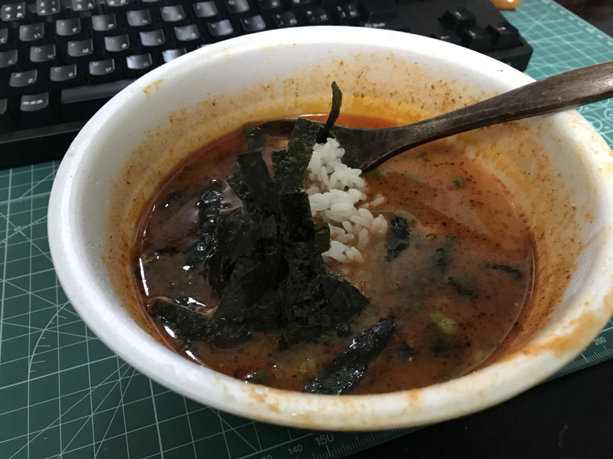
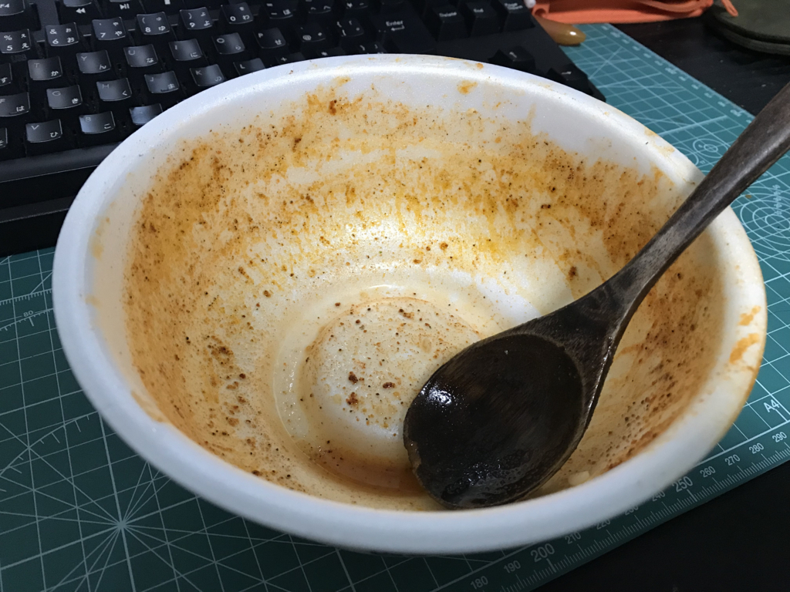

この前、箱（24カップ）でいただいた「辛辛魚らーめん」をいただきました。

<blockquote>

10周年を迎える本年は、全粒粉配合めんはそのままに、スープと辛魚粉を増量し、より力強く仕上げました。荒々しい刺激の中にも、豚骨の旨みと魚粉の風味が一体となって味わえる、他ではまねできない味をお楽しみください。

</blockquote>

「スープと辛魚粉を増量し、より力強く仕上げました」じゃねーよ、こんなの毎年送られる身にもなってくださいよ。タダでさえ辛いのに、死んじゃうよ。

<a href="http://www.amazon.co.jp/exec/obidos/ASIN/B078GM14D4/bestylesnet-22/">寿がきや 麺処井の庄監修 辛辛魚らーめん 137g×24個 【2018年】</a>
<ul><li>出版社/メーカー: 寿がきや食品</li><li>メディア: その他</li><li><a href="http://d.hatena.ne.jp/asin/B078GM14D4/bestylesnet-22" target="_blank">この商品を含むブログを見る</a></li></ul>

でも、お値段見たら結構な感じで……ありがとうございます、今度お礼させてください。

――さてさて。

今回いただいたのはカップ麺タイプですね。袋と違って

<ul>
<li>湯で時間が短い（5分半 → 4分）</li>
<li>鍋が汚れない</li>
<li>食べた後に容器を洗わなくて済む</li>
</ul>
のはうれしいポイントで、より身近な「辛辛魚」と言えます。味の違いは……そんなに舌に自信がある方ではないのであまり断言はできないのですが、カップ麺の方がツルっとして軽い感じかな？　袋麺の方が重厚で、店に出しても雰囲気次第ではインスタントとはわからないんじゃないかって感じですが、こっちはちょっとインスタント感がありますね。ただ、こっちの食感の方が好き！　っていう方は少なくないだろうなとは思います。自分は甲乙つけがたいけど、麺単体なら袋の方が若干好き。

内容物は、かやく入りスープの素、液体スープ、後入れ粉末の3つ。とりあえず、全部ぶち込んでみたんですが。相変わらず邪悪な赤です。

具はほぼないので、好みで追加するといいです（これも袋麺を押す理由の一つ。どうせ具に火を入れるならカップじゃなくてもいいし）。チャーシュー、もやし、なんでもいいんですが、魚粉のせいか、海苔が割とあう気がします。

今回はたまたま台所で製造していた温泉卵を入れました。うちには温泉卵を作るマスィーンがあるので、割といつも備蓄があります。

<iframe src="https://hatenablog-parts.com/embed?url=http%3A%2F%2Fblog.daruyanagi.jp%2Fentry%2F2015%2F12%2F12%2F130000" title="温泉たまご製造機のせいで、昨晩は卵を5個も食べてしまった。 - だるろぐ" class="embed-card embed-blogcard" scrolling="no" frameborder="0" style="display: block; width: 100%; height: 190px; max-width: 500px; margin: 10px 0px;"></iframe><cite class="hatena-citation"><a href="http://blog.daruyanagi.jp/entry/2015/12/12/130000">blog.daruyanagi.jp</a></cite>

温泉卵で辛さがやわらいでいるものの、相変わらず辛い。でも、辛いのってある一定以上になるとあんまり感じなくなりますよね。辛くなったとは言いますが、それほど強化されたとは感じませんでした（感覚破壊。

スープが余ったので（辛くて飲めねえ！）、たまたまあった冷ご飯をぶち込み、もみのりを加えて食べてみました。冷ご飯の冷たさが、唐辛子の絨毯爆撃で荒廃した舌を癒すぜ……。

完食！　おいしゅうございました。これがあと 23 個も食べられるなんて嬉しい（震え声

<h3>事後経過</h3>

この「辛辛魚」は月曜日の午後4時に食べたのですが、その日の晩は普通に暮らすことができました。なんだ、おなか痛くならないじゃん、余裕だな……と思いながら床に入ったのですが……翌午前3時、それは来ました。

寝ぼけ眼をこすりながらトイレへ奔り、便器に座ると、火の玉のようなうんちが飛び出してきました。肛門が焼け付き、思わず体が九の字形に折れる。「ふおおお」と声にならない声が腹から絞り出され、口から鼻から漏れる気がする――結局、その晩（朝）は6時ぐらいまで断続的に3回ほどトイレに行く羽目になりました。

カップ麺でもなかなか強力っぽいですね。次に食べるのが楽しみでたまりません（震え声

