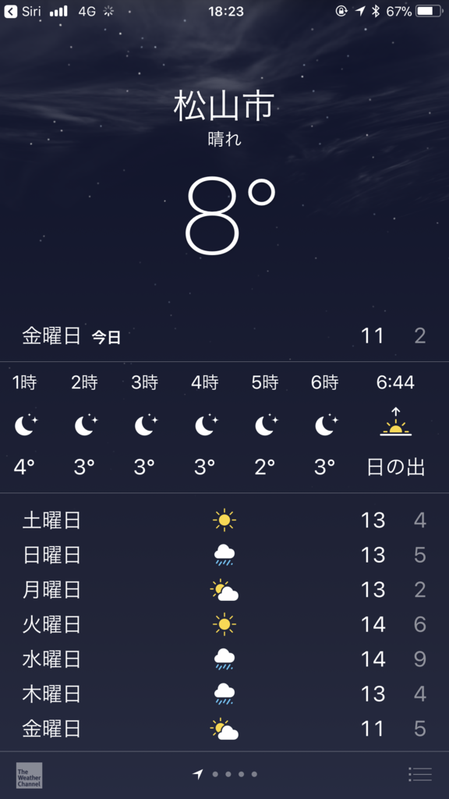
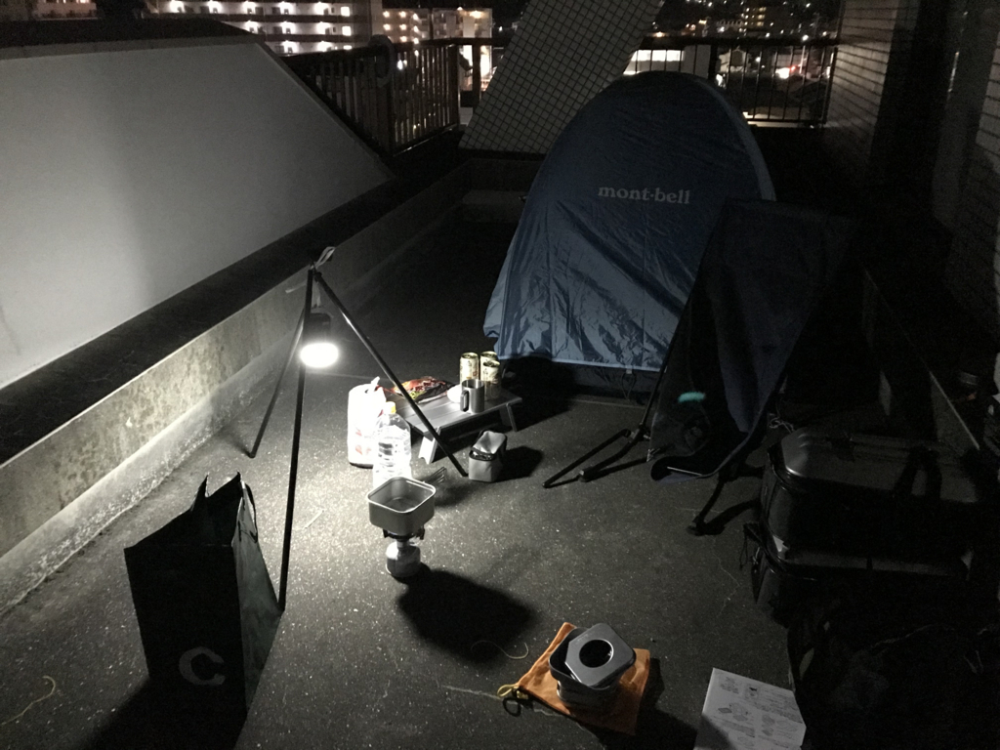
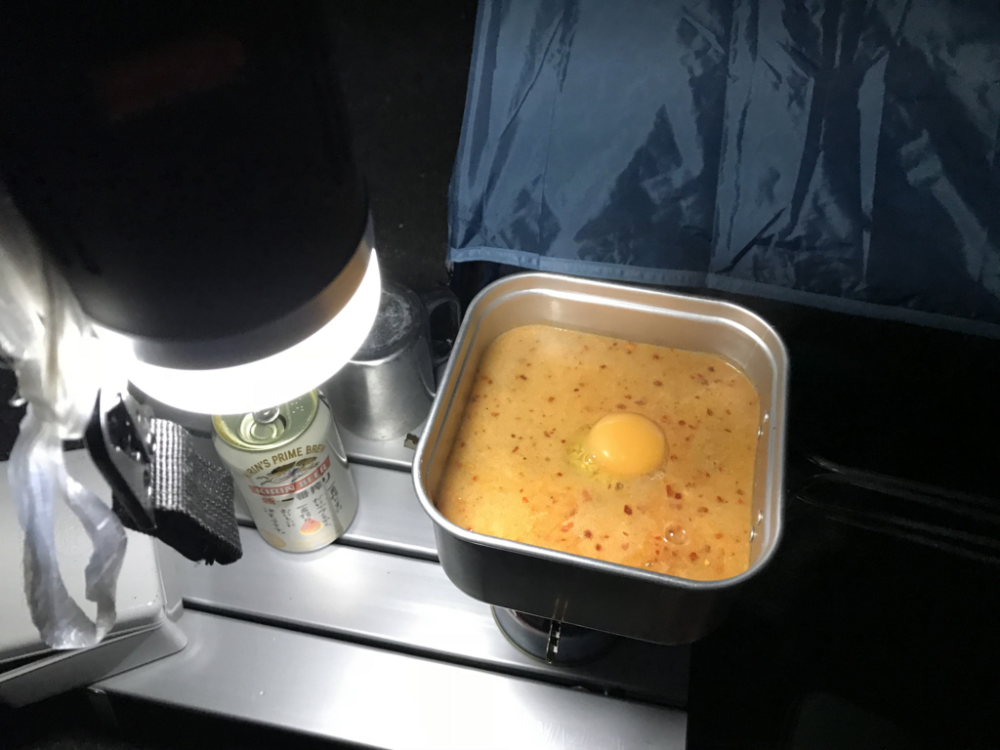

今週末はプレミアムフライデーなので（→）、ベランダでソロキャンプしました（？）。

<blockquote cite="https://headlines.yahoo.co.jp/hl?a=20180218-00000006-mai-soci">

１７日午後１１時半ごろ、福岡県篠栗町若杉のキャンプ場で「爆発音がしてテントが燃えている」と１１９番があった。福岡県警粕屋署などによると、テント一つが全焼し、中から成人男性とみられる遺体が見つかった。

<cite><a href="https://headlines.yahoo.co.jp/hl?a=20180218-00000006-mai-soci">&#xFF1C;&#x706B;&#x4E8B;&#xFF1E;&#x30AD;&#x30E3;&#x30F3;&#x30D7;&#x5834;&#x3067;&#x30C6;&#x30F3;&#x30C8;&#x5168;&#x713C; &#x4E2D;&#x306B;&#x7537;&#x6027;&#x907A;&#x4F53; &#x798F;&#x5CA1;&#x30FB;&#x7BE0;&#x6817; &#xFF08;&#x6BCE;&#x65E5;&#x65B0;&#x805E;&#xFF09; - Yahoo!&#x30CB;&#x30E5;&#x30FC;&#x30B9;</a></cite>
</blockquote>

キャンプ舐めてたら死ぬので、ちゃんと予行演習しておかんとな……この1カ月買いだめた俺さまのキャンプ道具が火を噴くぜ！　ちなみに、当日のコンディションはこんな感じ。

午後6時時点、愛用の丹前を着込んでいる分には外でも寒くない感じ。そこからだんだん冷え込みが厳しくなっていって……10年前に買ったテントと10年前に買った3シーズン用寝袋では厳しくなってきました。先週買った秘密兵器がなかったらちょっとやばかったかもしれない。

<a href="http://www.amazon.co.jp/exec/obidos/ASIN/B06WD6FCJN/bestylesnet-22/">BE DAYS インナーシュラフ 寝袋 フリース 毛布 ブランケット 大判 あったかい ひざかけ （ 膝掛け ） アウトドア 車中泊 洗える チェック 封筒型 180cm×80cm ブルー ( Blue ) 保証書付き</a>
<ul><li>出版社/メーカー: BE DAYS</li><li>メディア: その他</li><li><a href="http://d.hatena.ne.jp/asin/B06WD6FCJN/bestylesnet-22" target="_blank">この商品を含むブログを見る</a></li></ul>

これは薄いフリースでできたインナー寝袋なのですが……そんなに期待しすぎてはいけないけど、あるとないのとでは大違いかと。通常形態はいわゆる“封筒型”ですが、チャックを開けば1枚のフリースブランケットになるので、椅子でくつろいでるときにかぶってもよし。寝袋サイズの荷物が1つ増えるのがネックですが、これからの季節、温度調節がちょっと難しくなるので、マイナス20度対応寝袋（！）なんぞを持ち歩くよりも、さまざまな状況に適用できていいのではないでしょうか。

<a href="http://www.amazon.co.jp/exec/obidos/ASIN/B00H6XBI7I/bestylesnet-22/">[ルートート] ROOTOTE トートバッグ ルーガービッジ 30リットル 3色セット A 7005 700502 ARMY (ARMY)</a>
<ul><li>出版社/メーカー: ROOTOTE(Bag)</li><li>メディア: ウェア&シューズ</li><li><a href="http://d.hatena.ne.jp/asin/B00H6XBI7I/bestylesnet-22" target="_blank">この商品を含むブログを見る</a></li></ul>

あと、買ってよかったなって思ったのはルーガービッジという袋タイプのごみ箱。ある程度自立するし、なんとなくおしゃれだし、スーパーのごみ袋単体よりも扱いやすい。たためば荷物にもならないし……使えなかったら部屋で使うかと思ってあまり考えずにポチったのですが、これは携行品に格上げだな。

反省点としては、明かりは明るいに越したことないな、と。LED ランタンを持っていたのですが、これだけでは辛いかもしれない（その日の月齢は……よくわかんないけど三日月な感じでした）。めっさ明るいランタンと、ポールが欲しいなー。これ以上に持つ増えるのは厳しいけれど。

その日は昼食が遅かったので、夕食は何も作らなかったのですが、夜中にちょっと小腹が減ったので辛辛魚を作って食べました。手元が暗かったのと、バーナーの操作になれてなかったせいで吹きこぼしてしまい、あちこちベタベタになってしまった……まぁ、こういう失敗もベランダならいろいろリカバリーが効くわけで。なんでも予行演習って大事ですな。

<a href="http://www.amazon.co.jp/exec/obidos/ASIN/B007FFSTHE/bestylesnet-22/">UNIFLAME(ユニフレーム) 山クッカー 角型 3 No.667705</a>
<ul><li>出版社/メーカー: ユニフレーム</li><li>メディア: </li><li> クリック: 7回</li><li><a href="http://d.hatena.ne.jp/asin/B007FFSTHE/bestylesnet-22" target="_blank">この商品を含むブログを見る</a></li></ul>

道具の使い方は一通り習得したので、今度は外に出かけたいです。早速来週……と思ったけど、父ちゃんが長い出張から帰ってくるし、面白そうな勉強会もあるしで、ちょっと悩んでいます。あと、確定申告済ませてしまいたいんだけど……freee さん、早く不具合を直してくりゃれー。

