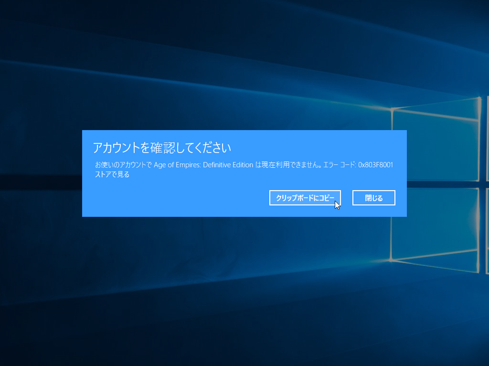

待ちに待った Age of Empires：Definitive Edition がやってきました！　週末はこれで10回ぐらい遊んでたり。

<iframe src="https://hatenablog-parts.com/embed?url=https%3A%2F%2Fforest.watch.impress.co.jp%2Fdocs%2Fnews%2F1107557.html" title="「Age of Empires」が4K HDで復活！ ～「Definitive Edition」がストアで配信開始／再収録されたサウンド、8人対応のマルチプレイ、共有可能なシナリオビルダーにも注目" class="embed-card embed-webcard" scrolling="no" frameborder="0" style="display: block; width: 100%; height: 155px; max-width: 500px; margin: 10px 0px;"></iframe><cite class="hatena-citation"><a href="https://forest.watch.impress.co.jp/docs/news/1107557.html">forest.watch.impress.co.jp</a></cite>

でも、正直、いろいろトラブルあり過ぎだよね。

まず、リリースが伸びた。まぁ、これ自体は仕方がない。

次に、事前ダウンロードしたゲームが起動しなかった。解禁日に速攻遊んでやるぜ！　って意気込んでたのに、この仕打ちはないよ。再インストールでなおったけど、17GB 以上をダウンロードしなおすのは正直辛かった。

まぁ、それだけならまだいい。何回か遊んだら、また起動しなくなった。

<blockquote class="twitter-tweet" data-lang="ja">
お使いのアカウントで Age of Empires: Definitive Edition は現在利用できません。エラー コード: 0x803F8001  おい、どういうことやクソ野郎
&mdash; ヴァイオレット・ダルーガーデン (@daruyanagi) <a href="https://twitter.com/daruyanagi/status/967365523708067840?ref_src=twsrc%5Etfw">2018年2月24日</a></blockquote>

これも再ダウンロードで治ったんだけど、これでダウンロード2回目だよ。合計35GBのダウンロードだよ。ほんとクソだと思った。で、今さっき遊ぼうかなって思ったら、また同じエラーが出て動かない。また17GB、再ダウンロードかよ。マジでふざけんなって感じ。

個人的には、Windows ゲームは全部ストア配信になってくれたらうれしいなって思ってる。「Steam」を入れるのめんどくさいし。でも、こんな状況じゃ、とてもじゃないけどストアでゲームを買おうっていう気にならん。

ゲーム自体は……期待したほどのクオリティはなかったけど、2000円で懐かしいゲームが楽しめるのは結構お得だと思った。ストア界隈の不具合さえなければ、全力で推せる。

