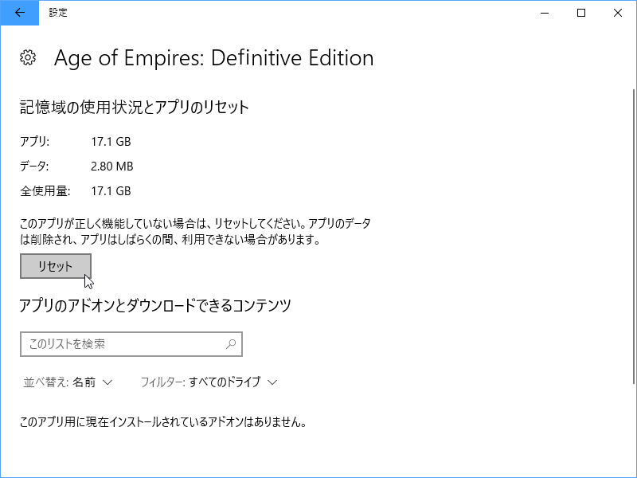
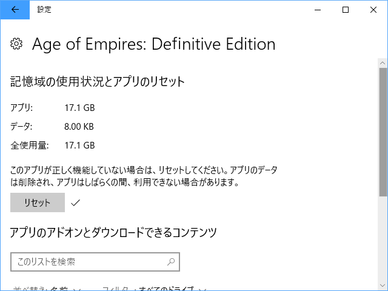

 

<h3>症状</h3>

スプラッシュ画面でゲームがクラッシュして、以降、次のようなエラー画面が出て起動できなくなる。

<blockquote>

お使いのアカウントで Age of Empires: Definitive Edition は現在利用できません。エラー コード: 0x803F8001

</blockquote>

<h3>回避策その1：なんでもいいからアプリをストアからインストールしてみる</h3>

なんでもいいので、

<ul>
<li>無料</li>
<li>サイズが軽いもの</li>
</ul>
がいいんじゃないでしょうか。うちではランキング上位に掲載されていた謎の知育ソフトをインストールしてみましたが、サクッと起動しました。

<h3>回避策その2：アンインストールして再度インストール</h3>

再インストールでも治るようですが、毎回 17GB 超をダウンロードするのは正直しんどいと思います。回避策その1 がダメだったら試してみてください。

<h3>その他の回避策</h3>

ストアアプリにおける一般的な回避策を列挙しておきます。やっても治らないことが多い気がしますけど、wsreset だけで治ることもあるので、一通り覚えておくと役に立つこともたたないこともあります。

<ul>
<li><code>wsreset.exe</code> を実行する</li>
<li>管理者権限で <code>sfc /scannow</code> を実行する</li>
<li>管理者権限で <code>DISM /Online /Cleanup-image /Restorehealth</code> を実行する</li>
</ul>

<h3>結論</h3>

いい加減にしろ。

<h3>ToDo（2018/02/28 14:20 追記）</h3>

今度エラーに遭遇したら、アプリの詳細オプションにある［リセット］ボタンで治るかどうか試してみる。

<h3>追記（2018/03/01）</h3>

またエラーに遭遇したので［リセット］ボタンを試してみましたが……これでは治らないみたい。回避策その1でエラー回避。

