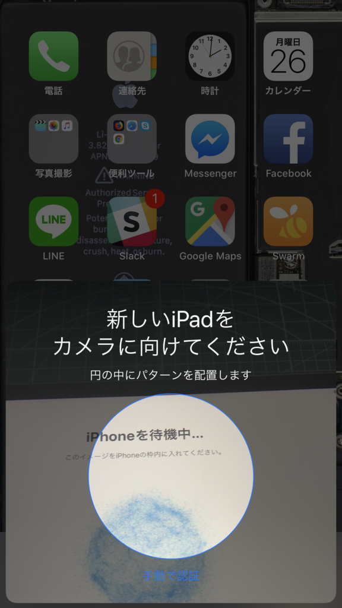

諸事情あって、急遽 iPad mini（第4世代、Cellular+Wi-Fi）を購入しました。ストレージは 128GB モデルしかなかった。価格は6万ちょいだったかな？

それにしてもこのモデル、なにげに2年余り更新されてないんだなぁ（新モデル発売フラグの建立！）。スタイルはともかく、開封直後から日本語変換がたまにもたついたりするなど、少し古さを感じました。あと、最近の iPhone/iPad を使ってるとつい勘違いしてしまいそうだけど、こいつは<b>防水ではない</b>。間違って裸のままお風呂で使うとえらいことになりそう。そろそろパワーアップと防水はやってほしい気がする。

このモデルの良さは、やっぱり「ちょうどいい大きさ」ですかね。

横に持って両手で日本語をぷちぷち入力するのにちょうどよい。 
お布団でゴロゴロしながら文庫本やマンガを読むのにちょうどいい。 
お仕事しながら横で Netflix をだらだら流すのにちょうどいい。

その点、iPad Pro はちょっと大きすぎるかな。iPhone（Plus）がこれだけ大きくなると、iPad mini の立ち位置は少し微妙になるけれど……でも、iPhone Plus でもマンガ読むのはつらいし、このサイズのちょうどよさはまだまだ捨てがたいところがある。iPhone が見開き表示にでもなればちょうど iPad mini のサイズになるので完全にリプレースできちゃいそうだけど、そういうブレイクスルーはまだちょっと先かも。やる気があるのかもわからんし。

あと、最近の iPad は手元に iPhone があれば謎の技術でシームレスにセットアップできるんだな。

 

iPhone のカメラで iPad に表示される謎の模様をパシャっととるだけで、いろいろよしなにやってくれた。んー、こういうのは Apple ならではのおもてなし精神やな。家の Wi-Fi が詰まってたっぽくて、オフにしないとちゃんとアクティベーションされなかったのはちょっとダメだったけど（こういう機能って"わからない人"向けだろうし、そういうところまでこだわるべきだと思うだ）、なかなか良い機能だと思った。Windows にもこういうのがあるといいけれど、Windows 10 Mobile を諦めちゃったから期待できないのは悲しい。

<h3>追伸</h3>

うちのバッファローのルーター、iOS 端末を 2.4GHz 帯につなぐと応答がなくなってしまう……5GHz 帯につなぎかえると大丈夫なんだけど、プリンターや家電リモコンなんかは 2.4GHz 帯にしか対応していないからだいぶ面倒くさい。以前からそういう不具合？があるのは把握していたんだけど、買ったばっかりの iPad mini を間違って 2.4GHz 帯につないじゃって、ここ2日間はネットワークトラブルに悩まされてしまった。

東京にいる時代から使っている気がするし（7年ぐらい？）、そろそろ退役させるべきかもしれない。

