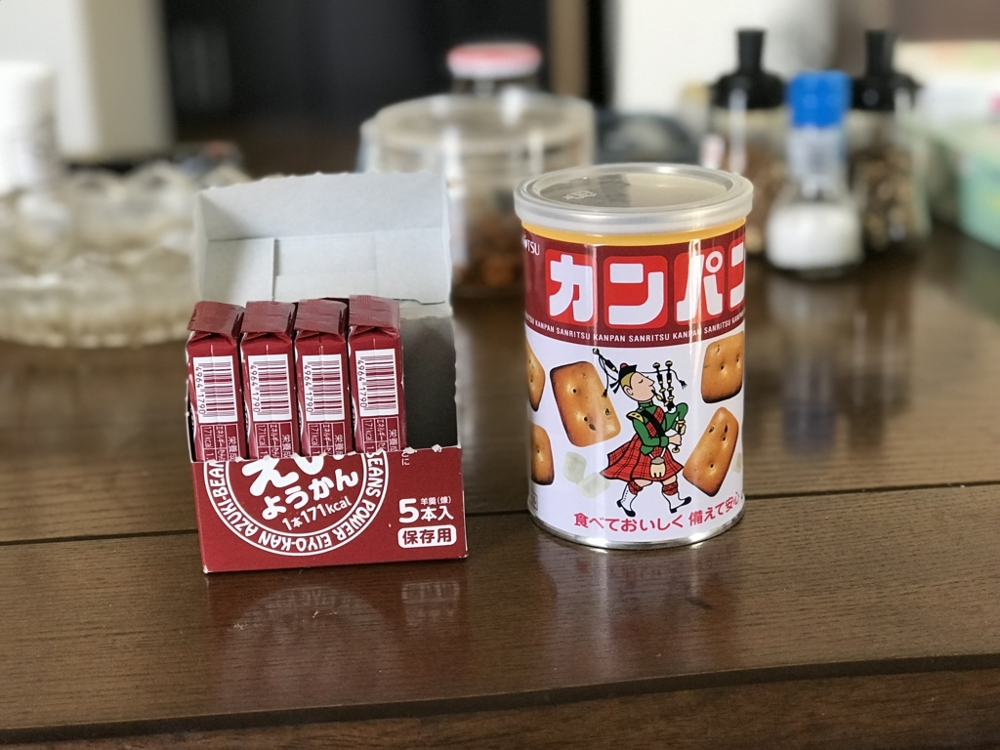
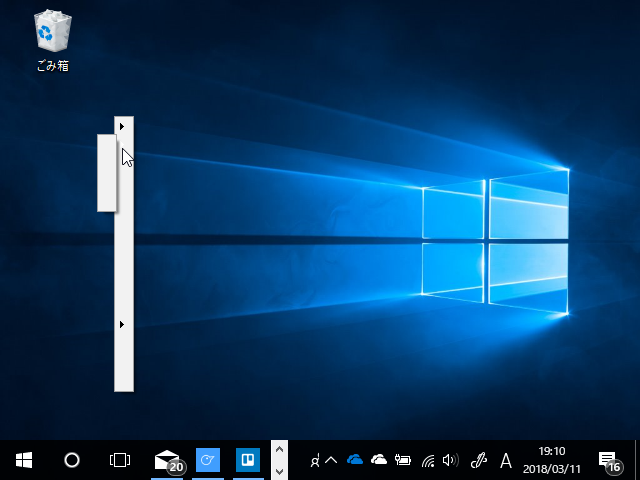
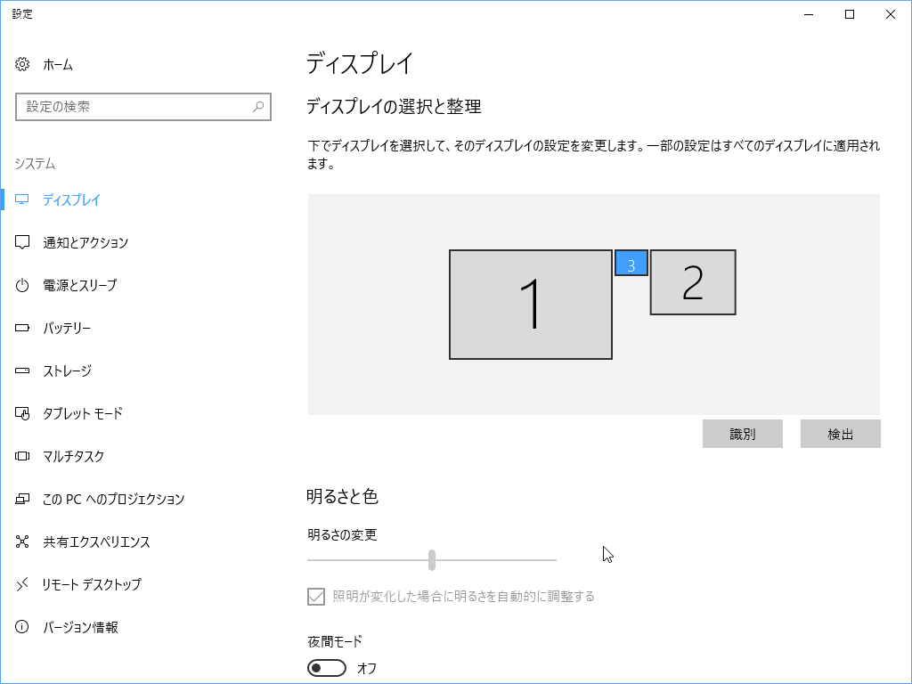

この土日は少し仕事をして、あとはだるだると過ごした。将棋名人戦の6者プレーオフのおかげで、連日 Abema（とニコニコ動画）で将棋の中継があるから飽きない。今日は渡辺棋王が永瀬六段を下していたけど、昨日は豊島 vs 会長がみられたし、その前は B2 の最終戦がみられた（郷田九段の格調高い差し回しに感服……）。どれもこれも、対将棋星人向けの最終決戦兵器・フカーラが頑張ってくれたおかげ（今日の高見くんとのコンビ解説も面白かったｗ）。絶対に勝つと信じていたから、その通りになって ( *´艸｀) となる一方、足を向けて寝られんとも思った。

あと、震災から7周年？　らしいので、非常持ち出し袋の中身を点検したついでに、かんぱんとえいきょうかんをたべた。

<a href="http://www.amazon.co.jp/exec/obidos/ASIN/B000VZ2KCA/bestylesnet-22/">三立 缶入カンパン 100g</a>
<ul><li>出版社/メーカー: 三立</li><li>メディア: その他</li><li>購入: 3人 クリック: 3回</li><li><a href="http://d.hatena.ne.jp/asin/B000VZ2KCA/bestylesnet-22" target="_blank">この商品を含むブログ (3件) を見る</a></li></ul>

乾パンは……思っていた味と違うというか、ちょっと不味いビスケット？みたいな感じだった。非常用としては十分においしい。あと、氷砂糖が入っているのはなんでなんだろう。

<blockquote>

缶の中に入っている氷砂糖は、糖分の補給としてだけでなく、唾液の分泌を促し、水なしでも食べやすくします。

</blockquote>

へぇ。まぁ、お水が手に入る状況だとは限らないしね。いろいろ考えてるんだなぁ。100g だけど割と飽きるし、ちびちび食ってたら結構持ちそうだな。フタを開けて 1/3 ぐらい食べたところでやめてしまった。備蓄品としては合格なので、追加注文して、封を切った奴は口が寂しい時に食べる。

<a href="http://www.amazon.co.jp/exec/obidos/ASIN/B0053F5FAC/bestylesnet-22/">井村屋 えいようかん 5本</a>
<ul><li>出版社/メーカー: 井村屋製菓</li><li>メディア: 食品&飲料</li><li>購入: 57人 クリック: 167回</li><li><a href="http://d.hatena.ne.jp/asin/B0053F5FAC/bestylesnet-22" target="_blank">この商品を含むブログ (20件) を見る</a></li></ul>

えいようかんは……ちょっと堅めの、ふつうの羊羹だった。超おいしい、ってことはないんだけど、普通に食べておいしい。コンビニの見切り品のところにおいてありそうな、80円ぐらいの羊羹っぽい感じ。これも合格。

非常持ち出し袋からは、バスタオルを抜いた。タオルは必須だけど、バスタオルまでは要らんな。その代わりに、救護セットを入れておくことにした。水・お茶の備蓄は常にあるから、とくに考えなくてもいい……はず。あとは、手巻き充電式懐中電灯 ＆ ラジオが動くかどうかチェックして終わり。軍手も買っておいた方がいいかもしれない。

夕飯のときに、やりかけの Age of Empire: DE を一時停止していたら、

<ul>
<li>Surface Book 2 に接続している外部モニターの1つ（メインモニターに設定）が、解像度 640x480 に（← これが最大解像度）</li>
<li>シェルのコンテキストメニューが出なく</li>
</ul>
なった（識別番号 3 のモニター）。

2番目の不具合は久しぶりで、修理・交換から帰ってきてからは初めて。たぶん（GeForce の）グラフィックドライバーが死んだのだと思うけど……ときどきコンテキストメニューがでなくなるのは、結局グラフィックドライバーの問題だったのかもしれないな。

Surface Book 2 は修理から帰ってきて絶好調で、何ら不都合はない。これなら「これだけあれば、なにもいらない」というキャッチフレーズにもなっとくできる。素晴らしいデバイスなので、宗教が許すならばぜひこれを買うといいと思う。

