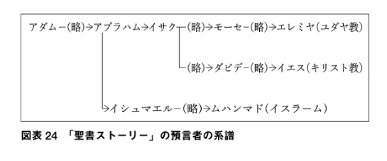

ここ数日は少し忙しく、夕ご飯を食べた後は崩れるように眠ってしまう。とはいえ、眠るのは数時間ぐらい。夜中は眼がギンギンして、本を読んだり、布団から這い出して Age of Empires: DE で遊んだりしている。そして、明け方また眠くなり、また少し寝る。

そんな感じなので、朝――といっても9時ぐらいだが――はなかなか寝床から出られない。というわけで、最近は iPad mini 4 で Feedly のチェックをしてたりする（そのために買ったわけではないのだが）。一晩放置するとだいたい 4,000 件ぐらい未読がたまるのだけど、そのほとんどは読み飛ばして、必要なものだけ Trello へ飛ばすのが日課だ。

Feedly と Trello の連携は、iOS の共有コマンドで十分補える。Feedly の［iOS Sharing］コマンドで［Trello］を選んで、共有先のボードとリストを指定するだけ。

ただ、Trello のクラウドと同期するタイミングはアプリ次第みたい。すぐさま他の端末と同期させたい場合は、Trello アプリを起動する必要があった（起動すると同期アイコンがくるくるして、データがクラウドに送られる＆クラウドから受け取ってるのがわかる）。これを忘れると「あれ？　Trello に投げ忘れた？」ってなることがあって混乱する。あと、URL はアイテムとして添付される。まぁ、これは別にどうでもいい。

読書の方は、読みかけて放置していた『古代オリエントの宗教』を読了した。

<a href="http://www.amazon.co.jp/exec/obidos/ASIN/B01N6KWOTD/bestylesnet-22/">古代オリエントの宗教 (講談社現代新書)</a>
<ul><li>作者: 青木健</li><li>出版社/メーカー: 講談社</li><li>発売日: 2017/01/13</li><li>メディア: Kindle版</li><li><a href="http://d.hatena.ne.jp/asin/B01N6KWOTD/bestylesnet-22" target="_blank">この商品を含むブログを見る</a></li></ul>

「そういえば、世界史でマニ教とかミトラ崇拝とか習うけど、実際どんなもんかさっぱり知らんよなー」と思い Kindle で買ってみたのだけど、最初の方はともかく、中盤からはグノーシス主義の知識が要求され、ちょっと難しかった。あらかじめグノーシス主義とはなんぞやというのを攫ってから手に取れば、もっとよくわかったかもしれない。

<blockquote cite="https://www.gotquestions.org/Japanese/Japanese-Christian-gnosticism.html">

グノーシス主義は、最初の三世紀の間、初代教会を脅かした最も危険な異端と言えます。プラトンなどの哲学者の影響を受けて、グノーシス主義は二つの偽りの前提に基づいています。 

まず、霊と物質に関して二元説を支持しています。グノーシス主義者は、物質は本質的に悪であり、霊は善であると主張します。この前提の結果、グノーシス主義者は、肉体に対してなされることは、最も邪悪な罪でさえ、何の意味もない、なぜなら、現実のいのちは霊的な領域にだけ存在するのだから、と信じています。 

二番目にグノーシス主義者は高い知識、ある数人の人にだけに知られている”より高い知識”をもっていると主張します。グノーシス主義は、ギリシャ語の’グノーシス’「知る」という意味のことばから来ています（俺注：英語での読み方は「ノーシス」、Know、Knowledge みたいな）。グノーシス主義者は、聖書からではなく、何か神秘的、高い場所の存在から得たより高い知識を持っていると主張します。グノーシス者たちは、より高い深い神の知識を持っているので、自分たちを他の誰よりも高級な特権階級だと見ています。

<cite><a href="https://www.gotquestions.org/Japanese/Japanese-Christian-gnosticism.html">&#x30AF;&#x30EA;&#x30B9;&#x30C1;&#x30E3;&#x30F3;&#xFF0E;&#x30B0;&#x30CE;&#x30FC;&#x30B7;&#x30B9;&#x4E3B;&#x7FA9;&#x3068;&#x306F;&#x4F55;&#x3067;&#x3059;&#x304B;&#xFF1F;</a></cite>
</blockquote>

正直よくわからんけど、厨二病がよくかかる「世の中（現世）はクソだ、肉体は仮初で解脱すべき対象にすぎない」病の一種で、「だから、禁欲して霊的に生きよう、理性によって神の知を追求しよう」派と「ヒャッハー、好き勝手生きてやるぜ！　変なクスリとかやって感覚的に神に近づくぜ！」派に分裂するらしい。前者はストア派哲学に、後者はエピキュロス派や神秘主義、怪しいエロエロ宗教なんかにつながる感じか。

この本の面白いところは、古代オリエントの宗教を「聖書ストーリー」という点から見ているところ。説明は雑になるけど、ラノベ原作と二次創作の派閥抗争だと思えばいいかもしれない。無理やりガンダムで例えるとこんな感じ

<ul>
<li><b>初代ガンダム</b>：アムロの受難を通じてニュータイプを確信 → <b>ユダヤ教</b>（1,500万人）</li>
<li><b>Zガンダム</b>：カミーユが激闘の末死亡するも復活（注：あ、ほんとの Z はそうじゃないです）、めっちゃニュータイプやん → <b>キリスト教</b>（21億人）</li>
<li><b>ターンエーガンダム</b>：いろんな話あるけど、あれ、まとめて黒歴史な。ローラ・ローラを崇めろ by グエン・サード・ラインフォード → <b>イスラム教（スンナ派）</b>（13億人）</li>
<li><b>ターンエー後のいろいろガンダム</b>：ターンエーガンダムの続き（第7の告知者）、やっぱ見たいやん？ → <b>イスラム教徒イスマイール派</b>（2,000万人ぐらい）</li>
<li><b>逆襲のシャア</b>：初代はクソ、「ターンエー」も認めない、オールドタイプだけど頑張ってるシャア（洗礼者ヨハネ）が一番熱い → <b>マンダ教</b> （イラク南部に1万人ぐらい）</li>
<li><b>08小隊</b>：局地的に存在する泥臭い・リアルな兵士を描くの好き派（アルメニアの土着神・ミトラ）にガンダム要素がもたらされる ～ 陸戦型ガンダム・ジムスナイパーの誕生、ローマでやたら流行る → <b>ミトラ崇拝</b>（死に絶えた）</li>
<li><b>ボトムズ</b>：ガンダムに対するボトムズの影響を頑張って考察、こっちの方が歴史古いし正統だろと我田引水的にいろいろ繋げたりしてみたけど、ガンダム人気に押されて消えた → <b>ゾロアスター教</b>（2万人以下）</li>
<li><b>Gガンダム</b>：謎のガンダム解釈、東方不敗（マーニー・ハイイェー）は王者の風よ！ → <b>マニ教</b>（中国福建省で数百人）</li>
</ul>
異論は認める。安彦良和のやつが本当に「オリジン」かとか、小説版では～とかそういう話をやってるとざっくり解釈すると、真面目に信じてる人には怒られそうだけど。

