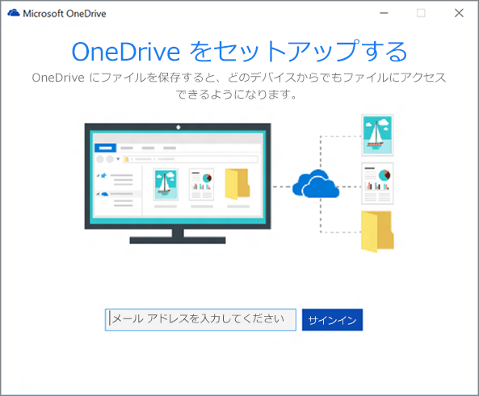

先日から OneDrive のスクリーンショットフォルダーで画像のサムネイルが表示されなくなって困っていた。このフォルダーは <code>%USERPROFILE%&yen;Pictures&yen;Screenshots</code> のシンボリックリンクで、［Windows］＋［Print Screen］キーなどで保存したスクリーンショットを複数デバイスで同期する。

当初は単にサムネイルキャッシュが壊れているのかと思ったのだけど、よく観察してみると

<ul>
<li>保存直後～同期中はサムネイルが表示される</li>
<li>同期が完了すると、サムネイルが表示されなくなる</li>
<li>他の非 OneDrive フォルダーではサムネイルが表示される</li>
<li>OneDrive とそのほかのフォルダーでファイルを移動させていると、ときどきサムネイルが有効になる場合がある（リネームした場合？）</li>
</ul>
などとよくわからないことになっている。下記リンクの Q＆A が手元の状況に近かったので、これを参考に修復を試み―― 

<iframe src="https://hatenablog-parts.com/embed?url=https%3A%2F%2Fanswers.microsoft.com%2Fja-jp%2Fonedrive%2Fforum%2Fodwork-odtags-sdmac%2Fonedrive%E3%81%AE%E5%86%99%E7%9C%9F%E3%82%B5%2Fc63c89a0-6d0d-4bee-af9e-e6f5d30206a1" title="OneDriveの写真サムネイルが表示されない" class="embed-card embed-webcard" scrolling="no" frameborder="0" style="display: block; width: 100%; height: 155px; max-width: 500px; margin: 10px 0px;"></iframe><cite class="hatena-citation"><a href="https://answers.microsoft.com/ja-jp/onedrive/forum/odwork-odtags-sdmac/onedriveの写真サ/c63c89a0-6d0d-4bee-af9e-e6f5d30206a1">answers.microsoft.com</a></cite>

<iframe src="https://hatenablog-parts.com/embed?url=https%3A%2F%2Fanswers.microsoft.com%2Fja-jp%2Fonedrive%2Fforum%2Fodwork-odfiles-sdwin10%2Fonedrive%E3%81%AE%E7%94%BB%E5%83%8F%E3%82%B5%2Fff9c5ad4-40e7-4cb9-836c-f9b12ae10b45" title="OneDriveの画像サムネイルについて" class="embed-card embed-webcard" scrolling="no" frameborder="0" style="display: block; width: 100%; height: 155px; max-width: 500px; margin: 10px 0px;"></iframe><cite class="hatena-citation"><a href="https://answers.microsoft.com/ja-jp/onedrive/forum/odwork-odfiles-sdwin10/onedriveの画像サ/ff9c5ad4-40e7-4cb9-836c-f9b12ae10b45">answers.microsoft.com</a></cite>

――ようと思ったのだけど、見た感じめんどくさそう……。とりあえず、一番簡単そうなサポートページの手順に従ってみた。

<iframe src="https://hatenablog-parts.com/embed?url=https%3A%2F%2Fsupport.office.com%2Fja-jp%2Farticle%2FOneDrive-%E3%81%AE%E5%90%8C%E6%9C%9F%E3%81%AB%E9%96%A2%E3%81%99%E3%82%8B%E5%95%8F%E9%A1%8C%E3%82%92%E8%A7%A3%E6%B1%BA%E3%81%99%E3%82%8B-83ab0d8a-8400-45b0-8dcf-dc8aa8a6bcf8" title="OneDrive の同期に関する問題を解決する" class="embed-card embed-webcard" scrolling="no" frameborder="0" style="display: block; width: 100%; height: 155px; max-width: 500px; margin: 10px 0px;"></iframe><cite class="hatena-citation"><a href="https://support.office.com/ja-jp/article/OneDrive-の同期に関する問題を解決する-83ab0d8a-8400-45b0-8dcf-dc8aa8a6bcf8">support.office.com</a></cite> 

<blockquote>

それでも OneDrive が起動しない場合は、OneDrive の最新バージョンをダウンロードし、インストールします。 

<a href="https://onedrive.live.com/about/download/">https://onedrive.live.com/about/download/</a>

OneDrive のセットアップが開始されたら、OneDrive アカウントを入力し、[サインイン] を選んでアカウントを設定します。

 

</blockquote>

アカウントを設定すると“OneDrive”フォルダーが開くだけで、とくに何かが変わった様子もない。不具合も解消されていなかった。

ところが、別件の不具合で Windows を再起動したところ、いつの間にか直っていた。もしかしたら、シェルのリロードが必要だったのかもしれない。

もともと Windows の再起動で直る問題だったのか（基本的に用がなければ OS の再起動はしないので、それは十分あり得る）、OneDrive の最新版ダウンロード＆実行が奏功したしたのか、そのあとに再起動したのがよかったのか、イマイチさっぱりわからないのだけど、とりあえず直ってよかった。サムネイルで中身がみられるのとみられないのとでは作業効率に大きな違いが出る。

