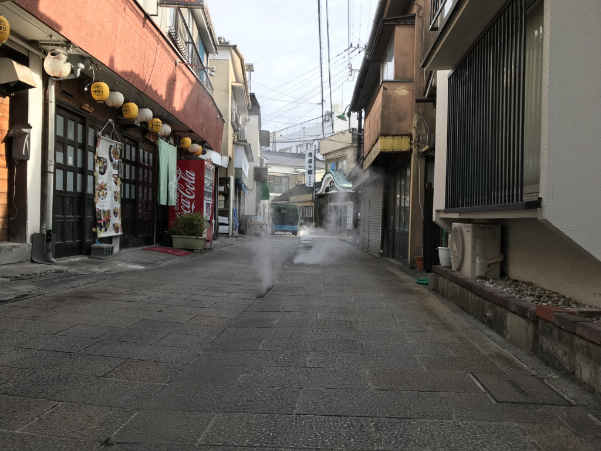

火曜日の夜は、三津まで飲みに行った。雨が降っていたのでタクシーを使おうと思い、近所のタクシー会社まで歩いて行ったのだけど（徒歩30秒！）、出払っていて誰もいなかった。さすがに一台もいないのは初めてで、ちょっとうろたえてしまった。タクシー会社にいるのに、タクシーの配車センターに電話をするという間抜けな事態。これだったら、家に呼んだ方がよかったかもしれないな。

そんなこんなでちょっと時間は食ったけど、7時過ぎぐらいに「いとさん」に付き、R さんと日付が変わるまで飲んだ。あと、ミカンもらった。ありがとう。

食い物の写真は撮り忘れたのだけど、相変わらず美味しかったです。遅くまですみません。

飲み会で何の話をしたのかはすっかり忘れたけど、この前の大分旅行でアニサキス？をいただいたかもしれないという話をしていたような気がする。

大分の宿はアットホームな感じで、部屋は10畳ぐらいか、真ん中にコタツがデンと置いてあってぬっくぬく。まるで自分ちでゴロゴロしているかのような、居心地のよさだった。しかも夕飯は部屋まで持ってきてくれて、一人1万円ちょいで関アジ付きの船盛まで付いてくる。わいとおとんはすっかりいい気分になって、びっくりするぐらいたらふく食べた。

ところが、夜中あたりから妙におなかがキリキリする。放っておけば痛みは消えるし、別に下痢も嘔吐もない。「さすがに食いすぎたかなぁ」「温泉で湯あたりでもしたのだろうか」と思い、ときどき襲う痛みをやり過ごしながら、朝まで本を読んでいた。

翌日は朝ごはんもしっかりいただいたけど、おとんがグロッキーになっとる。自分もまだときどきおなかが痛いし、なんか温泉を楽しむ感じでもなくなったので、チェックアウトした足で船に乗り、愛媛に帰ってしまった。おんせん県にきたのに、ほとんど温泉に入らなかった。おおいたではらいた、って洒落にもならんな。

で、家に帰ってからちょっと気になったのでいろいろ検索してみたら、どうやらアニサキスっぽい。

<blockquote cite="https://www.asahi.com/articles/ASK6Z72XXK6ZUBQU00Y.html">

アニサキス症になると摂食後８時間以内に、みぞおちに、最初は張った感じから、やがて差し込むような強い痛みが出ます。しばらくすると治まり、また数分すると強い痛みの波がやってきます。これはアニサキス症に特徴的と言われています。同時に発熱やじんましんなどのアレルギー症状を伴うこともあります。胃の痛みは虫体が粘膜に刺さった痛みではなく、アレルギーによるものと考えられています。放置しても人間の体内ではアニサキスは生きられないので、４、５日で痛みは消えます。

<cite><a href="https://www.asahi.com/articles/ASK6Z72XXK6ZUBQU00Y.html">&#x523A;&#x3057;&#x8EAB;&#x306B;&#x3064;&#x304F;&#x30A2;&#x30CB;&#x30B5;&#x30AD;&#x30B9; &#x5F37;&#x3044;&#x75DB;&#x307F;&#x306E;&#x6CE2;&#x304C;&#x7279;&#x5FB4;&#xFF1A;&#x671D;&#x65E5;&#x65B0;&#x805E;&#x30C7;&#x30B8;&#x30BF;&#x30EB;</a></cite>
</blockquote>

割と健康な人なので病院に行くという発想がなかったけど、そのまま直行すりゃよかったなーと思った。

というわけで、この前のおんせん県はさんざんだったのだけど（あー、でも、親父と行く旅行は毎回何かしらあるんだよな、なんだろな）、道からもくもく温泉の湯気が出ていたりするのは大変テンションが上がった。おんせん県を僭称するだけのことはある。今度は一人でバイクで行こうかなって思った。できれば、阿蘇とかにも足を延ばしたい。

ちなみに「いとさん」でもアジのタタキをいただいた――牡蠣にあたっても牡蠣がきらいにならない、結構鷹揚なタイプなのだ――けど、そっちはなんともなかった。おいしかったです。

