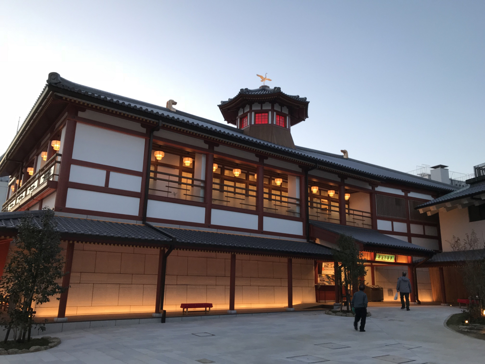
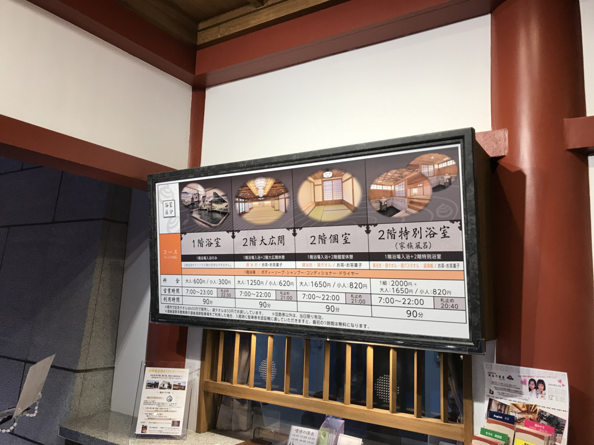
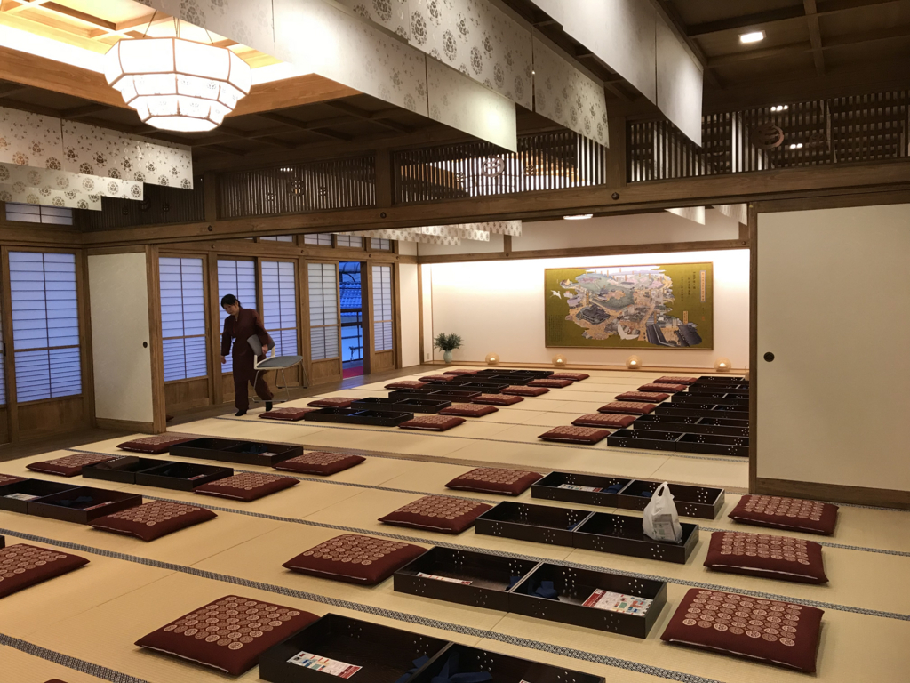
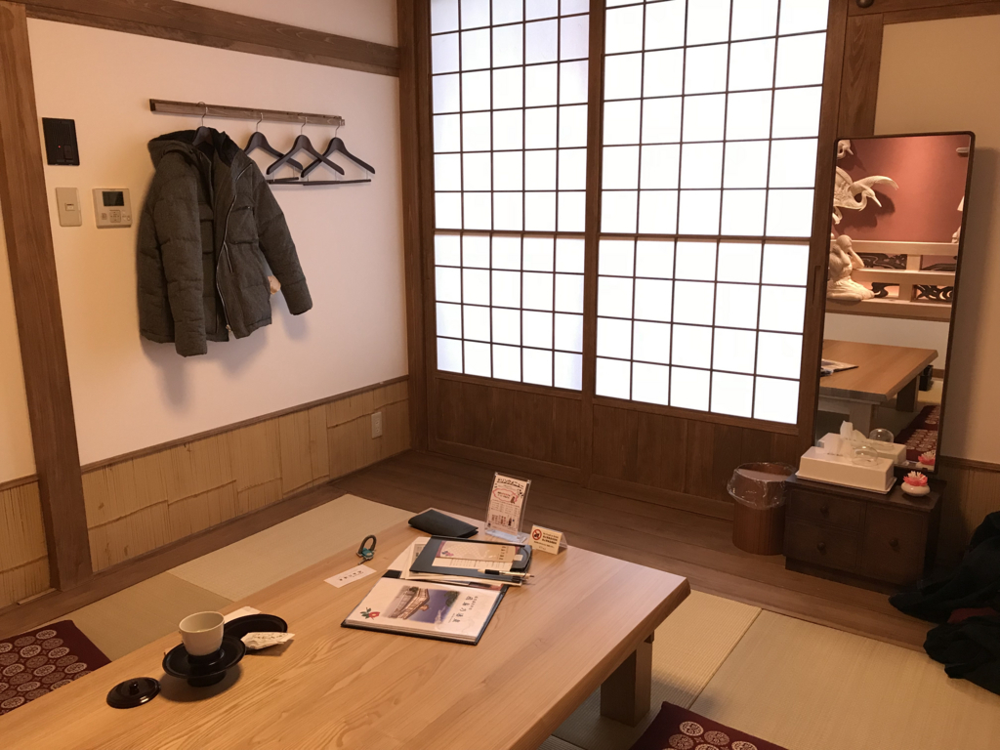
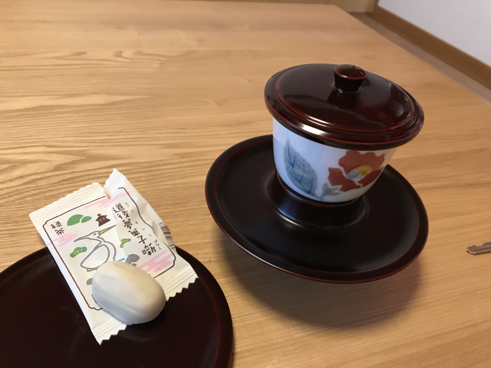
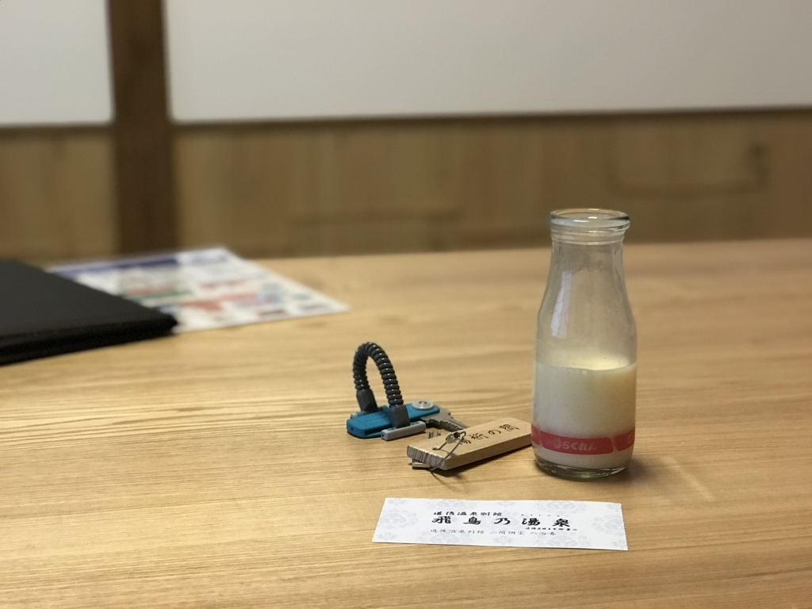
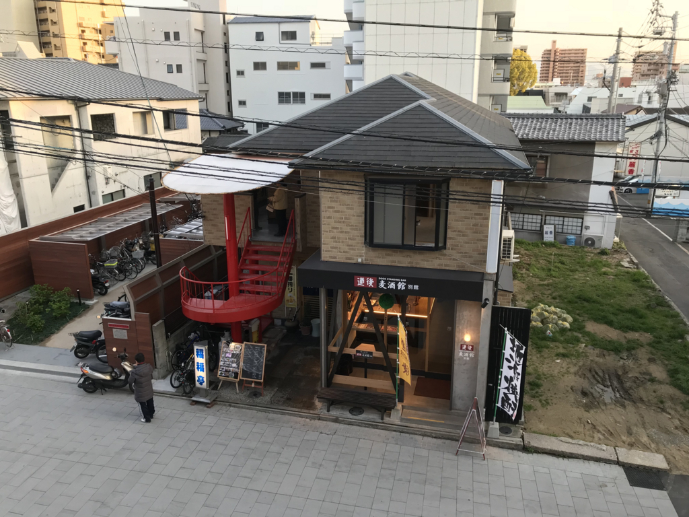

先週の金曜日、仕事が早く片付いたので、久しぶりにバイクのエンジンに火を入れて、ぶらっと道後温泉まで行ってきた。今回は観光客でババ混みの本館じゃなくて、新しくできた「飛鳥の湯」を偵察。オープン当初は混んでたみたいだけど、さすがにもうサクッと入れるじゃろ。

建物は飛鳥時代をモチーフにしているとかしていないとか。正直なところ、あんまり重みを感じない建物だなと思う。もっとガッツリお金をかけて「100年後に重要文化財になるのを狙うぜ」的なノリでつくってほしかったけど、「ない袖は振れない」というやつかな。

料金はこんな感じ。入浴のみ・広間での休憩あり・個室休憩ありの3択で、道後温泉本館と似たようなスタイルだ。本館でいうところの「神の湯」がなくて、入浴のみ・休憩ありにかかわらず、同じお風呂に入るみたい。あと、家族風呂があるんだなー。これは結構いいかもしれない。

外国人のお姉さんが、英語で窓口のおばちゃんとやり取りをしている。お姉さんはどうやらスペインの方で、「Spanish」を「えすぱにっしゅ」と言っているところからも、そんなに英語は得意じゃなさそう（発音は聞き取りやすかったけど）。窓口のおばちゃんが iPad を持ち出して説明をしようとしているが、英語にしか対応していないようで悪戦苦闘している。助け船を出そうかとも思ったけど、あいにく自分だって英語力は大したことないし、藪蛇になるのもイヤで手を出さなかった。「ゆっくり対応してくださって結構ですよ、のんびり待ってますよ」と温顔を湛えながら待つのが、ヘタレなワイにとっては精いっぱいの助け舟でござる。

5分ほど待たされて、やっと自分の番がくる。今回は2階の個室（1,650円）をとってみた。一人でも大丈夫なのかなと少し不安になったけど、空いてる時間でもあり、イヤな顔はされなかった。

できたばかりということもあって、内装はすごくきれい。階段は広く、傾斜は緩やかで、本館にはないエレベーターも完備してる。休憩用の大広間は本館を踏襲しているようだ。本館が混んでて入れないならともかく、これならば個室を選ぶべきだろう。

というのも、個室はそれぞれテーマが設けられていて、どれも内装が凝っている。休憩している人がいなければ好きな個室が選べるようだが、ついつい目移りしてしまう。

今回は端の「湯桁（ゆげた）の間」を選んだが、ここには西条のだんじり祭り（愛媛では有名なお祭り）の彫り物が一面に施してある。

あと、カギがしっかりしているのはよいと思った。本館にはセキュリティという概念がほぼないのだけど、さすがに「飛鳥の湯」は新しいだけあってその辺は割としっかりしている。

<ul>
<li>下駄箱のカギ：カウンターに預けるとロッカーのカギにグレードアップ。100円玉が必要だが、戻ってくる</li>
<li>ロッカーのカギ：脱衣場で使う。番号は指定</li>
<li>個室のカギ：本館とちがって部屋に貴重品を置いておいてもあまり不安はない</li>
</ul>
ちょっとスーパー銭湯チックになってしまってはいるけど、まぁ、そこは仕方ないかな。本館はガバガナすぎるから……それだけ防犯に気を付けなくちゃいけなくなってる状況こそが残念ともいえるけど。

お風呂場の写真はもちろんないが、こっちもモダン。洗い場はシャンプー・ボディーソープ完備で広く、衝立もある。浴槽は本館1階よりも1.5倍ぐらい大きい感じ（あっちは2つあるけど）。あまり開放的ではないが、外気の入る露天風呂もあり、酒呑童子（椿）や伊予椿などが楽しめる。季節によって変わるのかもしれないな。露天風呂にある木彫りっぽいレリーフは、ぱっと見、ただヒダヒダみたいな文様が描かれているだけのようだけど、よくみると道後温泉周辺の地形図になっているみたいだ――間違ってるかもしれんけど。

もう一つ必見なのは、壁面。砥部焼の陶板でできていて、大浴槽の壁面などは、ときどき朝から晩への移り変わりがライトアップで表現される。まぁ、こういう演出の是非はともかく（なんつうか、ツクリモノには風情を感じないたちなので！）、一度見る分には結構楽しい。

湯上りには本館と同様、茶菓子が出る（休憩するときだけ）。お菓子は2種類選べるようだけど、味はともかく、ちょっと小ぶりすぎて物足りない感じがある。本館の坊ちゃん団子では物足りなさをあまり感じなかったのは、団子が3個あるからだろうか。

ってなわけで、フルーツ牛乳も追加した。インターホンで注文できるのがナウい。

戸を開けて濡れ縁に出てみると、真下に道後麦酒館がある。完全に罠だが、バイクできていたおかげでハマらずにすんだ。電車できていたら、絶対に吸い込まれていた。

全体的に見て、格の点ではまったく本館にかなわないけど、見るべき点は割とあると思う。松山だけではなく、ほかの地域の魅力にも少し触れられるのはいい。でも、アクティブな訴求が先行し過ぎというか、ちょっとてんこ盛りすぎというか、もうちょい雰囲気を持たせた・パッシブな魅力にも配慮してくれたら結構よくなると思う。「和」のよさって、もともとそういうものじゃない？　まぁ、（大陸に結構目が向いていた）飛鳥時代がモチーフっぽいから、もともと「和」を目指してないのかもしれないけど。

本館はちょっと人が多すぎるから、のんびりしたい人は外観を見るにとどめて（それか朝一で入って！）、温泉は「飛鳥の湯」で楽しむのもいいと思う。個人的には割と気に入ったから、またふらっと入りに行きたい。

