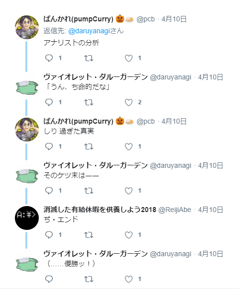

今日は朝から押し入れの整理整頓。東京に行きの荷物もそろそろ作らないといけない。今回はモニターを2台、実家にもっていって、お仕事環境を作る。ストレスなくお仕事ができる環境が出来上がったら、ちょっと長めに滞在する予定だ。実家でゴロゴロ、朝昼三食掃除洗濯付きの生活をゆっくり満喫したいし（なお、お金は収めなければならない模様）、会いたい人も多いしね。

<h3>ツイートがバズった</h3>

先日、なぜか知らないけどやたらツイートがバズってしまった。

<blockquote class="twitter-tweet" data-lang="ja">
「Web で契約できるものは Web で解約できなければならない」 「解約の手順数は、契約の際の手順数を超えてはいけない」  法律にしたい
&mdash; ヴァイオレット・ダルーガーデン (@daruyanagi) <a href="https://twitter.com/daruyanagi/status/983557822070734848?ref_src=twsrc%5Etfw">2018年4月10日</a></blockquote>

最終的には3万RTまでいったみたいだけど、ここまでバズるといろいろ面白いことが分かる。

<h4>とくに理由などない</h4>

似たようなことは昔から何回も言っているわけで、今回だけ「いいこと」（？）を言ったわけではない。

<blockquote class="twitter-tweet" data-lang="ja">
解約料みたいなのはなくす方法でよろしくお願いしたい。そういうロックインめんどい。あと、契約と同じぐらいの”気軽さ”で解約できるように。ネットで契約できるのに、解約は電話（繋がらない）とかはこの際一掃したいものだなぁ
&mdash; ヴァイオレット・ダルーガーデン (@daruyanagi) <a href="https://twitter.com/daruyanagi/status/765944570425118722?ref_src=twsrc%5Etfw">2016年8月17日</a></blockquote>

<blockquote class="twitter-tweet" data-lang="ja">
簡単に契約できるのに、解約はできないのって、Yahoo や GMO 並みだということだぞ！？
&mdash; ヴァイオレット・ダルーガーデン (@daruyanagi) <a href="https://twitter.com/daruyanagi/status/837486041036533761?ref_src=twsrc%5Etfw">2017年3月3日</a></blockquote>

<blockquote class="twitter-tweet" data-lang="ja">
サービスを解約する人は、また契約してくれるかもしれない人なんですよ！
&mdash; ヴァイオレット・ダルーガーデン (@daruyanagi) <a href="https://twitter.com/daruyanagi/status/837515925012131840?ref_src=twsrc%5Etfw">2017年3月3日</a></blockquote>

「刺さる」（←あまり好きではない表現）言い回しってのはあるのかもしれないけど、結局のところ、バズるとか炎上するというのはタイミングだの、めぐり合わせだのというのが大きく影響するなーって思う。

あと、たまにバズらせるためにいろいろ頑張るヒトがいるけど、そういうのって「収穫めっちゃ逓減」だからそこそこにした方がいいと思う。バレると印象もよくないし。SEO とかも最低限のことをちょろっとやったら、あとは内容の充実にリソースをつぎ込んだ方がいいと思うんだよね。

<h3>いろんなリプがくる</h3>

リアクションが500を超えたぐらいから、よくわかんないリプライがくるよね。まぁ、スルーしとけばいいんだけど、万を超えると類型がだいたい出そろってくる。

一番よくあるのが、<b>「俺にリプライくれても困る」</b>パターン。

<blockquote class="twitter-tweet" data-lang="ja">
GMOさーん？聞こえてますかー？ポケットWifiとプロバイダ料込みで縛り契約して、違約金なし契約解除時期を電話で聞こうとしても全くつながらず、メールサポートにわざわざ連絡を要し、解約手続きの導線もぐちゃぐちゃで郵送受付、しかも解約後に使用料誤請求かましたGMOさん、聞こえてますかー？
&mdash; れごどーる（準備中@洛西交通企画） (@legodoll) <a href="https://twitter.com/legodoll/status/983750882939494401?ref_src=twsrc%5Etfw">2018年4月10日</a></blockquote>

リプライくれても GMO には聞こえませんよ！　まぁ、でも Twitter に慣れてないんだったらよくある話で、あんまり目くじら立ててもしょうがないと思う。

あとは、<b>「個人的な体験を聞かせてくれる」</b>パターン。以下は、先ほどのツイートに対する巻き込みリプライの事案も兼ねた例。

<blockquote class="twitter-tweet" data-lang="ja">
楽天モバイル絶対解約する！と決めて、いろいろ調べてたら、その悪質さに震えました。。がんばって戦います。。涙
&mdash; ✳︎ △ＳＵＭＩ ☆ (@asumi403) <a href="https://twitter.com/asumi403/status/983877325459615744?ref_src=twsrc%5Etfw">2018年4月11日</a></blockquote>

あんまりリテラシーがないクラスターに飛び火すると、こういうのが一挙に増えるが、まぁ、こういうのも別に不快じゃない。みんなそれぞれに発達段階ってのがあるわけで……学びの途中の人にキツい言い方をしちゃうのはよくない。そっと見守るのじゃ……

でもな、正直こういうのは鬱陶しいし、見苦しいと思うぢゃよ。

<blockquote class="twitter-tweet" data-lang="ja">
同じではありません。契約という法律行為を説明するうえで、「無効」と「解除」では明確に違う意味を指します。ここは民法においてかなり初歩的でかつ重要な部分でして、見ている方が恥ずかしくなるレベルの文書なので早急にツイ消しされる事をオススメします。
&mdash; まち針@FGO (@Marking__pin) <a href="https://twitter.com/Marking__pin/status/983980514326573057?ref_src=twsrc%5Etfw">2018年4月11日</a></blockquote>

<b>他人巻き込んでケンカするなよ。</b>しかも煽り方が中学生か？っていうレベルの稚拙さで、こっちの方が黒歴史を思い出して恥ずかしくなる。もうちょい専門チックなヒトのツッコミだったらいろいろ勉強になっただろうけど、これではなぁ。

<blockquote class="twitter-tweet" data-lang="ja">
横から失礼します。 一昨年消費者保護ルールの改定がありまして、ある程度指定されたルールができしました。Webはブラウザに依存するため細かい指定がされてないんですが…。 ひどければ総務省さんにチクるといいですよ。 <a href="https://t.co/XaNRTKnqmP">pic.twitter.com/XaNRTKnqmP</a>
&mdash; ようこ@滋賀2day→桃響導夢 (@yoko_momoclo) <a href="https://twitter.com/yoko_momoclo/status/984067565935673345?ref_src=twsrc%5Etfw">2018年4月11日</a></blockquote>

こういうのだったら結構勉強になるのにね。それにしても、ルールの増改築で意味不明なことになってんな。たまにリファクタリングして、今回の提言みたいに<b>「契約コストと解約コストをバランスさせよう」</b>といった原則にまとめられないものかなぁ。

<blockquote class="twitter-tweet" data-conversation="none" data-lang="ja">
Webで解約はいいとしても仮にも自分の意思で契約したものを簡単になかった事にできるというのは逆に問題が起こりそう 解約、言い換えれば契約破棄のハードルは最低でも契約そのものよりも高くあるべきかと
&mdash; 月城＠むげんだいでござる(*ﾟ∀ﾟ) (@castle0722) <a href="https://twitter.com/castle0722/status/983860820005158912?ref_src=twsrc%5Etfw">2018年4月11日</a></blockquote>

その点では、さっきのケンカのおおもとになったこのツイートも本質を外してると思う。まぁ、今回の提言を一般的な意味での「契約」に当てはめるとうまくいかないよって言いたい（のだろうと思う）のはわかる。制約をかけて、原則を当てはめるべき契約の種類を狭めないといけない。

あいにく法学はまったくしらんので、どういう風に制約をかければいいのかよくわからんけど、たとえば<b>「1対多のコモディティ契約において、サービスの提供者は契約コストと解約コストのバランスを著しく欠いてはならない」</b>とかになるんだろうか。

最初のツイートで「法律にしたい（でもできないよね）」って言ったのも、「この提言は原則としては有用だと信じるけれど、実際の法令にするには課題が多いよね」といったことを含ませていたつもりだ（← ただし、これはエスパーでもなけりゃ読み取れないと思う）。

あと、こういうのもちょっとね。

<blockquote class="twitter-tweet" data-conversation="none" data-lang="ja">
無駄に契約の手順数増やされそう…
&mdash; 白夜@p9集めたいマン (@byakuya_tcg) <a href="https://twitter.com/byakuya_tcg/status/983666554473611264?ref_src=twsrc%5Etfw">2018年4月10日</a></blockquote>

「契約の手順を増やし」たら、契約までのハードルがあがって成約率が下がるじゃん。だから企業には契約の手順を短くするインセンティブがある。必要であれば法令で手順を延ばすように仕向けることすらあるぐらいだ（本人確認や重要事項説明の義務など）。それと比べ解約では、企業は手順を長くするインセンティブをもつ。契約を失うことは利益を失うことだし、最悪の場合、競合企業に利することになる。

自分でも思いついていない例外があるかもしれないけれど、本質をつかんでいれば考えなくていいケースを例にツッコんでいるわけで、まぁ、こういうのは「よく読んでから出直してきてね」って感じやね。<b>「本質を外した」</b>パターンとでもいうべきか。

鬱陶しい例を挙げちゃったので、お口直しで自分の好きなパターンを。

<blockquote class="twitter-tweet" data-conversation="none" data-lang="ja">
 <a href="https://t.co/ppDNw7A9KO">pic.twitter.com/ppDNw7A9KO</a>
&mdash; 知欠健太郎【公式】🔵 (@myuutasu) <a href="https://twitter.com/myuutasu/status/983720078108585985?ref_src=twsrc%5Etfw">2018年4月10日</a></blockquote>

これは<b>「おもわずクスッとしちゃって悔しい」</b>パターンやな。こういうのばっかりだったら、Twitter も平和なのに。

<h3>フォロワーが少し増える</h3>

あと、ツイートがバズると少しフォロワーが増える。たぶん「面白そうなことをいう人」という認識なのだろうけど、そういう期待をもたれるのは経験上、ロクなことにならない。

なので、バズった後はちゃんとタイムラインを中和しておく必要がある。

<blockquote class="twitter-tweet" data-lang="ja">
なんか今日はうんちがいっぱいでるなー
&mdash; ヴァイオレット・ダルーガーデン (@daruyanagi) <a href="https://twitter.com/daruyanagi/status/983876551727984640?ref_src=twsrc%5Etfw">2018年4月11日</a></blockquote>

<blockquote class="twitter-tweet" data-lang="ja">
うんちかたかった……穴が痛い……
&mdash; ヴァイオレット・ダルーガーデン (@daruyanagi) <a href="https://twitter.com/daruyanagi/status/983844878923673600?ref_src=twsrc%5Etfw">2018年4月10日</a></blockquote>

これでお堅い人はフォローを外してくれるだろう。

まぁ、こういうロクでもないことになったりもするけど……これはこれで平和ってことでｗ

