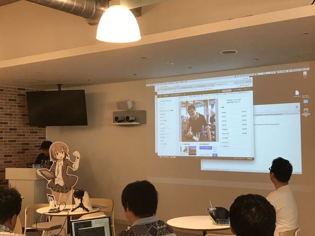
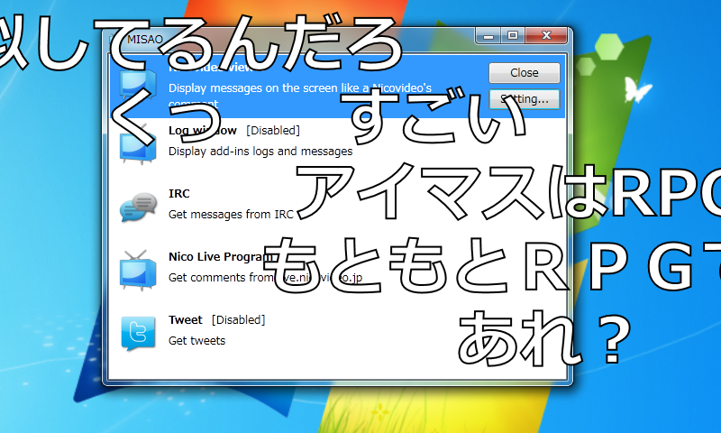

今年もやるっぽいので、よろしくお願いします！（52回でいいのかな？　間違ってたらごめん！）

<iframe src="https://hatenablog-parts.com/embed?url=https%3A%2F%2Fatnd.org%2Fevents%2F96211" title="2018/06/16 プログラミング生放送勉強会 第52回＠サイボウズ株式会社 松山オフィス : ATND" class="embed-card embed-webcard" scrolling="no" frameborder="0" style="display: block; width: 100%; height: 155px; max-width: 500px; margin: 10px 0px;"></iframe><cite class="hatena-citation"><a href="https://atnd.org/events/96211">atnd.org</a></cite>

とりあえずスピーカーがまったくきまってないので、誰かお願いします……最悪、だるやなぎトークがんばるしかない……orz

<h3>プロ生って何？</h3>

たぶんニコニコ生放送発祥の IT 勉強会コミュニティです。IT に関することならジャンルを問わず、みんなで持ち寄って発表をしています。今ハマってる面白いこと、お仕事でこんなことやってる、俺はこんな失敗をした、こんなことやってみました……だいたいなんでもオッケーなはず。

勉強会の内容は、たぶんオンライン配信されます。視聴者のコメントは「MISAO 」でニコニコ動画風にプレゼンに表示されることも多いです。たまにマサカリも飛んできますけど、キニシナイ。

<a href="https://archive.codeplex.com/?p=misao">https://archive.codeplex.com/?p=misao</a>

愛媛では毎年6月にやるのが半ば恒例です。今年がうまくいけば、来年もまた開催できると思うので、是非ともよろしくお願いします。昨年の様子を知りたい方は、<a href="https://atnd.org/events/96211">https://atnd.org/events/96211</a> に参加体験記のリンクを張っていますので、参考にしてください。

<h3>参加したい！</h3>

現地でお会いしましょう。<a href="https://atnd.org/events/96211">https://atnd.org/events/96211</a> から申し込んでね！

オンライン視聴も歓迎です（たぶん配信されるのだと思う

<h3>スピーカーがしたいんだけど</h3>

Twitte/@daruyanagi やこのブログのコメント、なんでもいいのでコンタクトをいただければ。顔出しは困るという方も相談に乗ります（基本的に配信されるのはスライドだけかな？

ライトニングトーク（LT）や準備のお手伝いをしたいという方も歓迎です。例年、県外から来てくれる方も多いのですが、できたら県内の学生とかに頑張ってほしいかなーって、おじさんは思っています。

<h3>参加費は？</h3>

不要です。家におやつが余ってれば、一品持ってきてくださるとみんなが喜びます。

懇親会は、去年4,000円でした。今年も同じところに仕様かなって思ってるので、同じ額になる予定です。ちなみに、学生の方は申し出ていただければ半額になります。タダじゃなくてごめんね。

