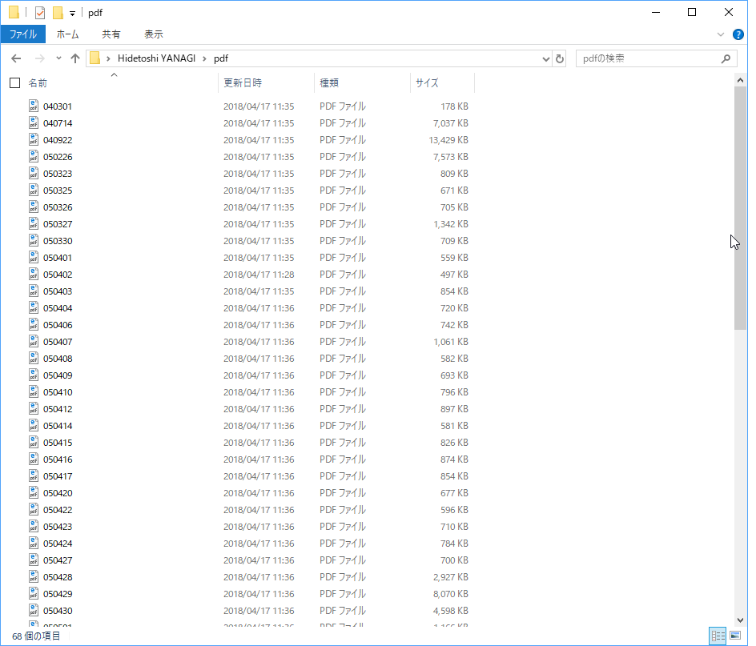
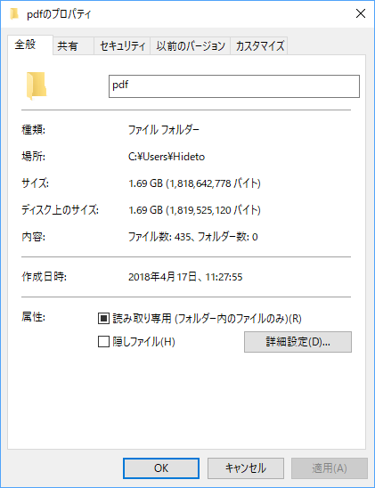

<pre class="code lang-ps1" data-lang="ps1" data-unlink>$source = &quot;https://www.asahi.com/articles/ASL4J669JL4JUEHF016.html&quot;
$folder = &quot;C:\Users\Hideto\pdf&quot;

$result = Invoke-WebRequest $source -UseBasicParsing
$urls = $result.Links.href | Get-Unique |  where { $_ -match &quot;.pdf&quot; }

foreach ($url in $urls)
{
$file = ($url  -split &quot;/&quot;)[-1]
Invoke-WebRequest -Uri $url -OutFile (Join-Path $folder $file)
}
</pre>

結構量があるんだなぁ……（終わらねぇ。文学作品として割と楽しめるらしいので、ダウンロードが終わるの楽しみ☆（ゝω・）vｷｬﾋﾟ

それはともかく、PowerShell、もっとうまく、サクッと書けるようになりたいなぁ。

<h3>元ネタ</h3>

<blockquote class="twitter-tweet" data-lang="ja">
イラク日報ぶっこ抜きスターターパック $ curl <a href="https://t.co/nt7h0I8NpE">https://t.co/nt7h0I8NpE</a> | grep &#39;&lt;td class=&quot;link&quot;&gt;&#39; | grep pdf | awk -F&#39;&quot;&#39; &#39;{print $4}&#39; | xargs wget
&mdash; opensorter (@opensorter) <a href="https://twitter.com/opensorter/status/985894737071652866?ref_src=twsrc%5Etfw">2018年4月16日</a></blockquote> 

<h3>追伸</h3>

ナメてたけど、結構量が多かった。ダウンロード中のファイルを一つ開いちゃって、ダウンロードに失敗したにもかかわらずこんなにデカくなったぞ……。

