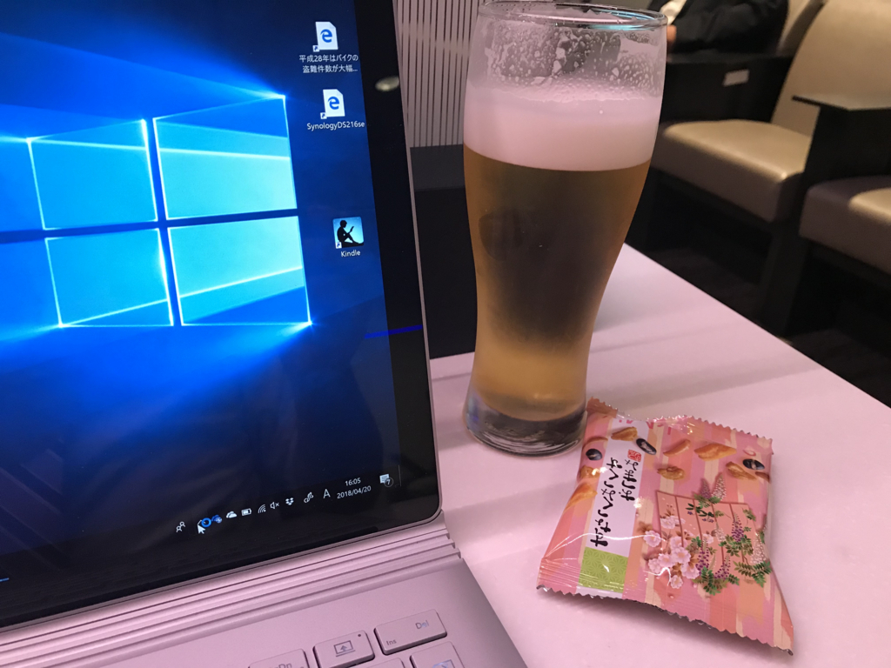
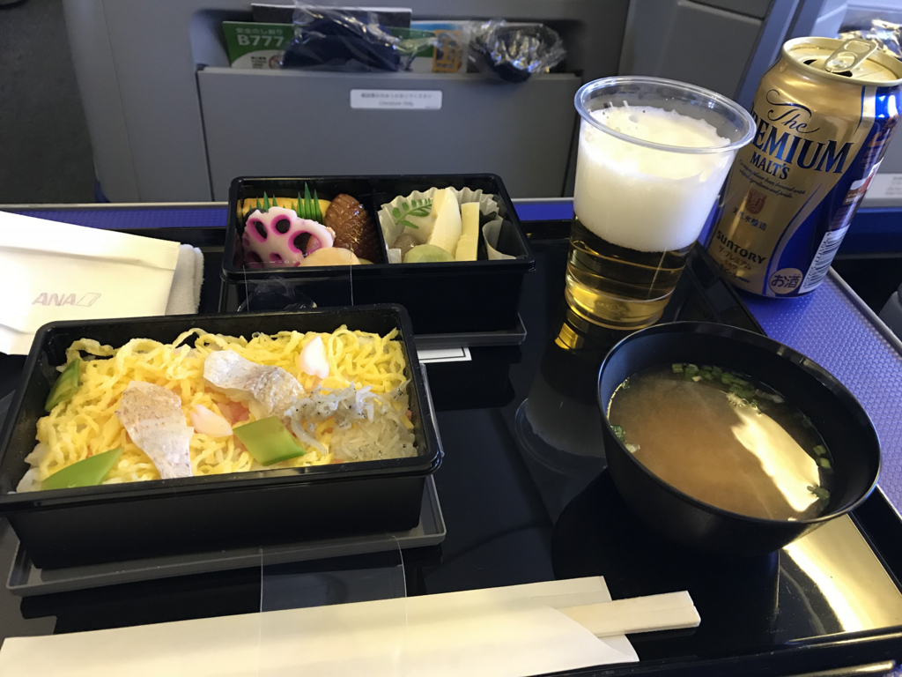

さる20日、38歳になりました。メッセージをくれた方、プレゼントを贈ってくれた方、ありがとうございます<a href="#f-326be073" name="fn-326be073" title="出かけ際にちょうどクロネコがきたから、アウトドア枕しか確認できてない！">*1</a>。もう祝ってもらうような歳でもないのに、ちょっと恥ずかしいですけど……<b>まだ生きててよさそうだな</b>っていう実感が得られました（ぉ

この日は仕事を早めに切り上げて、17:20 の便で羽田へ。この日から数週間、実家でゴロゴロするつもりです。この日はお誕生日ということでプレミアムクラスを奢りました。

キャビンアテンダントさんは奇麗だったし、機内食はおいしかったし、大変寛げました。

仕事終わってからの移動は疲れてるし、時間も読めないし、ちょっと高くても予約変更可能なチケットで。帰りの便はケチって LCC で。最近はメリハリをつけた飛行機の使い方ができてきて、ようやく移動にも慣れてきたなって感じですね。まぁ、羽田と成田間違えないようにしないとだけど……。

羽田着はちょっとおくれて7時過ぎ。京急に乗れたのが結局7時半過ぎでした。そこから小岩までなんだかんだで1時間……ほんとこのルートにグリーン車がほしい。成田からの特急は青砥とばして日暮里まで行くのがつらいし……飛行機より電車に改善の余地多いと思う。

そのあとは小岩で日付が変わるちょい前まで飲みました。弟1号に加え、古い友人も参加してくれて、楽しかったです。しゃべって飲むのに忙しくて、写真がいちまいもない。

ほんとは38歳の抱負でも書くべきなのだろうけど、東京はいろいろ忙しいので、今日はここまで。空気が悪くて、目がしばしばするし、鼻水は出るしでつらいけど、久しぶりの実家をしばらく満喫しようかと思います。

<a href="#fn-326be073" name="f-326be073" class="footnote-number">*1</a>:出かけ際にちょうどクロネコがきたから、アウトドア枕しか確認できてない！

