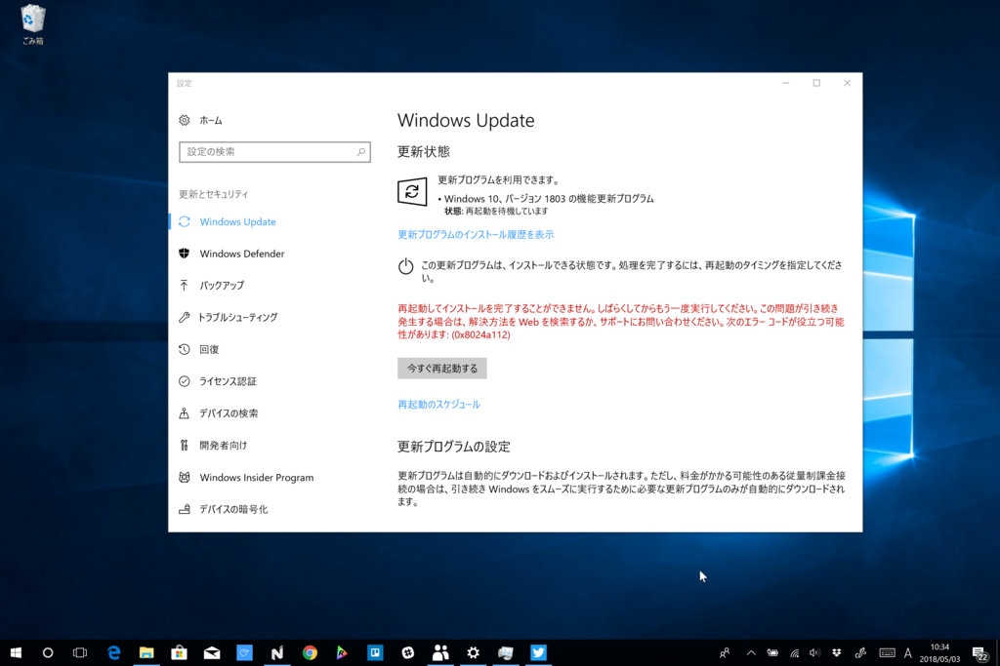
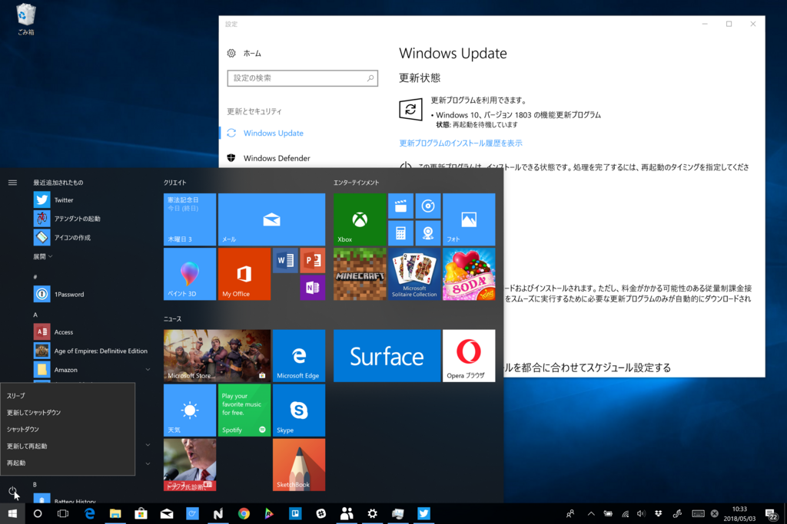
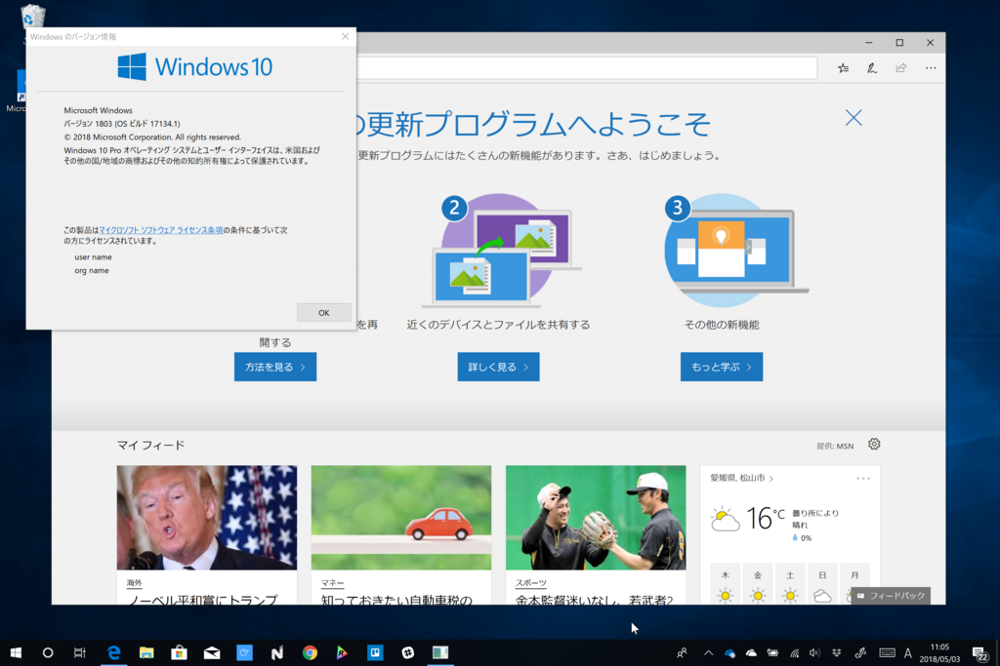

いささか旧聞に属するが、Surface Book 2 に Windows 10 April 2018 Update を入れた。

<iframe src="https://hatenablog-parts.com/embed?url=https%3A%2F%2Fblogs.windows.com%2Fwindowsexperience%2F2018%2F04%2F27%2Fmake-the-most-of-your-time-with-the-new-windows-10-update%2F" title="Make the most of your time with the new Windows 10 update" class="embed-card embed-webcard" scrolling="no" frameborder="0" style="display: block; width: 100%; height: 155px; max-width: 500px; margin: 10px 0px;"></iframe><cite class="hatena-citation"><a href="https://blogs.windows.com/windowsexperience/2018/04/27/make-the-most-of-your-time-with-the-new-windows-10-update/">blogs.windows.com</a></cite>

Windows 10 April 2018 Update もこれまでの機能アップデートと同様、段階的にリリースされるはずだけど、Surface Book 2 は Microsoft 製デバイスだからか、解禁とともに入手できるようになっていたようだ（うちでアップデートしたのは5月3日だけど、1日にはバッグラウンドでダウンロードされていたみたい）。

PWA「Twitter」アプリを試してたらアラートがでたので、ちょうど朝昼兼食タイムだったこともあり、そのままアップデートを実行――したのだが、失敗／(^o^)＼

0x8024a112 エラーがでた。ただ、このエラーはたいしたことがない（？）ようで、［スタート］画面左下の電源アイコンから［更新して再起動］などを選ぶと問題なくアップデートできるらしい。

世間では Google Chrome や Cortana で問題が発生していると話題だけど、うちの端末はとくに問題なし。ただ、期待の「Quiet Hours」機能（日本語では「集中モード」かな？）が効いていないというか、Age of Empires で遊んでるあいだもトーストがでる。

Windows 10 の機能アップデートも早……何回目だっけ？　数えるのめんどくさいや。ともかく、回数を重ねるにつれて慣れてきたというか、標準的なデバイス構成であればトラブルなく、サクッとアップデートできるようになってきたようでなにより。今回は

<ul>
<li>Edge のインク機能強化（PDF/EPUB</li>
<li>dGPU 設定</li>
<li>手書き入力の強化</li>
</ul>
あたりが Surface Book 2 向けの強化といえるだろうか（ほかにもいっぱいあるけど）。どれもまだ試せていないけれど、アップデートのたびに使い勝手がよくなっていてうれしい。

