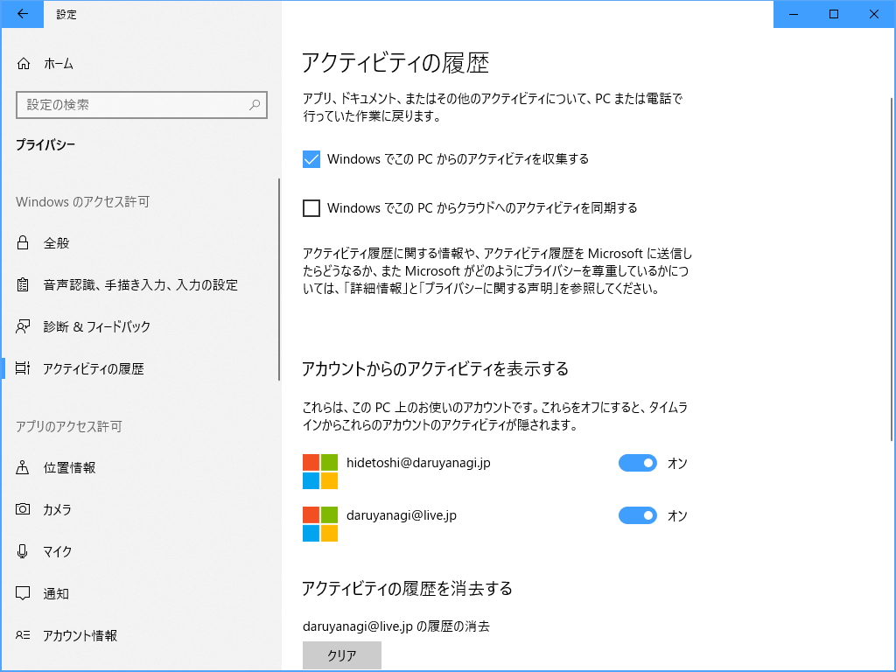
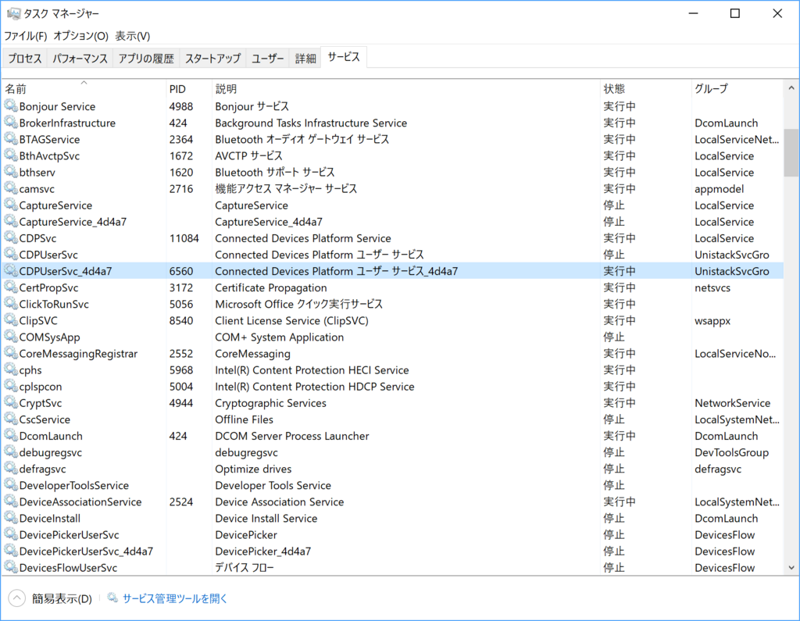

Dropbox ローカルフォルダーでファイル操作を行うと Explorer をクラッシュさせるようだ。しばらく待っていればファイル操作は完了するが、CPU を1コア使い切ったりするので、OS 全体のパフォーマンスに影響が出る（追記：コラボレーションに利用していると相手側のファイル操作でもこちら側の OS が半分フリーズしてつらい！！）。

Dropbox クライアントのバージョンは 48.4.58。Qt を使ってるみたいだけど、管理 UI の HiDPI 対応もイマイチだし、しょうもない機能を追加するぐらいならばネイティブで作り直してほしい感じする。

Windows 10 April 2018 Update ではそのほかにも Google Chrome や Mozilla Firefox で互換性問題が出ているようだが（Firefox はマイナーアップデートで修正済み、Chrome はウチの環境では問題ない）、これらはかならずしも OS のせいとは言えない。OS の仕様変更がアプリの実装不備を顕在化させるケースもあるわけで、要するにテスト不足だ。

Insider Preview でもっとサードパーティー製アプリのテストをしてもらうにはどうすればいいか、もう少し考えないといけないかもしれない。わいの仕事ではないけど。

<h3>追記（2018/06/07 19:00）</h3>

Dropbox をアンインストールして、ビルトインの OneDrive を代わりに利用したところ（OneDrive にも他のユーザーとフォルダーを共有する機能あるんだな！）、少しだけ状況はましになった……けれど、やはり全体的にもっさりしているし、ときどき Explorer が「応答なし」になっているようだ。これは海外でも報告があるらしい。

<iframe src="https://hatenablog-parts.com/embed?url=https%3A%2F%2Fnews.softpedia.com%2Fnews%2Fwindows-10-april-2018-update-bug-causes-explorer-exe-to-crash-repeatedly-520995.shtml" title="Windows 10 April 2018 Update Bug Causes Explorer.exe to Crash Repeatedly" class="embed-card embed-webcard" scrolling="no" frameborder="0" style="display: block; width: 100%; height: 155px; max-width: 500px; margin: 10px 0px;"></iframe><cite class="hatena-citation"><a href="https://news.softpedia.com/news/windows-10-april-2018-update-bug-causes-explorer-exe-to-crash-repeatedly-520995.shtml">news.softpedia.com</a></cite>

ワークアラウンドとして

<blockquote>

According to some users, fixing this bug comes down to disabling Windows Timeline. To do this, go to Settings > Privacy > Activity History and set the option called Let Windows sync my activities from this PC to the cloud to off.

</blockquote>

などと書かれているが、うちの環境ではもともとオフだった。

あとはユーザーアカウントデータが壊れているから作り直したら、GPU ドライバーのせいじゃねえのっていう話があるみたいだけど、Insider Preview のときも OneDrive がクラッシュする問題はあったし、リパースポイントなんか、ファイルシステム周りで仕様変更があったんではないかって個人的には想像してるが……どうだろ。

<h3>追記（2018/06/07 22:30）</h3>

<code>CDPUserSvc_****</code> という名前のサービスがあれば止めてみる → あまり効果はないように思えるが、これで直ったという人もいる。

<code>C:\Users\（ユーザー名）\AppData\Local\Microsoft\Windows\（数字四桁）\StructuredQuerySchema.bin</code> というファイルをリネームして再起動する → うちの環境ではこれで直ったように思える。

だんだん当初の問題から離れてきたので、記事を改題。

<h3>追記（2018/06/08 02:30）</h3>

Build 2018 を観ながら仕事をしていたけど、また問題が再発したようだ……あと、OneDrive フォルダー以外でもフリーズが激しくなった。「フィードバック Hub」で問題を報告したけど、ロールバックも検討しなきゃいけないな？

<h3>追記（2018/06/08 13:30）</h3>

ふと［アクティビティ履歴］の設定を確認すると、いつの間にかチェックが入っていたので外し、念のため再起動して再度無効化されていることを確認してしばらく使っていたが、まぁまぁ、快調に動いている。またぶり返すかもしれないけれど、とりあえずは様子見。

<h3>追記（2018/06/09 04:30）</h3>

症状は相変わらず。StructuredQuerySchema.bin をリネームした直後だけなのかな、調子いいのは。

あと、Insider Preview を入れてる Surface 3 でタイムラインがぶっ壊れちゃったことに気づいた……もしかすると Insider Build と Release Build でアクティビティをクラウド同期してたのがまずかったのかなぁ

<h3>追記（2018/06/15 18:00）</h3>

5月の定例アップデートを当ててからは症状は治まった。快適快適

