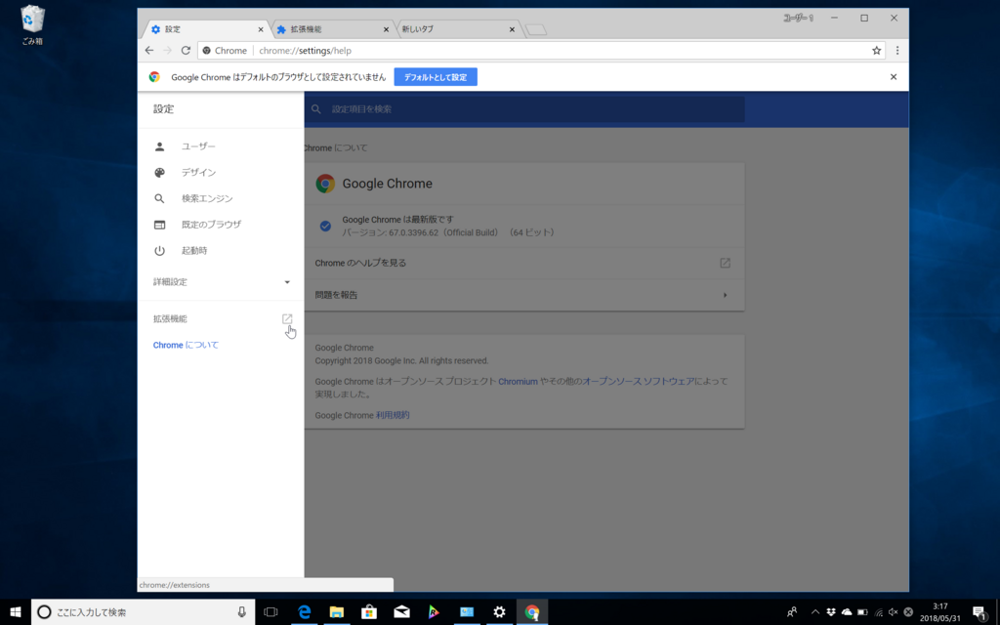
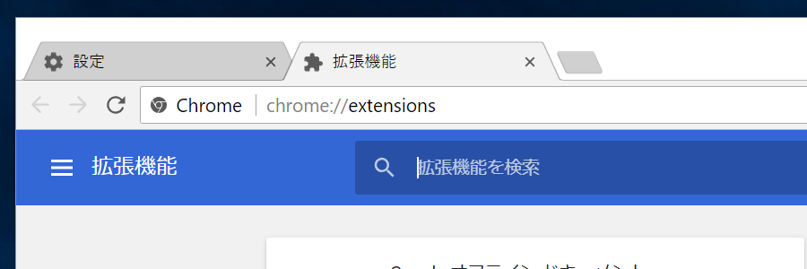
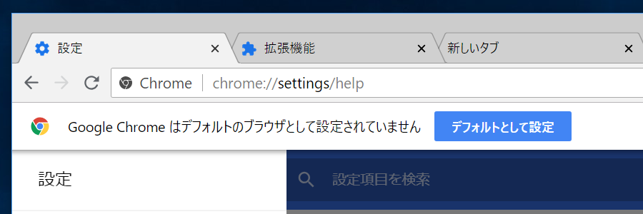
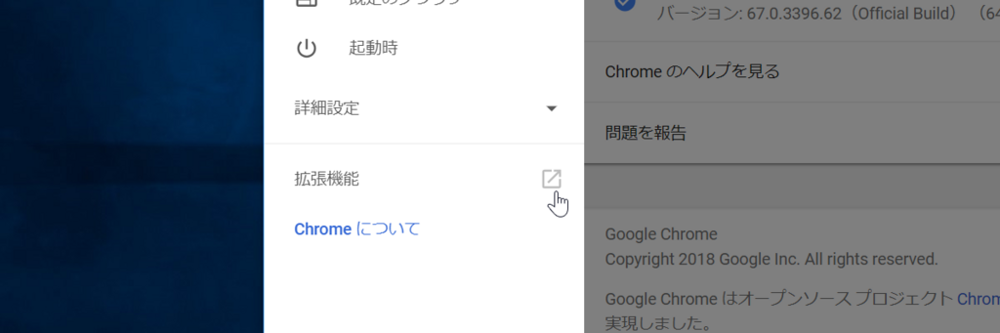
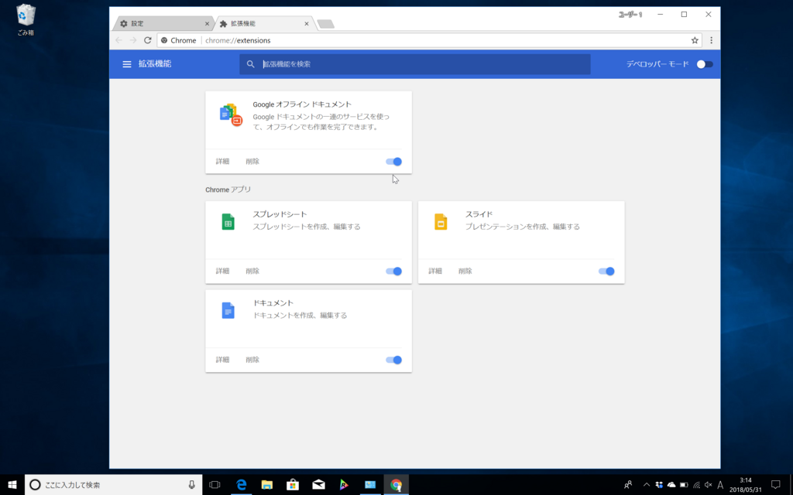

<iframe src="https://hatenablog-parts.com/embed?url=https%3A%2F%2Fforest.watch.impress.co.jp%2Fdocs%2Fnews%2F1124593.html" title="「Google Chrome 67」が正式版に ～“Spectre”脆弱性の緩和策“サイト分離”をテスト／“High”9件を含む34件の脆弱性も修正" class="embed-card embed-webcard" scrolling="no" frameborder="0" style="display: block; width: 100%; height: 155px; max-width: 500px; margin: 10px 0px;"></iframe><cite class="hatena-citation"><a href="https://forest.watch.impress.co.jp/docs/news/1124593.html">forest.watch.impress.co.jp</a></cite>

アップデート時には気が付かなかった細部のフォローアップをしておく。

<h3>アイコンの色が変わった</h3>

Chrome 66

Chrome 67。設定などのアイコンが青色になった（保護された Google Chrome のページ chrome:// であることを示したいのかな）。あと、タブバーの背景色がグレーになっているように思う。

<h3>chrome://settings/ のナビゲーションに chrome://extensions/ へのリンク</h3>

誰も気づかねーよ！　こんなもん！！

ちなみに chrome://extensions/ はちょっと前のバージョンからタイルデザイン（っていうより、マテリアルデザインだな）になっている。

