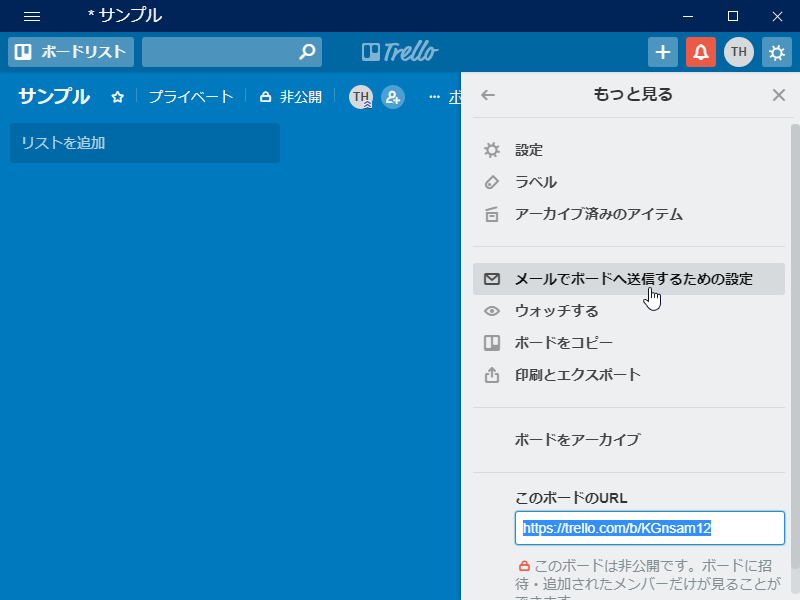
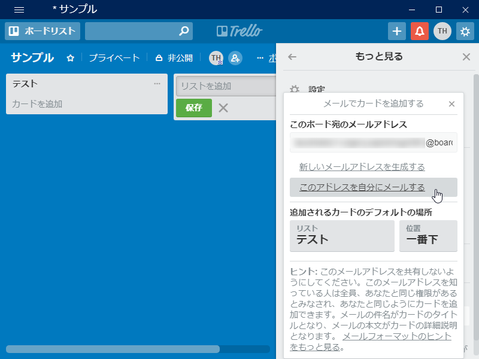
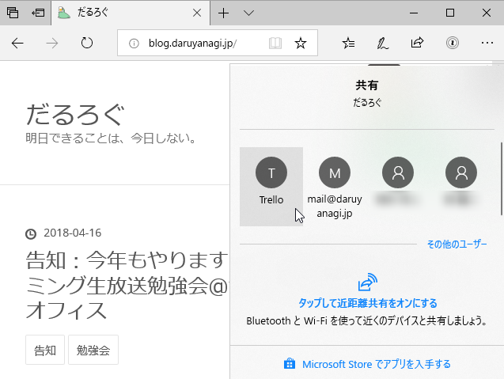

今まで Web ページを「Trello」につっ込むときは、<i>「Create Link」拡張機能で ページタイトル＋改行＋URL というテキストを生成して「Trello」のリスト下部へコピー＆ペーストする</i>という方法をとっていた（ページタイトルがカードタイトルに、URL がカードの概要になります）のですが、

<ul>
<li>リストが長くなると下に余白がなくなって、ペーストが面倒になる（空いたリストに一旦コピーして移動しなければならない）</li>
<li>カードの作成時に概要を編集したい（作成 → 即アプリ連携 する場合、いつもの方法だと概要がしょぼいまま連携されてしまう）</li>
</ul>
といった不満がありました。また、スマホから「Trello」アプリで Web ページを共有する際は、URL が概要ではなく添付になり、デスクトップの場合とスタイルに齟齬が出てしまう。そこで、メールを使って「Trello」へ共有するようにしてみました。メールならば使えないシステムは皆無だし、手順や結果を統一することができます。

やり方は簡単。設定メニューから［メールでボードへ送信するための設定］を開き……

メールアドレスを取得するだけです。メールのタイトルがカードのタイトルに、中身が概要になるみたいですね。添付ファイルは試してませんが、まぁ、イケるんでしょう、知らんけど。

<h3>応用する</h3>

<iframe src="https://hatenablog-parts.com/embed?url=http%3A%2F%2Fblog.daruyanagi.jp%2Fentry%2F2018%2F01%2F23%2F083356" title="Firefox Quantum でつかってる拡張機能（2018年1月版） - だるろぐ" class="embed-card embed-blogcard" scrolling="no" frameborder="0" style="display: block; width: 100%; height: 190px; max-width: 500px; margin: 10px 0px;"></iframe><cite class="hatena-citation"><a href="http://blog.daruyanagi.jp/entry/2018/01/23/083356">blog.daruyanagi.jp</a></cite>

自分は Web ページの更新通知サービス「Distil」を愛用しているのですが、こいつは更新をメールで通知する機能を備えています。メールの宛先を「Trello」の共有アドレスにしてやれば、更新通知をそのまま「Trello」にぶち込めます。

メールアドレスのセットアップを行うにはバリデーション（自分のものか検証する）必要があるのですが、ちゃんと「Trello」がバリデーションメールを受け取ってカードにしてくれるので大丈夫！（ちょっと変な気分だなー）

アドレス帳に登録して「Microsoft Edge」から共有するのも結構快適でした。共有前に不要な部分を削ったり、追加のコメントを足せるのがいい感じですね。

メールアプリがもう少しさっさと起動してくれれば言うことはないんですけど。

