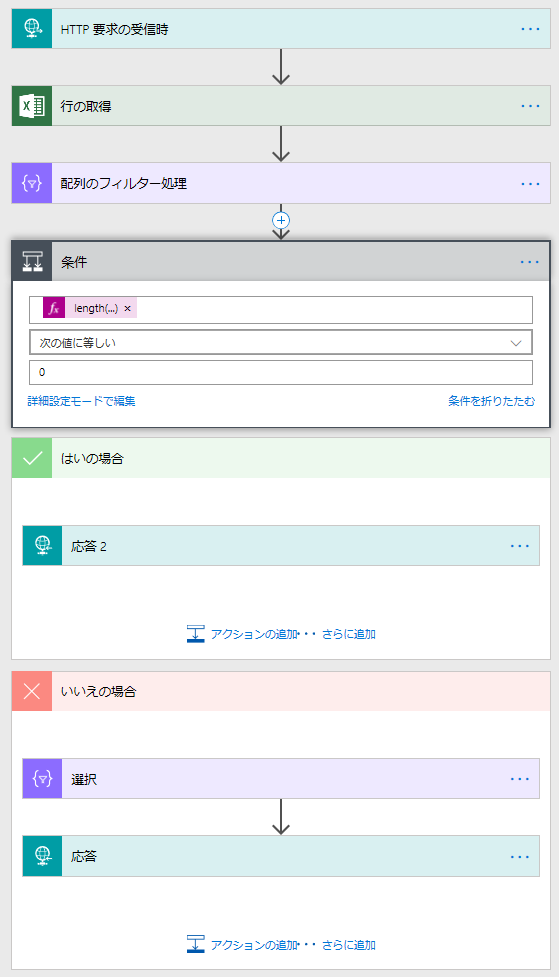
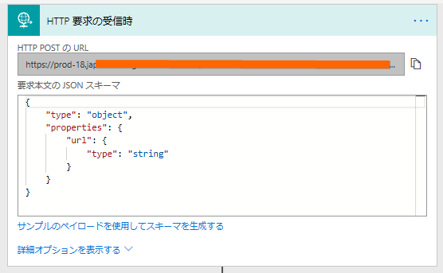
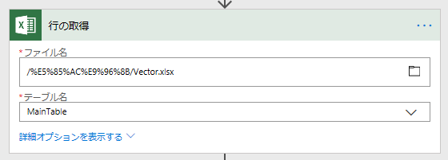
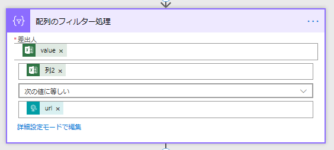
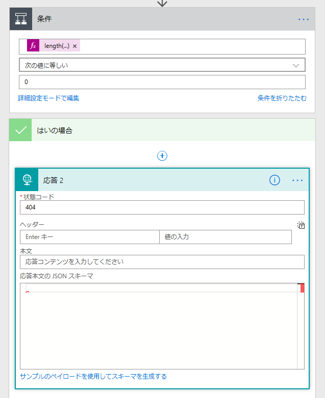
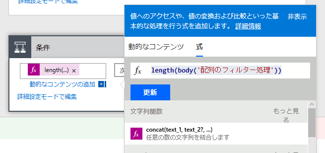
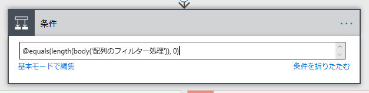
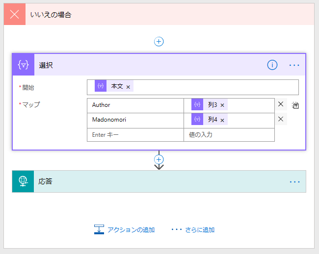
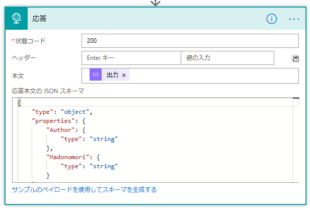
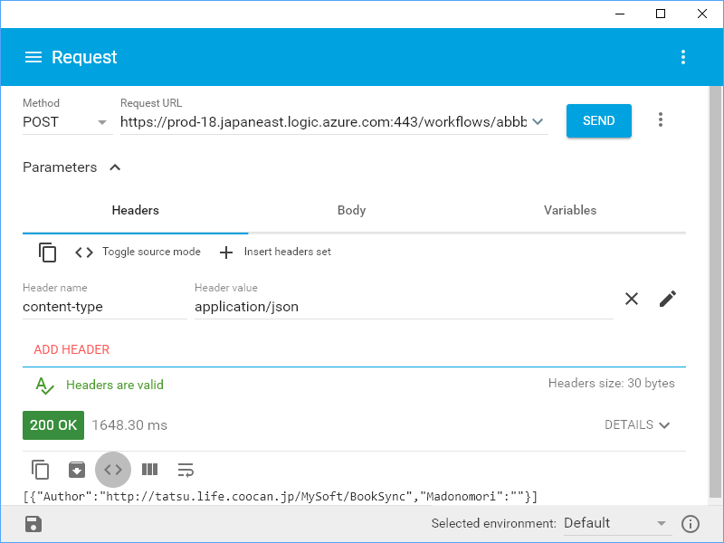

Excel で管理しているデータを Web サービス に再利用したいといったことはままあると思います。そういう場合、普通ならば

<ol>
<li>Excel のテーブルデータをデータベースに移す</li>
<li>スクリプトで Web アプリをガシガシ書く</li>
<li>それを Web サーバーにホストして、アクセスできるようにする</li>
<li>サーバーが落ちたり、プラットフォームの更新があれば対応する</li>
</ol>
という感じで運用するんだと思いますが、ちょっとしたモノにそこまで手間をかけるのはウンコ面倒です。というわけで、今回はそれを Microsoft Flow でやってみました。Microsoft Flow はよく「IFTTT」みたいなものと表現されますが、ずっと強力であることが分かると思います。

Web サービスの方が柔軟性はありますが、Microsoft Flow で作ると

<ul>
<li>Excel なのでみんなで気軽にデータを追加・削除できる（データベースの管理 UI が要らないし、気分的にとっつきやすい。ただし、素人がぐちゃぐちゃにする恐れはある）</li>
<li>スクリプト言語苦手でも、多少ロジックが組める人なら大丈夫（関数とかほとんど出てこない）</li>
<li>サーバーを用意したり、管理する必要がなくなる</li>
</ul>
のは結構メリットなんじゃないでしょうか。

<h3>三分間クッキング</h3>

今回は題材として「なにかを問い合わせたら Excel のデータを舐めて変換する」サービスを作ってみます。たまたま手元に「ベクターのソフト公開ページの URL と作者サイト・窓の杜ライブラリの関係」を管理した Excel ファイルがあるので、それを使って「ベクターの URL を投げたら、作者と窓の杜ライブラリの URL を返す」アプリ（Web サービス）を作ってみます。

完成イメージはこんな感じです。

 

<ul>
<li>JSON で HTTP 要求を受けたら</li>
<li>OneDrive に置いた Excel のテーブルを読んで</li>
<li>ベクターの URL に合致する行を取得し
<ul>
<li>なければ 404 を返す</li>
<li>あれば
<ul>
<li>配列を生成し</li>
<li>200 で JSON を返す</li>
</ul></li>
</ul></li>
</ul>
ウンコ簡単だね！！

<h4>1. JSON で HTTP 要求を受けたら</h4>

まず、［HTTP 要求の受信時］というトリガー（切っ掛け）を追加。［サンプルのペイロードを使用してスキーマを生成する］でサンプルをぶち込んでスキーマを作ります。

今回はシンプルにこんな感じのペイロード（リクエストの中身）にしてみました。

<pre class="code lang-json" data-lang="json" data-unlink>{
&quot;url&quot;:&quot;https://www.vector.co.jp/...&quot;
}
</pre>
Microsoft Flow はたいへん賢いので、これを読み込ませると勝手にスキーマ（リクエストの型枠）を作ってくれます。

<pre class="code lang-json" data-lang="json" data-unlink>{
&quot;type&quot;: &quot;object&quot;,
&quot;properties&quot;: {
&quot;url&quot;: {
&quot;type&quot;: &quot;string&quot;
}
}
}
</pre>
これで受け付けは完了。すごく長い URL が生成されるので、それを  <b>content-type ヘッダーを application/json に</b>して <b>POST</b> で叩けばフロー（一連の処理）が始まります。

<h4>OneDrive に置いた Excel のテーブルを読む</h4>

次に、Excel ファイルを読みます。Microsoft のサービスだけあって、OneDrive との相性がいいですが、別に Google スプレッドシートでも構わないと思います。試してないけど。今回はしょうもないところでコケるのもアホらしいので、OneDrive で試してみました。

何の変哲もない Excel ファイルですが以下の点には気を付けてください。

<ul>
<li>個人向け OneDrive を利用している場合は、他の人と共有しているフォルダーに配置しないでください。見れないっぽい……</li>
<li>10,000 行とかになると扱えなくなります……おとなしく自分でアプリ組め</li>
<li>テーブルにはわかりやすい名前を付けておくといいよ。ヘッダーにも適切な名前があるといいかもね</li>
<li>一度 Microsoft Flow で使うと勝手に __PowerAppsId__ という列が追加されるが、気にするな</li>
</ul>
この［行を取得］コマンドは <code>value</code> という名前で取得した行をすべて返します。Microsoft Flow には FindFirst() みたいな要素を1つだけ取得する処理はないので、複数の値が返ってくるかもしれません。

<h4>ベクターの URL に合致する行を取得</h4>

続いて、［配列のフィルター処理］を追加して、目的の URL が含まれる行だけを取得します。

<h3>要素がなければ 404 を返す、あれば処理を続ける</h3>

(2018/06/05 追記：Microsoft Flow にこのサービスを組み込む場合、404 を返すと次のステップに進めなくなります。分岐を削除して、生成した配列をそのまま返すといいです)

<b>この処理はなくてもいいです</b>（空の JSON を返してもいいわけで）。今回はほかの Flow と接続するときに条件分岐がしやすいように、あらかじめチェックをくわえておきました。

ほとんどの処理をブロックで表現できる Microsoft Flow でも、「要素の数を求める」みたいなのはさすがに無理みたいで、ここで初めて関数が登場します。<code>length(body('配列のフィルター処理'))</code> というのがそれです。［配列のフィルター処理］の結果（body）に <code>Length()</code> 関数を適用しています（"配列のフィルター処理"というのが気に入らなければ、前の処理の名前をわかりやすいのに変えてね！）。

慣れてる人は Microsoft Flow の内部表現で直接書いてもいいです（詳細モード）。

<pre class="code" data-lang="" data-unlink>@equals(length(body(&#39;配列のフィルター処理&#39;)), 0)</pre>

<h3>配列を生成</h3>

いよいよ大詰め、返すデータを準備しましょう。日本語訳があまりよくなくて［選択］となっていますが、これが要するに「新しい配列を作る」コマンドです（SQL/LINQ の Select() です）。［配列のフィルター処理］を通った後の結果（body、クソ翻訳では"本文"）をテーブルにマップしていきます。ここでは「列3のデータには Author っていう名前を付けるよ、列4 は Madonomori ね」ってことです。

最後に、最初の要求受け付けのときと同じようにスキーマを作ります。これもサンプルから簡単に生成できます。

<pre class="code lang-json" data-lang="json" data-unlink>[{&quot;Author&quot;:&quot;http://...&quot;,&quot;Madonomori&quot;:&quot;&quot;}]
</pre>
みたいな感じでゲットできればいいわけなので、それを渡すと

<pre class="code lang-json" data-lang="json" data-unlink>{
&quot;type&quot;: &quot;object&quot;,
&quot;properties&quot;: {
&quot;Author&quot;: {
&quot;type&quot;: &quot;string&quot;
},
&quot;Madonomori&quot;: {
&quot;type&quot;: &quot;string&quot;
}
}
}
</pre>
というスキーマが出力されます。これで完成！　あ、配列じゃなくて1要素だけ返したいときは、［データ操作 - 作成］っていうコマンドで <code>first()</code> 関数を当ててやると最初のデータだけを抜くことができるみたいです。スキーマは、今回挙げたサンプルから一番外側の [] を抜いて再生成すればオッケーだと思う。知らんけど。

<h3>試してみる</h3>

できあがったフローは、<b>「Advanced Rest Client」</b>っていう Chrome アプリで試すといいです。最初に言ったけど、<b>content-type ヘッダーを application/json に</b>して <b>POST</b> で叩くのを忘れずにね。API のエンドポイントの名前が長いから、短縮 URL とかするといいのかもしれませんねぇ（ただし、セキュリティには気をつけてな、第三者にはあまり漏らさない方がいいと思う）。

<iframe src="https://hatenablog-parts.com/embed?url=https%3A%2F%2Fgithub.com%2Fjarrodek%2FChromeRestClient" title="jarrodek/ChromeRestClient" class="embed-card embed-webcard" scrolling="no" frameborder="0" style="display: block; width: 100%; height: 155px; max-width: 500px; margin: 10px 0px;"></iframe><cite class="hatena-citation"><a href="https://github.com/jarrodek/ChromeRestClient">github.com</a></cite>

ちなみに、失敗したときは Microsoft Flow  の実行履歴をみると、フローのどの段階でコケているのかがわかります。

そんじゃーね！

<h3>謝辞</h3>

<blockquote class="twitter-tweet" data-lang="ja">
たぶん typo なんだと思う（
&mdash; だる☆やなぎ (@daruyanagi) <a href="https://twitter.com/daruyanagi/status/1003021517741961216?ref_src=twsrc%5Etfw">2018年6月2日</a></blockquote>

