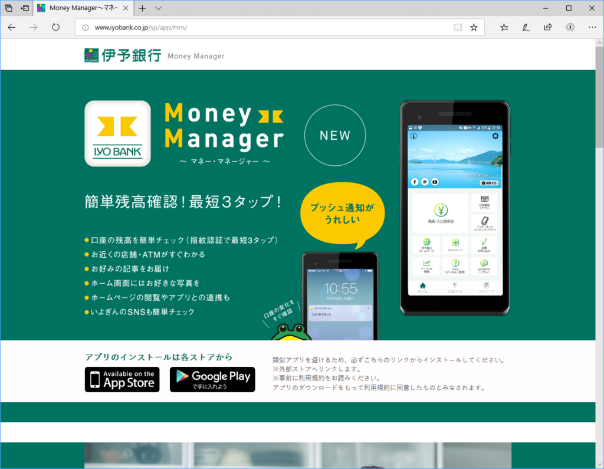
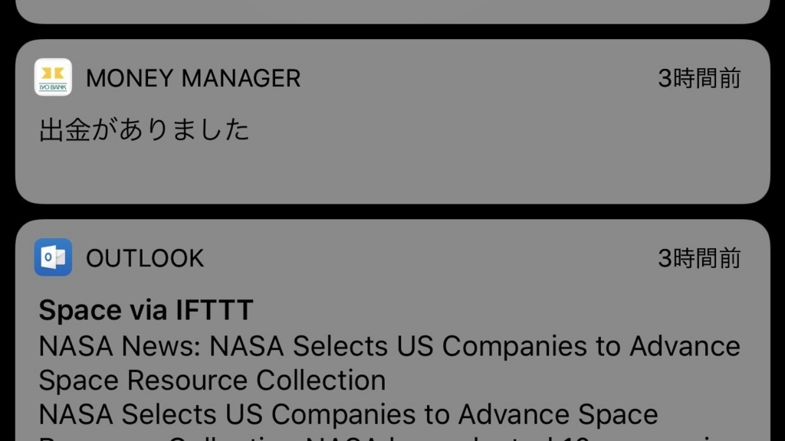
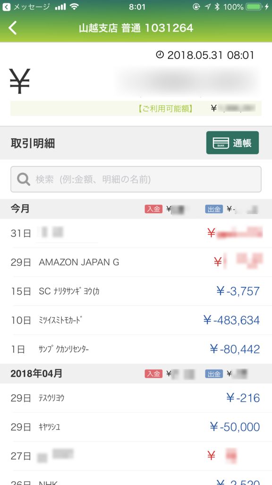
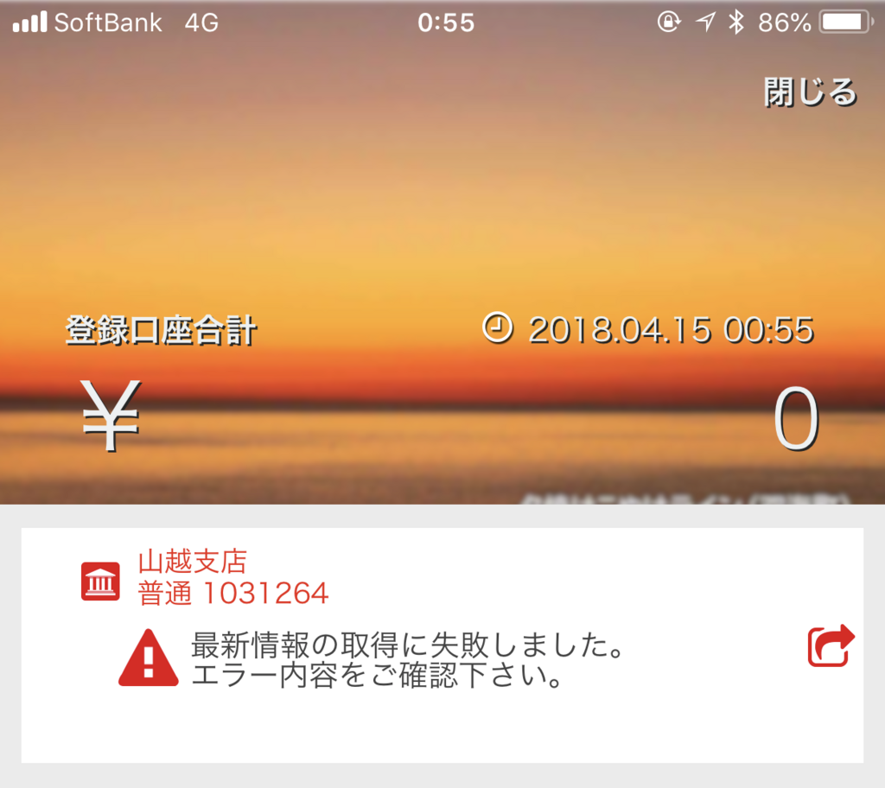

あまり TV は観ないのだが、まだ親父が家にいた頃は6時のローカルニュースぐらいはみていた。たぶんその時に流れていた CM で知ったんだけど、伊予銀行が<b>「マネー マネージャー」</b>というアプリを出したのだそうな。伊予銀行にはほかにもアプリが数種類あって、なんかスマホのオンラインバンクページにガワをかぶせたようなヤツは入れていたんだけど、こっちも入れてみることにした。

<iframe src="https://hatenablog-parts.com/embed?url=http%3A%2F%2Fwww.iyobank.co.jp%2Fsp%2Fapp%2Fmm%2F" title="Money Manager〜マネー･マネージャー〜｜伊予銀行" class="embed-card embed-webcard" scrolling="no" frameborder="0" style="display: block; width: 100%; height: 155px; max-width: 500px; margin: 10px 0px;"></iframe><cite class="hatena-citation"><a href="http://www.iyobank.co.jp/sp/app/mm/">www.iyobank.co.jp</a></cite>

いろいろ機能はあるけど、実質は入出金のプッシュ通知以外見るべき点はない。iOS 版は暗証番号（ATM の4桁のやつだぜ！！）を入れなくても、指紋でロック解除できるのがちょっとシブいなってぐらい。

振込とかはできないんだけど、これはこれで結構便利かもしれない。ジャパンネット銀行も残高チェックできるアプリを出してるけど（VISA デビッド使うときに残高があるか見るのに便利）、最近使ってないがプッシュ通知まではしてくれなかった気がする（もっとも、メール通知くるからいいんだけど）。

あとは入出金履歴がみれたり。［通帳］ってボタンを押すと、通帳形式でも見られる。

フリー素材なのに、ところどころモザイク＋ガウスぼかしかけてすまんな(n*´ω`*n)

<h3>ぶっちゃけた感想</h3>

サービス時間外は取引内容がみれないとか、「んー……」って思うところはなくもないけど、☆4つぐらいあげるかな、自分なら。どうでもいい機能だけど、愛媛の名所が背景画像になっているのもいいと思う。まだ行ったことないところもあって、バイクで出かけたくなるやで。

