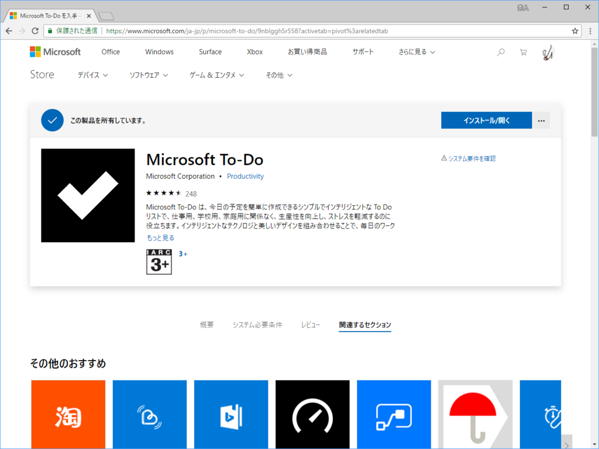
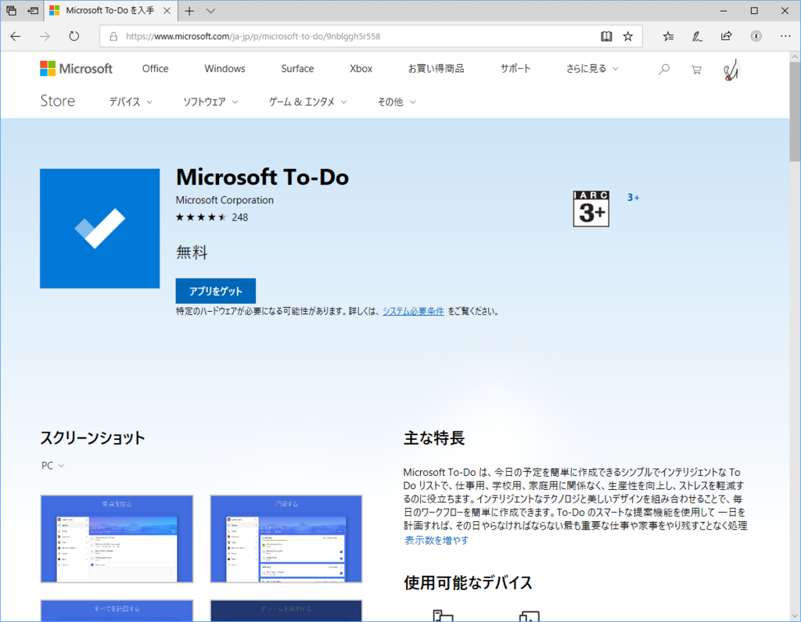
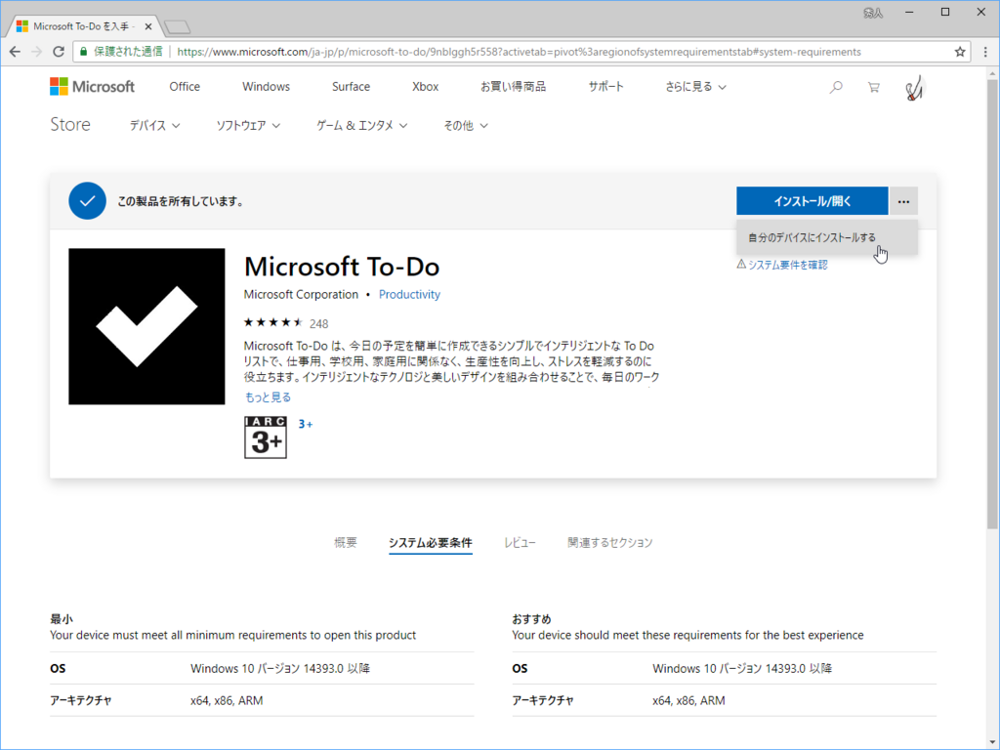
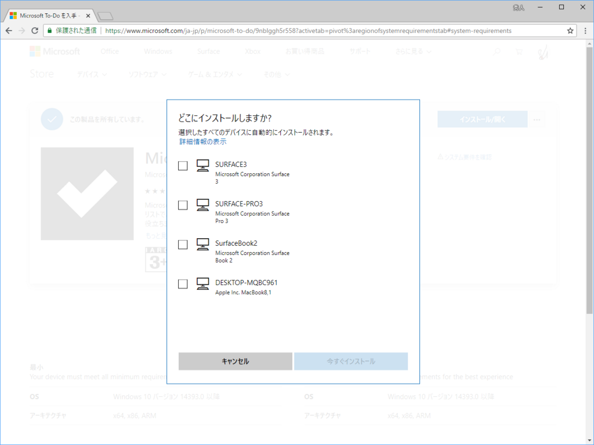

なんか一部環境で Microsoft Store の新デザインがテストされているようです。

ちなみに、フツーの環境ではこんな風に見えるはずです。旧デザインに比べると新デザインはスッキリとしていて、ファーストルックで把握できる情報が増えているように思います。［概要］、［システム要件］、［レビュー］、［関連するセクション］（要するに、"このアプリを使ってる人はこんなアプリも使っています"とか"ついでにこんなアプリはどうですか？"みたいな、レコメンド欄）がピボットで切り替えられるようになっているのも、コンパクトな印象につながっているのかも。

あと、画面右上の［…］ボタンからインストール先の端末を選べるのもグッド。

ただ、一部アプリケーションで記載されていたバージョンノートが見当たらないのはファッキンですね。なぜ表示するのやめた。あと、バージョンや最新更新日なども掲載してほしいと思います（相変わらず記載されていない）。どれだけアクティブに更新されているかも、アプリケーションの質を測るバロメーターになると思うので。

