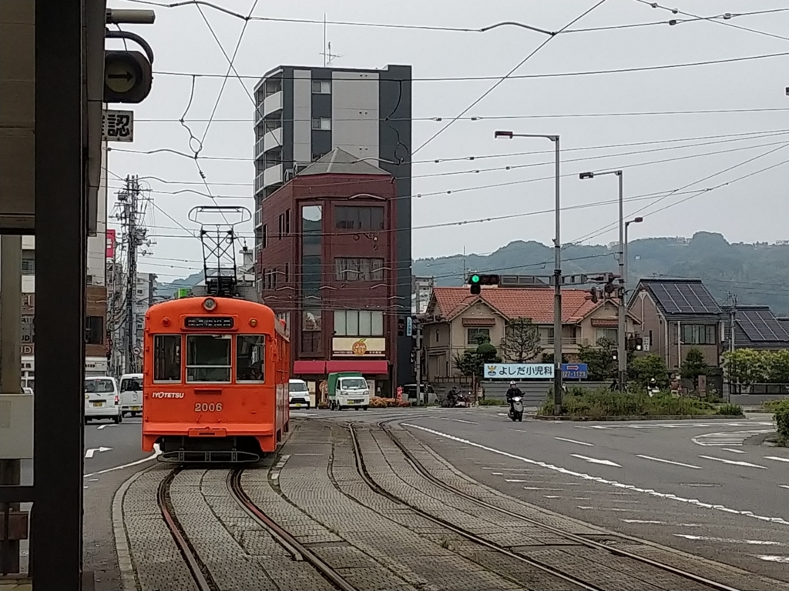

木曜日はお昼で仕事をキッパリやめて、iPhone 7 Plus の修理に行きました。

 

<blockquote>

愛媛県下iPhone・iPad修理件数・実績No.1 
愛媛県で一番古く、多くのiPhoneユーザーに支持されてきた松山市の老舗の修理店です。

</blockquote>

お店は清水町の、松山大学の前あたりにありました。松山へ帰ってきて早2週間、一度外へ飲みに行ったのと、近所のハトマートに買い物に行く以外はまったく外出していないので、その日はバイクではなく徒歩で行きましたが、当初は平和通り沿いにあると勘違いしていて、やたら遠回りしてしまいました。

修理にかかる時間は、約1時間との由。その間に温泉にでも浸かるかと思い、道後まで歩いていきました。

道後ヘルスビルの近くも通ったけど、健全な僕は中に入らないんだぜ。まぁ、よう中にはいらないヘタレなだけなのだけど。

来週はプロ生なので、もしかしたら県外の人を接待することになるかもしれない……ので、予行演習というわけでもないけど、もう一度椿の湯の2階席をとりました。ひとりで、平日、この真昼間から、ぜいたくだなー。

帰りは道後温泉駅で、 300円 ぐらいしか残っていなかったいよてつカードに5000円チャージして、鉄砲町まで電車に乗ります。めったに乗れない新型に乗れた上、上一万駅で乗り換えるときに上下2台の坊っちゃん列車がすれ違うところも見られて、たまには外に出るのもいいなーと感じました。こういうのが好きだから引っ越してきたわけでな。

ちなみに、iPhone の修理もバッチリ。幸いガラス面が割れただけで、その下のタッチパネルユニットは生きていたので、その部分をリサイクルということで修理はその差額 9,800 円で済みました。ついでに、なんか衝撃に強いシートも張ってもらいました。思ったより分厚いけれど、感度に問題ないし、なんとなく安心感があるから満足です（効果のほどは知らんし、たいして期待していない）。

でも、家に帰ってから気づいたんだけど、前の iPhone と少し画面の色味が違うかもしれない？　ギラギラした緑が黄緑になった感じで、個人的にはこっちの色合いの方が好きだからそのままにしておこうと思うのですが、サードパーティ製の部品だからか、保護シートを張ったからか……まぁ、どっちでもいいや。

<h3>追伸</h3>

飛鳥の湯で出されたお菓子、おいしゅうございました。もうちょい大きい方が満足感あるけど（デブの発想

<ul>
<li><a href="http://www2.enekoshop.jp/shop/ichiroku/item_list?category_id=540364&sort=2&num=10">&#x9053;&#x5F8C;&#x5922;&#x83D3;&#x5B50;&#x567A; | &#x30A4;&#x30C1;&#x30ED;&#x30AF;&#x30B7;&#x30E7;&#x30C3;&#x30D7;</a></li>
</ul>

