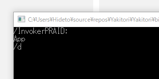

できないのかなーと思ってたのだけど、イケるっぽい。

<iframe src="https://hatenablog-parts.com/embed?url=https%3A%2F%2Fstackoverflow.com%2Fquestions%2F39487135%2Fuwp-javascript-app-run-win32-exe-with-parameters" title="UWP JavaScript APP: run win32 EXE with parameters" class="embed-card embed-webcard" scrolling="no" frameborder="0" style="display: block; width: 100%; height: 155px; max-width: 500px; margin: 10px 0px;"></iframe><cite class="hatena-citation"><a href="https://stackoverflow.com/questions/39487135/uwp-javascript-app-run-win32-exe-with-parameters">stackoverflow.com</a></cite>

こんな風に desktop:ParameterGroup をあらかじめ登録して……

<pre class="code lang-xml" data-lang="xml" data-unlink>&lt;?xml version=&quot;1.0&quot; encoding=&quot;utf-8&quot;?&gt;
&lt;Package ……
    xmlns:desktop=&quot;http://schemas.microsoft.com/appx/manifest/desktop/windows10&quot;
&gt;
&lt;Applications&gt;
&lt;Application Id=&quot;App&quot; Executable=&quot;$targetnametoken$.exe&quot; EntryPoint=&quot;$targetentrypoint$&quot;&gt;
&lt;Extensions&gt;
&lt;desktop:Extension Category=&quot;windows.fullTrustProcess&quot;
                Executable=&quot;Yakitori.Console\Yakitori.Console.exe&quot;&gt;
&lt;desktop:FullTrustProcess&gt;
&lt;desktop:ParameterGroup GroupId=&quot;Desktop&quot; Parameters=&quot;/d&quot;/&gt;
&lt;desktop:ParameterGroup GroupId=&quot;Active&quot; Parameters=&quot;/a&quot;/&gt;
&lt;/desktop:FullTrustProcess&gt;
&lt;/desktop:Extension&gt;
&lt;/Extensions&gt;
&lt;/Application&gt;
&lt;/Applications&gt;
&lt;/Package&gt;
</pre>
それを使えばいいみたい。

<pre class="code lang-cs" data-lang="cs" data-unlink>private async void Button_Click(object sender, Windows.UI.Xaml.RoutedEventArgs e)
{
await FullTrustProcessLauncher.LaunchFullTrustProcessForCurrentAppAsync(&quot;Desktop&quot;);
}
</pre>
これをコンソールアプリで受けてみると、こんな感じになった。

<pre class="code lang-cs" data-lang="cs" data-unlink>namespace Yakitori.Console
{
class Program
{
static void Main(string[] args)
{
foreach (var arg in args)
{
System.Console.WriteLine(arg);
}

System.Console.ReadKey();
}
}
}
</pre>
意味はよく分からんし、本来の使い方と違う気がするけど、これで UWP ⇔ コンソール連携できそう。

