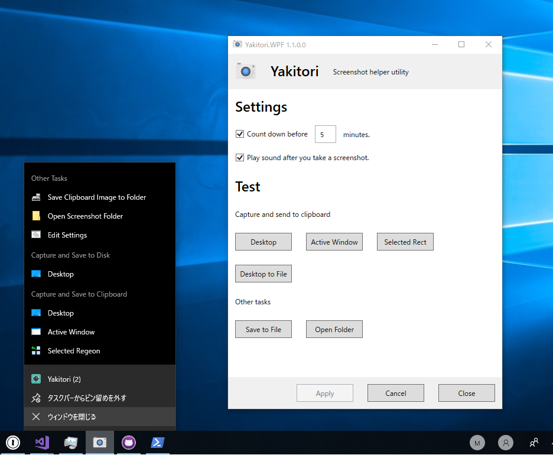
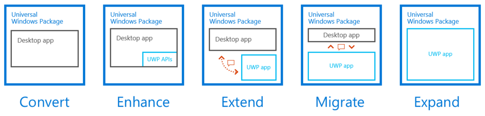

GitHub を掃除してたら、<a href="https://github.com/daruyanagi/Yakitori">&#x53E4;&#x3044;&#x30A2;&#x30D7;&#x30EA;</a>を見つけてしまい、ついでなのでいろいろ書き直しちゃいました。タスクバーにピン留めしておくと便利なスクリーンショットツールです。なるべく Windows 10 標準機能と使っている（＆若干の付加機能）のと、タスクトレイに常駐しないのが特徴と言えば特徴。

 

<ul>
<li>ユーザーインターフェイスの刷新</li>
<li>将来的なアップデートに備えたリファクタリング</li>
</ul>
<iframe src="https://hatenablog-parts.com/embed?url=https%3A%2F%2Fgithub.com%2Fdaruyanagi%2FYakitori%2Freleases%2Ftag%2Fv1.1.0.0" title="daruyanagi/Yakitori" class="embed-card embed-webcard" scrolling="no" frameborder="0" style="display: block; width: 100%; height: 155px; max-width: 500px; margin: 10px 0px;"></iframe><cite class="hatena-citation"><a href="https://github.com/daruyanagi/Yakitori/releases/tag/v1.1.0.0">github.com</a></cite>

トーストを出せるようになりたいなって思っていてそのまま放置だったのですが、WPF ＋ WinRT でごちゃごちゃやるより、WPF ⇔ UWP の仕組みを使えないかなと思い、それに備えたコードの整理を行いました。

要するに、リクツ上はできるという、これをやってみたい。できるかどうかは知らないけど。

