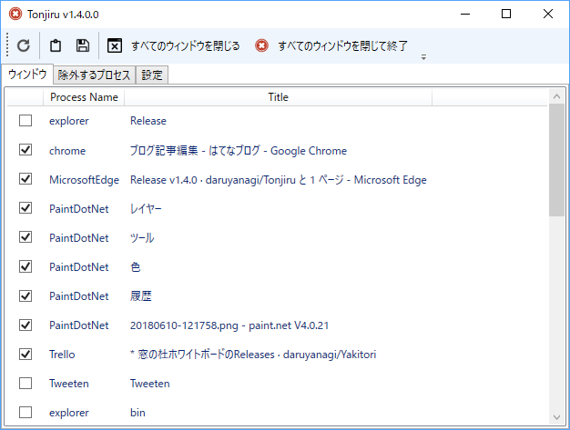
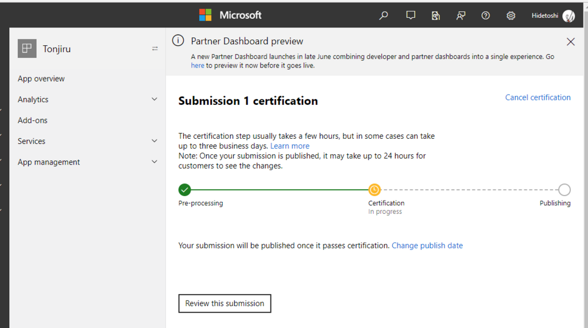

ワンクリックでまとめてウィンドウを閉じてデスクトップをきれいにするツールです。除外リストで閉じては困るウィンドウをのけておくことができます。

<iframe src="https://hatenablog-parts.com/embed?url=https%3A%2F%2Fgithub.com%2Fdaruyanagi%2FTonjiru%2Freleases%2Ftag%2Fv1.4.0" title="daruyanagi/Tonjiru" class="embed-card embed-webcard" scrolling="no" frameborder="0" style="display: block; width: 100%; height: 155px; max-width: 500px; margin: 10px 0px;"></iframe><cite class="hatena-citation"><a href="https://github.com/daruyanagi/Tonjiru/releases/tag/v1.4.0">github.com</a></cite> 

<ul>
<li>UI モードをデフォルトに（［Shift］キーを押すか /s スイッチで UI レスモード実行ができます）</li>
<li>すべてのウィンドウを閉じるけど「Tonjiru」は終了しないコマンドを追加</li>
<li>リフレッシュコマンドを非同期に（結構時間がかかるので）</li>
<li>UWP アプリが閉じてくれない不具合を修正（SendMessage じゃなくてKill することにした）</li>
<li>デフォルトウィンドウサイズを少し大きく</li>
</ul>
ついでに APPX でパッケージングして、ストアに出してみました！！

初めてだったけど、最新版の「Visual Studio」にはパッケージングのためのテンプレートがあるので結構簡単です。

<ul>
<li><a href="https://docs.microsoft.com/ja-jp/windows/uwp/porting/desktop-to-uwp-packaging-dot-net">Visual Studio &#x3092;&#x4F7F;&#x3063;&#x305F;&#x30A2;&#x30D7;&#x30EA;&#x306E;&#x30D1;&#x30C3;&#x30B1;&#x30FC;&#x30B8;&#x5316; (&#x30C7;&#x30B9;&#x30AF;&#x30C8;&#x30C3;&#x30D7; &#x30D6;&#x30EA;&#x30C3;&#x30B8;) - UWP app developer | Microsoft Docs</a></li>
</ul>