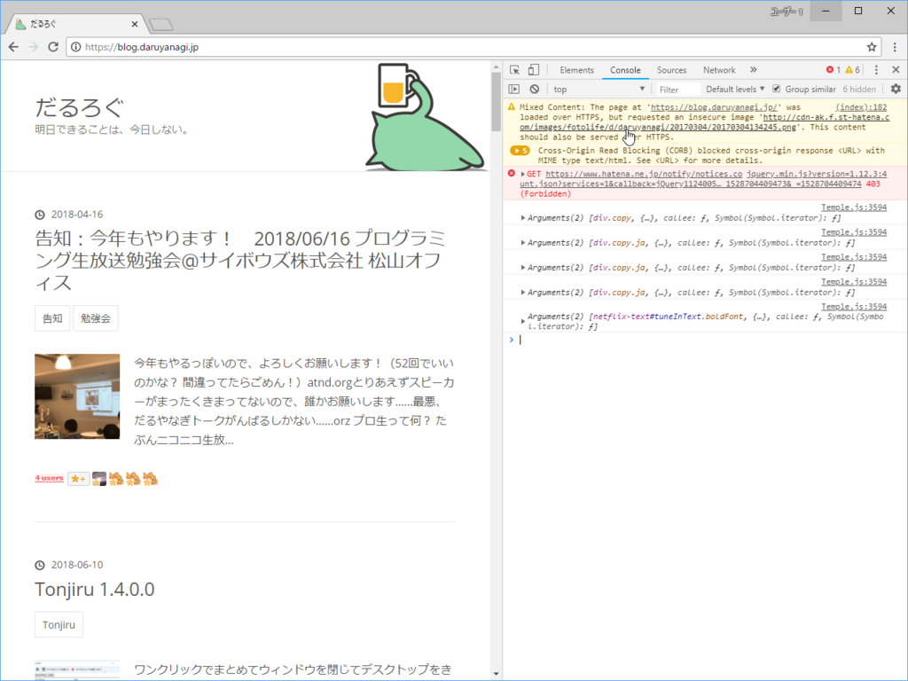
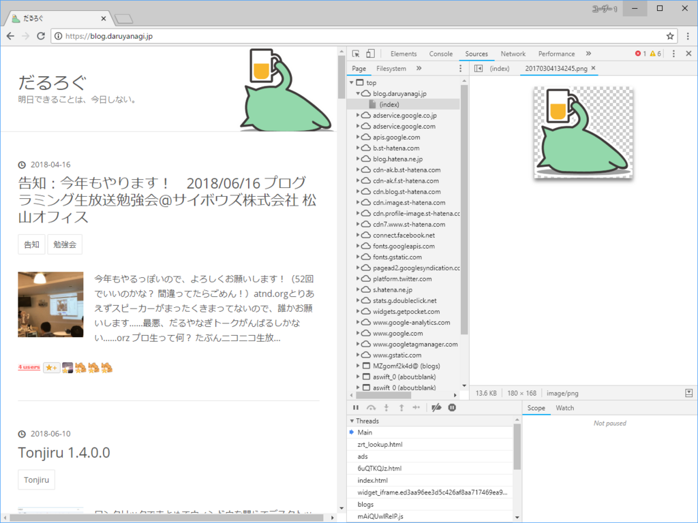

いつからなのかよくわからないのですが、独自ドメインで運用しているはてなブログ（blog.daruyanagi.jp）でも HTTPS 化のボタンが押せるようになっていたので、ノリでプチっと押してみました。

<blockquote class="twitter-tweet" data-lang="ja">
ちょっとした好奇心が だるろぐを 傷つけた <a href="https://t.co/DIwS9zrxG8">pic.twitter.com/DIwS9zrxG8</a>
&mdash; だる☆やなぎ (@daruyanagi) <a href="https://twitter.com/daruyanagi/status/1006078119805980672?ref_src=twsrc%5Etfw">2018年6月11日</a></blockquote>

みごと死にました……が、よくわかんないけどじきに直ったのでよし。でも、混在コンテンツ（mixed contents）があるみたいで、ページの一部が欠けている。

<blockquote class="twitter-tweet" data-lang="ja">
いろいろ手をくわえなきゃだめだなぁ、めんど（ <a href="https://t.co/5WINwMJpxA">pic.twitter.com/5WINwMJpxA</a>
&mdash; だる☆やなぎ (@daruyanagi) <a href="https://twitter.com/daruyanagi/status/1006078756623020032?ref_src=twsrc%5Etfw">2018年6月11日</a></blockquote>

どうやら AdSense のスクリプトを HTTP で読み込んでいるみたいなので、<b>http://</b> というところを探して <b>//</b> に書き換えました。これで将来的に httpsx:// みたいな謎プロトコルが爆誕してもコードを修正せずに済むような気がする。

<blockquote class="twitter-tweet" data-lang="ja">
AdSense はサクッと直したけど、画像はめんどいな？ <a href="https://t.co/O7m3VoFnt5">pic.twitter.com/O7m3VoFnt5</a>
&mdash; だる☆やなぎ (@daruyanagi) <a href="https://twitter.com/daruyanagi/status/1006080086905217025?ref_src=twsrc%5Etfw">2018年6月11日</a></blockquote>

これで広告は表示されるようになったのですが、まだどこか HTTP なリソースを読み込んでいるところがあるみたい。しょうがないので Google Chrome で［F12］キーを押して開発者ツールを起動。コンソールを眺めてみました。

最初の行に Mixed Contents の警告が出ていたので、リンクをクリックしてみます。

原因はお前か！！

この画像は自分でコードを追加したのではなく、はてなブログのデザイン機能で背景に指定しているものです。自分ではいじれないので、もはやこれまでか……と思ったのですが、ふと一度削除して再登録してみると、HTTP じゃなくて HTTPS で読み込まれるようになりました。

ただし、もとの画像は再登録で透過部分が黒くなってしまいます。まぁ、なにもなくてもいいのですが、それはそれで寂しいので、手持ちのしょぼい だるやなぎ 画像を登録しておきました。まぁ、枯れ木も山の賑わいってやつで。

<blockquote class="twitter-tweet" data-lang="ja">
できたー！画像しょっぱくなったけどｗｗｗ <a href="https://t.co/0L6vSXiT1V">pic.twitter.com/0L6vSXiT1V</a>
&mdash; だる☆やなぎ (@daruyanagi) <a href="https://twitter.com/daruyanagi/status/1006086636436766720?ref_src=twsrc%5Etfw">2018年6月11日</a></blockquote>

個別ページではまだエラーが出るかもしれませんが、それはおいおい修正していくことにして、今回の任務はこれで完了。これでセキュアなだるろぐになった！

――なお、メインページ（daruyanagi.jp：Azure Web Sites 製）は放置の模様。こっちもそのうち何とかしよう……Let's encrypt は触ったことないけど、こういうのも勉強になるはず。

