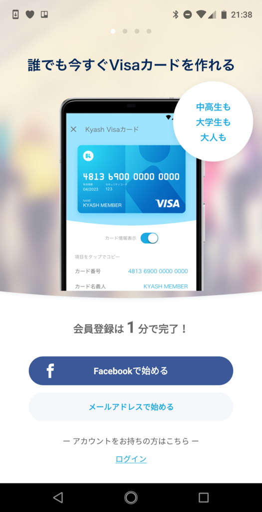
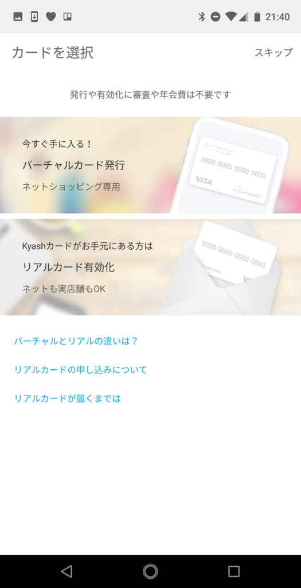
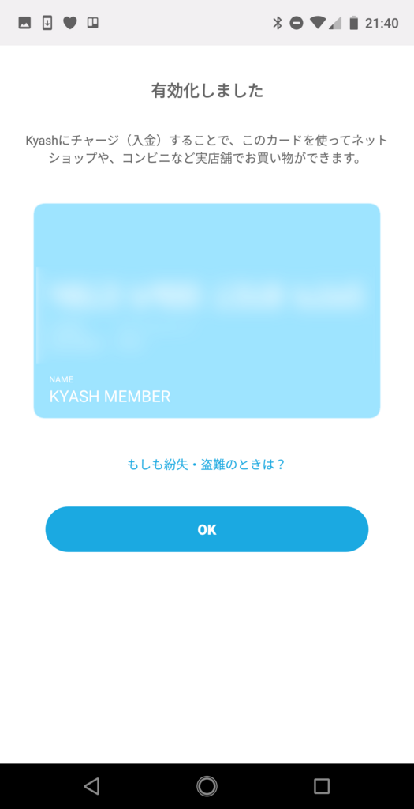
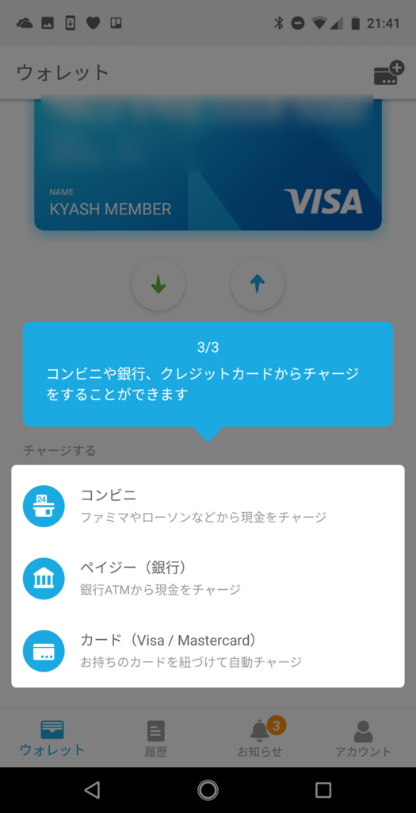

<ul>
<li>6月15日（金）：なにをしたか覚えてない。たぶん仕事頑張った。プロ生愛媛の LT を準備</li>
<li>6月16日（土）：@jz5 と大街道で昼飯を食って、プロ生愛媛。 翌日1時ぐらいまで飲み歩いてた</li>
<li>6月17日（日）：のんびり。部屋の掃除したり、洗濯したり、ゴロゴロアニメみたり</li>
<li>6月18日（月）：仕事頑張った。プロ生の反省ブログを書いた。Kyash のカードがきたので、登録を済ませる</li>
<li>6月19日（火）：仕事頑張った。買い物して、日本 vs コロンビアに備える（帰りにポストから出てきた税金・健康保険関係の書類を見て卒倒）。前半に2点決められたら TV 消して寝るつもり</li>
</ul>

すっかり忘れてたのだけど、Kyash でクレジットカードを頼んでいたのがきたので、さっそくユーザー登録してみた。

<iframe src="https://hatenablog-parts.com/embed?url=https%3A%2F%2Fkyash.co%2F" title="ウォレットアプリ Kyash - 買い物も割り勘もスマホ1つで" class="embed-card embed-webcard" scrolling="no" frameborder="0" style="display: block; width: 100%; height: 155px; max-width: 500px; margin: 10px 0px;"></iframe><cite class="hatena-citation"><a href="https://kyash.co/">kyash.co</a></cite>

Kyash（キャッシュ）というのはいわゆる「ウォレットアプリ」で、

<ul>
<li>登録ユーザー同士で資金移動が可能
<ul>
<li>割り勘や少額のやり取りに使える</li>
<li>Kyash 口座にはコンビニやペイジー、クレカでチャージできる</li>
</ul></li>
<li>クレジットカード（物理・バーチャル）を発行してもらえる
<ul>
<li>Kyash 口座に入ってるおカネで、物理店舗・ネットショップ決済が可能</li>
<li>カードブランドは Visa</li>
<li>審査はない（Visa デビッドと一緒？）なので、規約の範囲で誰でもすぐに持てる</li>
<li>海外では使えない、限度額が低いなど制限が結構多いのであくまで少額向け？</li>
</ul></li>
</ul>
みたいな感じ。個人的には1番目の<b>個人間決済</b>が魅力なのだけど、サービスに閉じてなくて、クレカで外の世界とつながってるのは結構いいなって思う。ネットサービスだからネットで使いやすいのは当たり前だけど、預けたおカネがリアルで使いにくいのは困る。その点、Kyash は物理カードがあるおかげで、リアルで使えていい。まだ使ったことないけど。

 

 

届いたクレカの有効化はマジで1分以内で行える。名前が KYASH MENBER になってるのが気に入らないけど、これでリアル店舗でも使えるようになった。

ID を友人に教えると、こうやって身に覚えのない請求を送り付けることができる。

<blockquote class="twitter-tweet" data-lang="ja">
解せぬ <a href="https://t.co/hOaihIOD4m">pic.twitter.com/hOaihIOD4m</a>
&mdash; daruyanagi.json（気味が悪い (@daruyanagi) <a href="https://twitter.com/daruyanagi/status/1008695880742940672?ref_src=twsrc%5Etfw">2018年6月18日</a></blockquote>

もちろんリジェクトすることが可能。「ふぁっきゅー」というコメントを付けて削除した。

<blockquote class="twitter-tweet" data-lang="ja">
巻き上げたぜー＼(^o^)／ <a href="https://t.co/26oizzKDg9">pic.twitter.com/26oizzKDg9</a>
&mdash; daruyanagi.json（気味が悪い (@daruyanagi) <a href="https://twitter.com/daruyanagi/status/1008700115438034944?ref_src=twsrc%5Etfw">2018年6月18日</a></blockquote>

すると、貸しにしてたおカネが振り込まれてきた＼(^o^)／

この分だけ、物理カードでも買い物ができるというわけだな。オートチャージの設定をしておけば、自動で足りない分をチャージしてくれたりもするらしい。試しに Google Pay のカードに追加してみたら、一時的に200円引き出されて（カードの有効性確認のためなのですぐに戻ってくる）登録が完了した。

<blockquote class="twitter-tweet" data-lang="ja">
Kyash を登録してみたけど EP-1 はやっぱりダメだなー <a href="https://t.co/IfbTfc9Gwn">pic.twitter.com/IfbTfc9Gwn</a>
&mdash; daruyanagi.json（気味が悪い (@daruyanagi) <a href="https://twitter.com/daruyanagi/status/1008699715825745920?ref_src=twsrc%5Etfw">2018年6月18日</a></blockquote>

Google Pay でも使えるといいんだけど、ウチの端末（Essential Phone EP-01）ではダメだった。まぁ、これはわかってたことで、しょうがない。

Kyash ユーザーが周りにいたら、割り勘でも使ってみたいなーと思う。

<h3>追記</h3>

<blockquote class="twitter-tweet" data-lang="ja">
しまった、脳内で読み替えて（ <a href="https://t.co/gMmnHNoA88">https://t.co/gMmnHNoA88</a>
&mdash; だるやなぎ 帝国元帥 (@daruyanagi) <a href="https://twitter.com/daruyanagi/status/1009630397813030912?ref_src=twsrc%5Etfw">2018年6月21日</a></blockquote>

