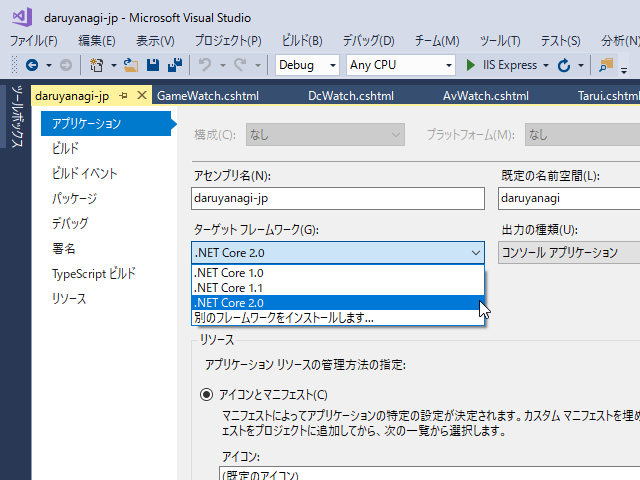
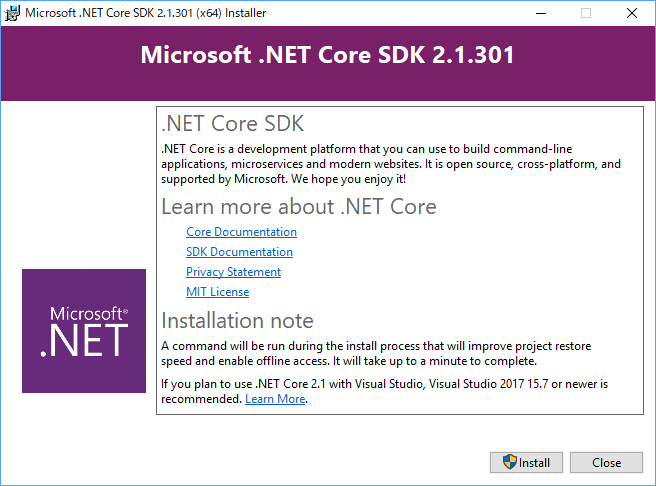
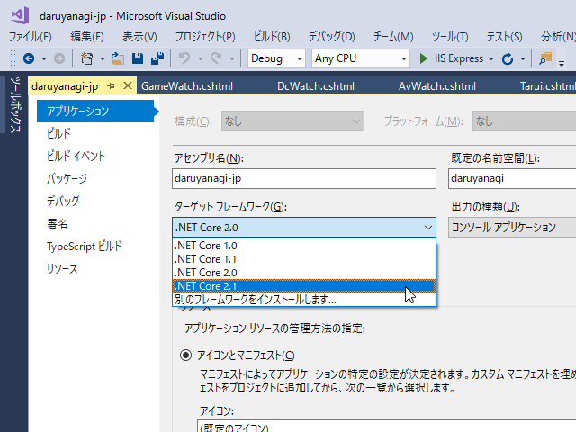
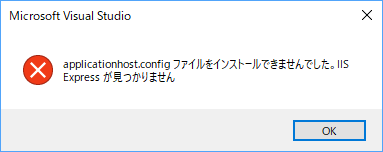
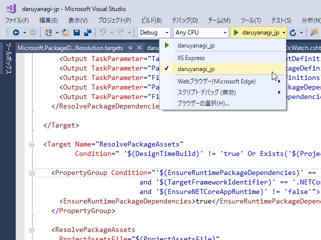
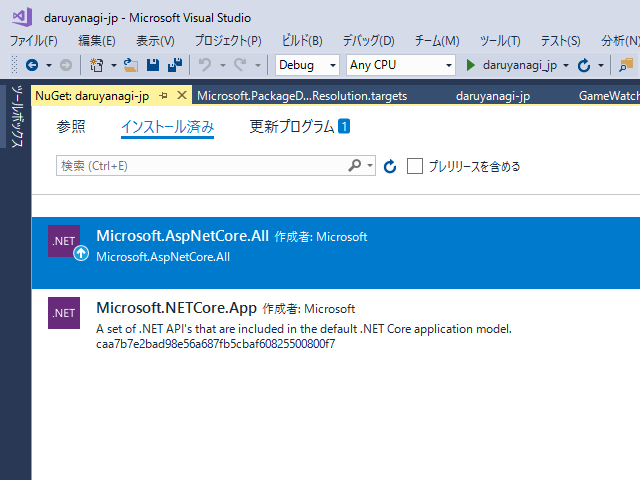
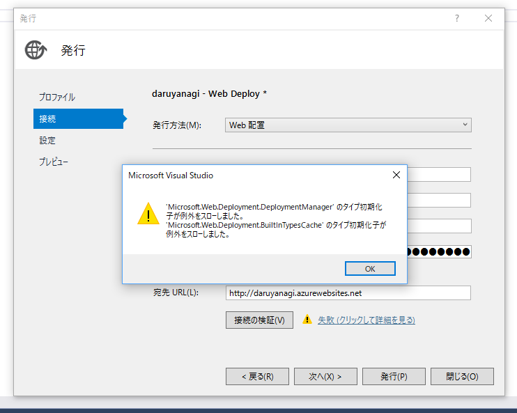
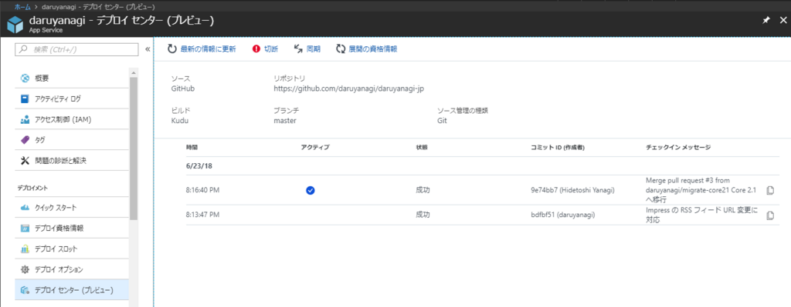

<blockquote class="twitter-tweet" data-lang="ja">
今まで「2.1？　あ、そぅ」と聞き流していた俺氏、移行作業をせざるを得ない模様 / “「.NET Core 2.0」のサポートは9月1日で終了 ～「.NET Core 2.1」への移行を - 窓の杜” <a href="https://t.co/3qCA4Fnozt">https://t.co/3qCA4Fnozt</a>
&mdash; だるやなぎ 帝国元帥 (@daruyanagi) <a href="https://twitter.com/daruyanagi/status/1009660814456848384?ref_src=twsrc%5Etfw">2018年6月21日</a></blockquote>

Current とか LTS とかよくわかんないんですが、ASP.NET Core 2.0 のサポートが終わるそうなので、daruyanagi.jp の移行作業を行いました。

<h3>SDK のインストール</h3>

とりあえずターゲット フレームワークを切り替えとくか、と思ったのですが 2.1 がプルダウンに出てこないので、SDK のインストールを行います。

<iframe src="https://hatenablog-parts.com/embed?url=https%3A%2F%2Fwww.microsoft.com%2Fnet%2Flearn%2Fapps%2Fweb%2Fget-started%2Fwindows" title="ASP.NET - Get started in 10 minutes" class="embed-card embed-webcard" scrolling="no" frameborder="0" style="display: block; width: 100%; height: 155px; max-width: 500px; margin: 10px 0px;"></iframe><cite class="hatena-citation"><a href="https://www.microsoft.com/net/learn/apps/web/get-started/windows">www.microsoft.com</a></cite>

なんとなくインストーラーをダウンロードしちゃったのですが、2.0 のインストールは chocolatey でやった気がするからコマンドラインでもよかった。

ちゃんとプルダウンに 2.1 がでてきたので切り替えました。

 

<h3>とりあえずデバッグ → エラー</h3>

とりあえず［F5］してみると、エラーが発生。エラーメッセージの意味はよくわかんなかったのですが、IIS Express がダメだというのはわかったので、それ以外に切り替えました。

それ以外にもいろいろ警告が出ていた気がするけど、キレイさっぱりなくなって、見慣れた daruyanagi.jp が「Microsoft Edge」で実行されました。IIS Express じゃなくても、ASP.NET Core に内蔵の Webrick みたいなサーバーが使えるんだな（何度聞いても名前が覚えられないんだけど、<a href="https://docs.microsoft.com/ja-jp/aspnet/core/fundamentals/servers/?view=aspnetcore-2.1&tabs=aspnetcore2x">Kestrel </a>っていうらしい？）。

<h3>NuGet パッケージの入れ替え</h3>

このままデプロイしちゃおうかなって思ったのですが、変なところでハマると嫌だなーと思い、しばやんのブログでもう一度いろいろ確かめました。

<iframe src="https://hatenablog-parts.com/embed?url=https%3A%2F%2Fblog.shibayan.jp%2Fentry%2F20180603%2F1527958208" title="ASP.NET Core 2.0 から 2.1 へのアップデートを行ったメモ - しばやん雑記" class="embed-card embed-blogcard" scrolling="no" frameborder="0" style="display: block; width: 100%; height: 190px; max-width: 500px; margin: 10px 0px;"></iframe><cite class="hatena-citation"><a href="https://blog.shibayan.jp/entry/20180603/1527958208">blog.shibayan.jp</a></cite>

頭悪すぎて色々よくわからなかったのですが、

<blockquote>

ASP.NET Core 2.0 から Microsoft.AspNetCore.All という狂気に満ちたメタパッケージが用意されましたが、2.1 からはマイルドになった Microsoft.AspNetCore.App というメタパッケージが追加されました。

</blockquote>

っていう部分はウチの環境でも対応しておいた方がいいかなって思ったので、NuGet パッケージを入れ替えました。

更新インジケーターが出ている Microsoft.AspNetCore.All をブッコ抜き、Microsoft.AspNetCore.App に入れ替えるだけ。これで狂気から解放されたようです。

これでウチの移行作業はだいたい終わりですが、リポジトリ上での変更はマジで<b>ターゲット フレームワークの変更だけ</b>でした。あとでいろいろ問題が出ないとも限らないけど、スクショとりながら進めるほどの作業でもなかった。

<h3>Web Deploy できない問題</h3>

さて、あとはデプロイするだけなのですが、ウチの環境はいろいろ腐り始めてるっぽくてエラーがでる。

<iframe src="https://hatenablog-parts.com/embed?url=https%3A%2F%2Fblog.daruyanagi.jp%2Fentry%2F2018%2F06%2F20%2F232113" title="未解決：Visual Studio 2017 から Azure へデプロイできなくなった（回避策） - だるろぐ" class="embed-card embed-blogcard" scrolling="no" frameborder="0" style="display: block; width: 100%; height: 190px; max-width: 500px; margin: 10px 0px;"></iframe><cite class="hatena-citation"><a href="https://blog.daruyanagi.jp/entry/2018/06/20/232113">blog.daruyanagi.jp</a></cite>

一通りググってみたけどピッタリの解決策は見つからなくて、FTP でデプロイするという邪悪な方法でしのいできたのですが――

<blockquote class="hatena-bookmark-comment"><a class="comment-info" href="http://b.hatena.ne.jp/entry/366160930/comment/nakaji999" data-user-id="nakaji999" data-entry-url="http://b.hatena.ne.jp/entry/s/blog.daruyanagi.jp/entry/2018/06/20/232113" data-original-href="https://blog.daruyanagi.jp/entry/2018/06/20/232113" data-entry-favicon="https://cdn-ak2.favicon.st-hatena.com/?url=https%3A%2F%2Fblog.daruyanagi.jp%2F" data-user-icon="/users/nakaji999/profile.png">未解決：Visual Studio 2017 から Azure へデプロイできなくなった（回避策） - だるろぐ</a> 
GitHubからデプロイするようにするのはダメなのかしら？
<a class="datetime" href="http://b.hatena.ne.jp/nakaji999/20180620#bookmark-366160930">2018/06/20 23:50</a></blockquote><cite class="hatena-citation"><a href="http://b.hatena.ne.jp/entry/366160930/comment/nakaji999">b.hatena.ne.jp</a></cite>

賢者の声がしたので、それに従ってみました。いや、前々からやろうと思ってたんだけど、なんかめんどくさくて後回しになってただけなんだからねっ！

で、やってみたらフツーにイケました。ソースコード管理は GitHub でやってるし、こっちの方が断然いいな。ちゃんと master ブランチを触らない癖も付きそうだ。

