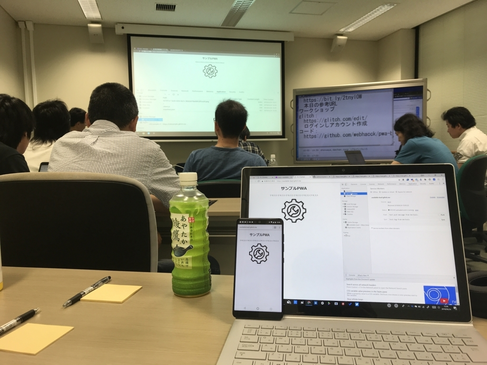
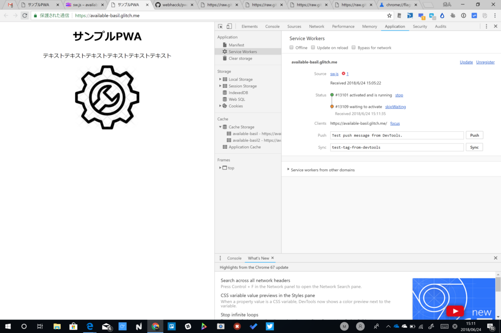
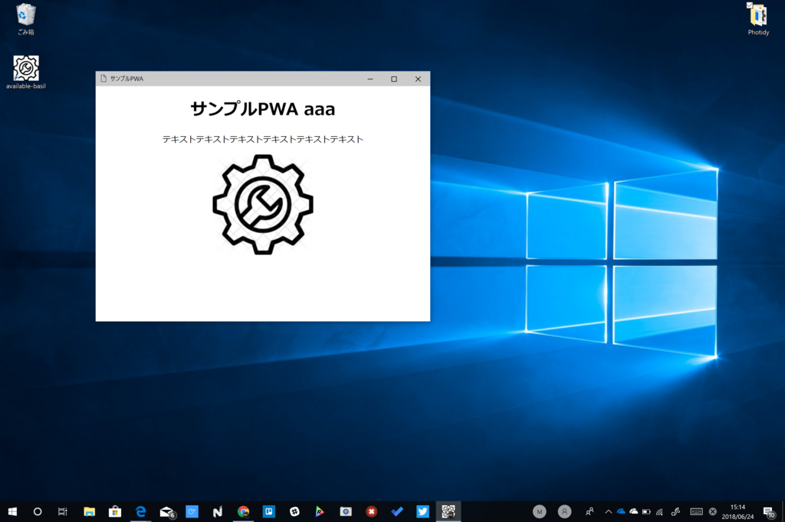
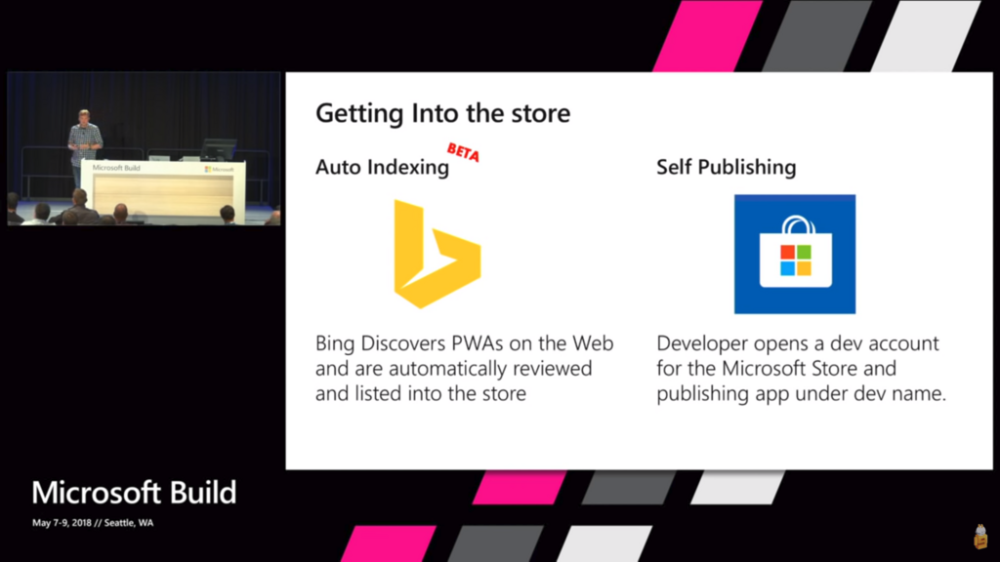

日曜日は愛媛大学で開催されていた『PWAの勉強会をやりませんか？ in 松山市』に参加してきました。

<iframe src="https://hatenablog-parts.com/embed?url=https%3A%2F%2Fconnpass.com%2Fevent%2F88717%2F" title="PWAの勉強会をやりませんか？ in 松山市 (2018/06/24 13:00〜)" class="embed-card embed-webcard" scrolling="no" frameborder="0" style="display: block; width: 100%; height: 155px; max-width: 500px; margin: 10px 0px;"></iframe><cite class="hatena-citation"><a href="https://connpass.com/event/88717/">connpass.com</a></cite>

PWA の概念については一通り知っていたつもりですが、実践的なことは何一つ把握していない状態だったので、どっちかっていうとワークショップが目当て。自学自習ではめんどくさいことでも、講師の指導でみんなと一緒にやるならちょっとは真面目に取り組めるものです。やったことは初歩の初歩で、用意されたソースコードをコピペしながら動作を確かめただけでしたが、

<ul>
<li>Google Chrome の開発者ツールでキャッシュや Service Worker、PWA マニフェストを扱う方法</li>
<li>Service Worker の基本的な使い方</li>
<li>マニフェストに記載すべき内容</li>
<li>キャッシュを使う上でのハマリどころ</li>
</ul>
なんかは大変お勉強になりました。自分一人だったらどこかでハマってやる気なくなってたなーｗ

あと、Glitch っていうサービスが使いやすかったです。

<iframe src="https://hatenablog-parts.com/embed?url=https%3A%2F%2Fglitch.com%2F" title="Glitch - The Friendly, Creative Community" class="embed-card embed-webcard" scrolling="no" frameborder="0" style="display: block; width: 100%; height: 155px; max-width: 500px; margin: 10px 0px;"></iframe><cite class="hatena-citation"><a href="https://glitch.com/">glitch.com</a></cite>

Node のお勉強環境？　よくわかってないけど、オンラインエディターでちょろっと書いて即座に実行できるのはめっちゃいいと思う。PWA って HTTPS 必須なんですけど、そのあたりもクリアされているみたいで、面倒くさいこと抜きに PWA へチャレンジできる。

最後は、ワークショップの傍らパワポでしこしこ書いた資料をもとに LT もしました。

PWA ってどうしても Google Chrome＋Android がメインになっちゃうと思うんだけど、

<ul>
<li>Windows での PWA サポートについて
<ul>
<li>Twitter Lite はジャンプリストや共有機能にも対応している</li>
<li>Auto Indexing で「PWA は探しにくい」問題を解決</li>
<li>次期 Windows 10 で追加される新しいウィンドウモード</li>
<li>ネイティブ開発者からみて PWA に期待していること・これからの展望</li>
</ul></li>
<li>Google Chrome だけじゃなく Microsoft Edge でもテストしてくれ！
<ul>
<li>Chrome でしか動作確認していないアプリが多い → Edge/Firefox でちゃんと動かないんだけでそれでいいのか？</li>
<li>Edge で動く≒Windows 10、Xbox、Surface Hub、Hololens でも動くようになる</li>
<li>デスクトップ（全体のシェアの半分弱）の 1/3 を占める Windows 10 はまだまだデカいマーケット</li>
</ul></li>
</ul>
みたいな感じのことを言いました。

この勉強会で欠けていた部分を補えたんじゃないかなーと個人的に満足だったのですが、いかがだったでしょうか。途中、HDMI アダプターが死んでわちゃわちゃしてしまいましたけどｗ　ちゃんと自分のモノを用意していかないといけないな……。

勉強会の後は、4人ほどで懇親会（？）をしました。機械学習などについて話したっけ？　結構面白かった……プロ生と被っちゃった機械学習の勉強会にも行きたかったな。それがバラけたあとも、帰り道にあった行きつけの居酒屋さんに寄って TV でサッカーを観たり。おかげで、日本 vs セネガル戦もみず、家に帰るなり和服のままベッドに撃沈してしまいました。

