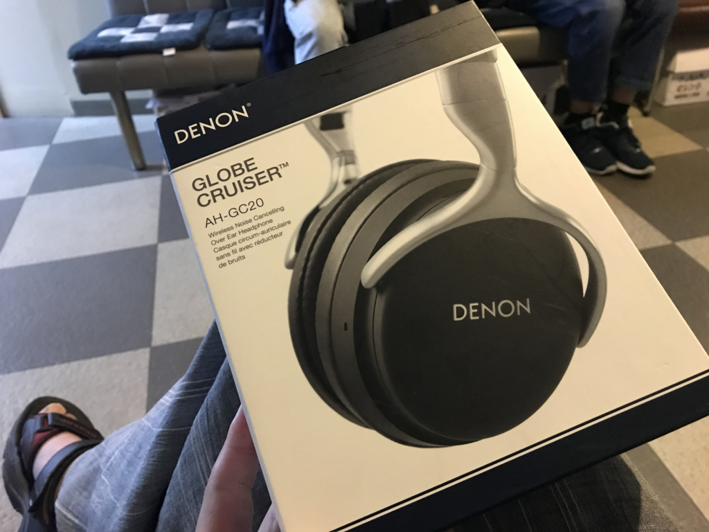
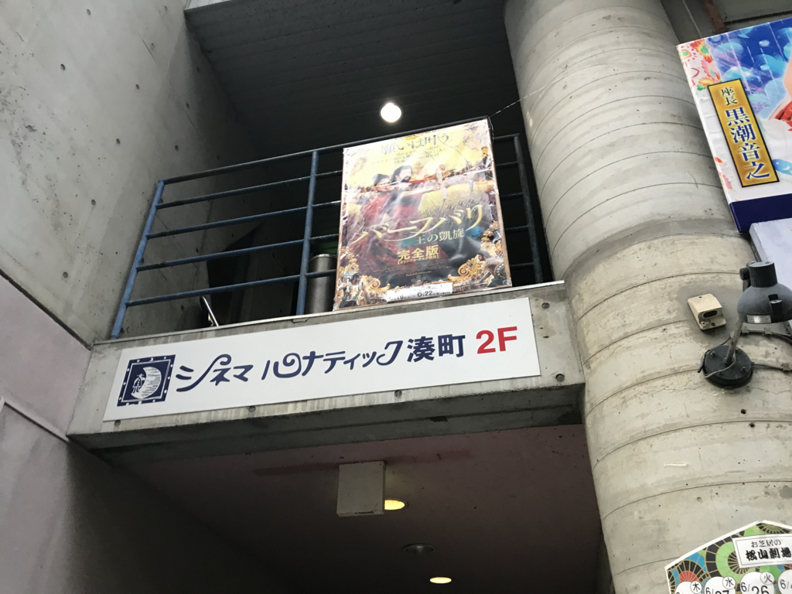
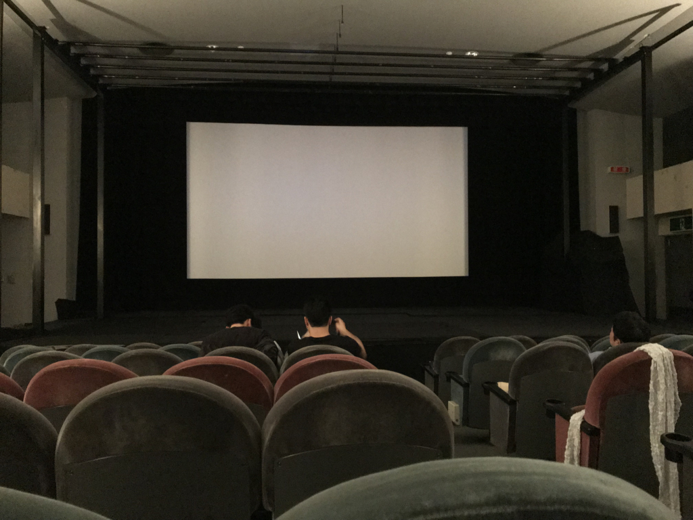
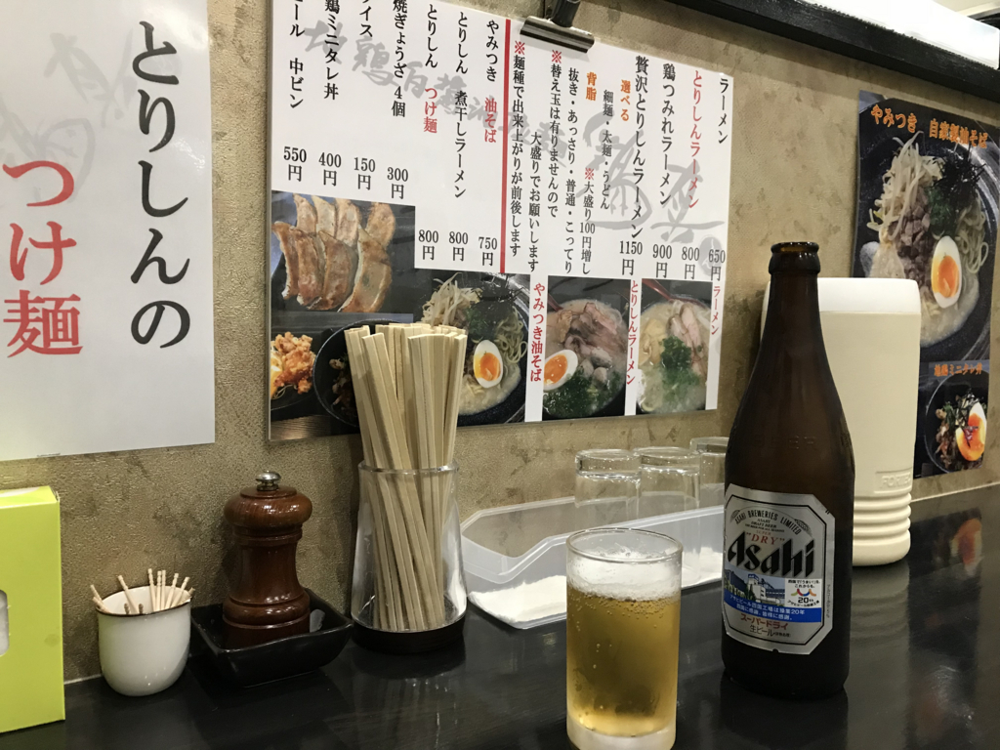

ソニーのヘッドフォンが壊れたので、先週の金曜日はエディオン松山本店へ修理持ち込みに行った。

<iframe src="https://hatenablog-parts.com/embed?url=https%3A%2F%2Fblog.daruyanagi.jp%2Fentry%2F2016%2F12%2F22%2F170757" title="ソニーのワイヤレスヘッドフォン MDR-XB950BT を買った。 - だるろぐ" class="embed-card embed-blogcard" scrolling="no" frameborder="0" style="display: block; width: 100%; height: 190px; max-width: 500px; margin: 10px 0px;"></iframe><cite class="hatena-citation"><a href="https://blog.daruyanagi.jp/entry/2016/12/22/170757">blog.daruyanagi.jp</a></cite>

耳のところが取れて、線だけでぶらんぶらんしてる。とりあえず修理には出すが、つなぎのヘッドフォンがないのは大変困るので、DENON のノイズキャンセル＋Bluetooth ヘッドフォンを買った。ちょっと古いモデルだけど、価格を横断検索したらエディオンが一番安かったのでちょうどいい。

<a href="http://www.amazon.co.jp/exec/obidos/ASIN/B00W8PWZKS/bestylesnet-22/">DENON ワイヤレスヘッドホン Bluetooth/ノイズキャンセリング対応 ブラック AH-GC20</a>
<ul><li>出版社/メーカー: デノン</li><li>発売日: 2015/05/15</li><li>メディア: エレクトロニクス</li><li><a href="http://d.hatena.ne.jp/asin/B00W8PWZKS/bestylesnet-22" target="_blank">この商品を含むブログを見る</a></li></ul>

DENON のヘッドフォンは昔使っていたというか、それまで数千円のヘッドフォンで満足していた自分を沼（というほど沼ではないけど）に引きずり込んだ張本人なので、着け心地と音質にはそれほど不満はない。

<iframe src="https://hatenablog-parts.com/embed?url=https%3A%2F%2Fblog.daruyanagi.jp%2Fentry%2F2013%2F03%2F06%2F023239" title="ヘッドフォンの受難 - だるろぐ" class="embed-card embed-blogcard" scrolling="no" frameborder="0" style="display: block; width: 100%; height: 190px; max-width: 500px; margin: 10px 0px;"></iframe><cite class="hatena-citation"><a href="https://blog.daruyanagi.jp/entry/2013/03/06/023239">blog.daruyanagi.jp</a></cite>

<iframe src="https://hatenablog-parts.com/embed?url=https%3A%2F%2Fblog.daruyanagi.jp%2Fentry%2F2012%2F05%2F17%2F211633" title="ヘッドフォンが退院！ - だるろぐ" class="embed-card embed-blogcard" scrolling="no" frameborder="0" style="display: block; width: 100%; height: 190px; max-width: 500px; margin: 10px 0px;"></iframe><cite class="hatena-citation"><a href="https://blog.daruyanagi.jp/entry/2012/05/17/211633">blog.daruyanagi.jp</a></cite>

ノイズキャンセリングは正直物足りないかな？　近くに聞こえていた環境音が少し遠くなった感じがするだけ。でも、昔は有線モデルが4万円近くしてたことを思えば、コストパフォーマンスがとっても良くなったと思う。

 
 

ちなみに、壊れた MDR-XB950BT の修理代は後日 9,000円だと連絡をいただいた。正直、そこまでおカネを出して直すのはなんだかなーって感じなので、自分で修理しようかと思ってる。

そのあとはタクシーで港町に向かった。シネマルナティックという映画館で、楽しみにしていた『バーフバリ 王の凱旋』を観るのだ。

シネマルナティックはちょっとマイナーな映画ばっかりやっている小さな映画館。学生の頃は京都で、こんな感じの映画館にたまに行っていたけど（アフガニスタン映画とか見てた）、松山にもあるんだな。待合室は雑然としているし、設備も古そうなんだけど、こういう映画館が街にあるっていうのはとてもいいことだと思う。潰れたら嫌だし、たまには行こう。

『バーフバリ 王の凱旋』はその日が上映最終日で、思ったよりは客が入っているように感じた。もっとも、いつもどれぐらい入るのかは知らないのだけど……最終的には40人ぐらいにはなったのだろうか。

<iframe src="https://hatenablog-parts.com/embed?url=http%3A%2F%2Fbaahubali-movie.com%2F" title="映画『バーフバリ　王の凱旋』完全版公式サイト" class="embed-card embed-webcard" scrolling="no" frameborder="0" style="display: block; width: 100%; height: 155px; max-width: 500px; margin: 10px 0px;"></iframe><cite class="hatena-citation"><a href="http://baahubali-movie.com/">baahubali-movie.com</a></cite>

インド映画は初めて見るが、最初のスポンサーロゴが延々続くあたりからしてすでに面白い。あと、「作中に登場する象やらなんやらは本物じゃないです」みたいな注意書きがあったのも楽しい。英語で一瞬表示されただけだからちゃんと読めなかったけど、動物を大切にするお国柄なんだろうと感じた。

そんな感じで、始まる前からすでにエキゾチック、期待は高まる一方だったのだけど、内容も素晴らしかった。

若干、「文化祭の演目かな？」と感じる臭い演出はあったけど、それは向こうの映画のお約束のようなものらしい――ここ笑いどころやで？　ほら、ここからテンション上げて行けよ！……みたいな。ストーリーは「まれによくある」タイプでとくに驚かされる要素はないが、技巧よりも魂を鷲掴みにする骨太感がある。物語を進める歌にうっとり、シヴァガミさまが追いつめられる展開にハラハラ、派手で仰々しいアクションにゲラゲラ、敵を蹴散らすバーブバリにハラショー！ってなもんで、一気に大団円にまで持っていかれた。観たあとは『300』を一度に三周したかのような、妙な充実感がある。パパフバリから息子フバリに繋げる大河感もいいな、周りの人間がやたら長生きしてるのが若干気になるけど。

心の底から楽しんだ後は、大街道まで歩いてラーメン屋さんに入った。

鶏ベースのお店なのかな？　頼んだ油そばは重厚ながらあっさりしていて、結構好みの味だった。店がガラガラなのが不思議なぐらいｗ　餃子と瓶ビールもいただいたけど、ちょっと食べたりなかったので、屋台でたこ焼きを買ってタクシーで家路につきました。なんか一人で妙にお金使っちゃったけど、たまにはこういうのもいいかなって思う。

