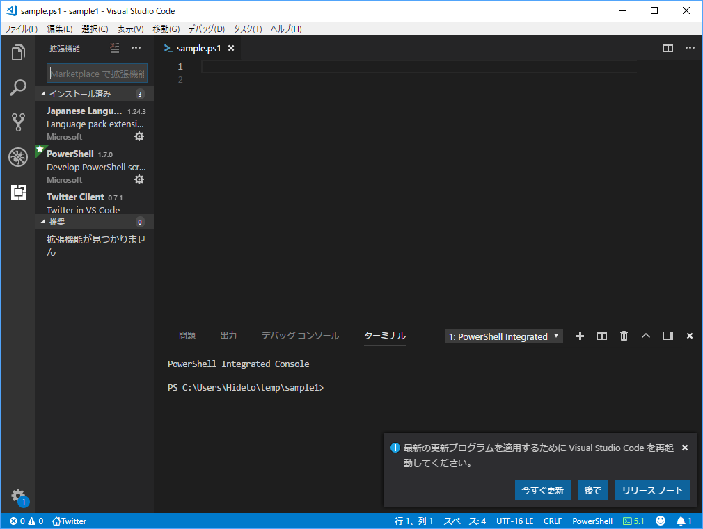
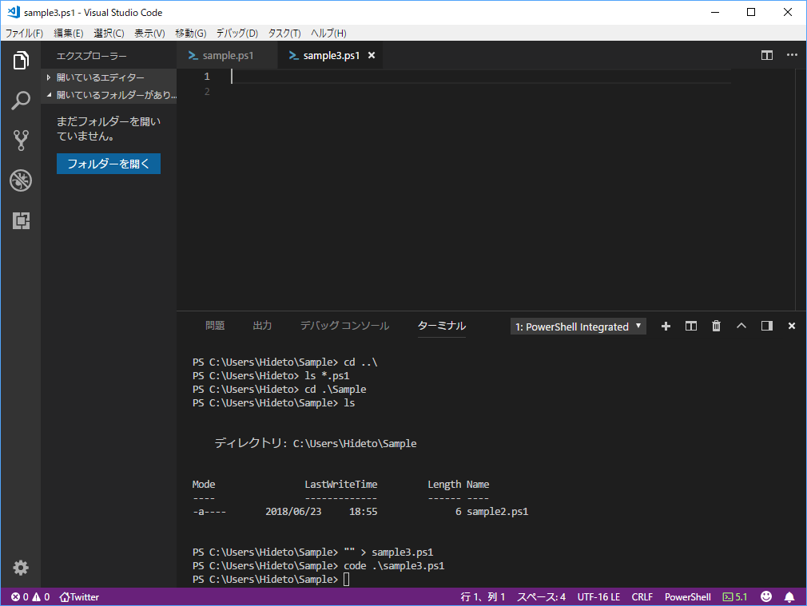
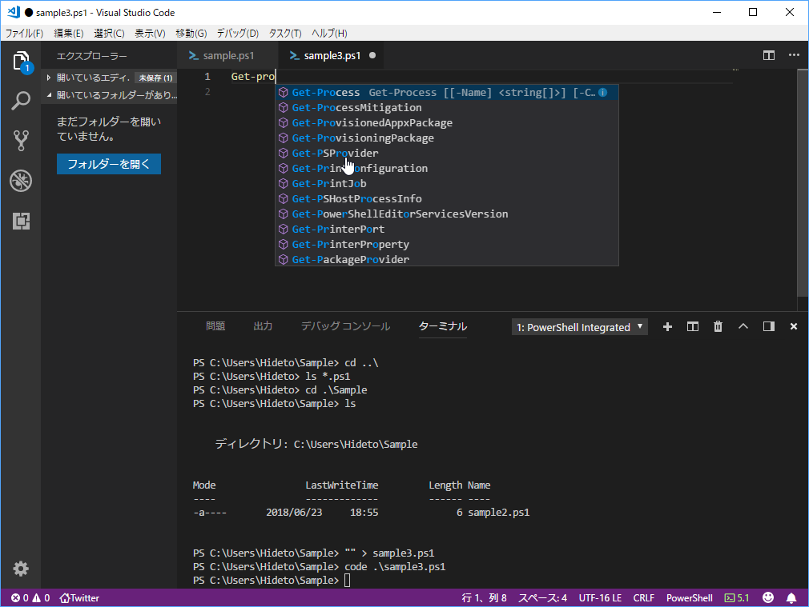
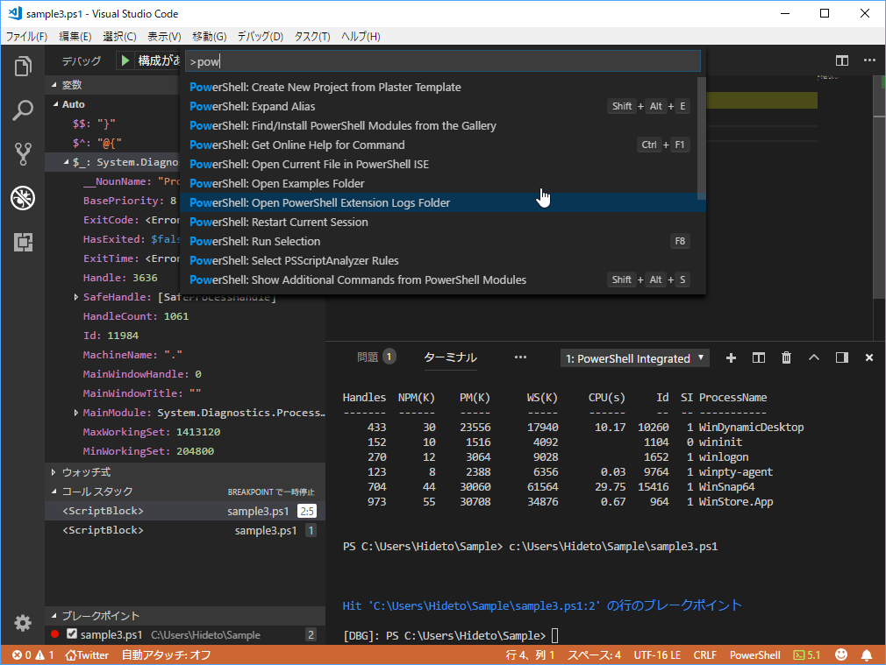
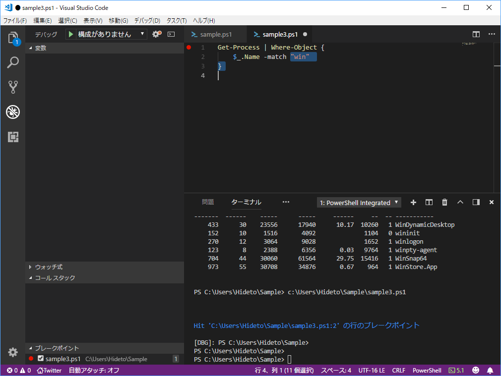

第1章だけ読んで、ちょっと手を動かしてみた。

<iframe src="https://hatenablog-parts.com/embed?url=https%3A%2F%2Fblog.daruyanagi.jp%2Fentry%2F2018%2F06%2F05%2F030249" title="6月5日：『PowerShell実践ガイドブック』 - だるろぐ" class="embed-card embed-blogcard" scrolling="no" frameborder="0" style="display: block; width: 100%; height: 190px; max-width: 500px; margin: 10px 0px;"></iframe><cite class="hatena-citation"><a href="https://blog.daruyanagi.jp/entry/2018/06/05/030249">blog.daruyanagi.jp</a></cite>

今回の目標は PowerShell ISE から Visual Studio Code への移行がメイン。Visual Studio Code は知らないでもないし、使いやすいのは知ってるし、PowerShell ISE はそのうちディスコンになるだろうし、早晩移行はしなければならないのだけど、おっさんになるとほんとダメだね……なんとなくクセで ISE を起動してしまう。めんどくさいけれどちゃんと環境を作って、Visual Studio Code を使う癖を付けなければならない。

本では丁寧に拡張機能の導入方法が書いてあるけど、Visual Studio Code は結構賢いので、PS1 ファイルを開くと「推奨する拡張機能」を教えてくれる。案内に従ってインストールして、リロードするだけで PowerShell 環境が完成するのでらくちんだね。

ちなみに PowerShell は Windows PowerShell 5.x のままにしてる。PowerShell Core 6.0 への移行は、そのうちやろうかなって感じ。あと、Visual Studio Code は <code>code</code>で起動できるので覚えておくとよい。cmd や explorer で <code>code .\</code> ってやれば、カレントフォルダーを Visual Studio Code で開けると思う。

まずは手始めにフォルダーの作成や移動を PowerShell だけでやる。統合ターミナルが使えるので、わざわざ cmd なんかを立ち上げる必要はない。PowerShell におけるファイルシステムの操作は ***-Item だけど、エイリアスがいい感じに振ってあるので、cd や ls、pwd が普通に使えていい（どんなエイリアスが降ってあるかは Get-Alias でみられる）。ただ、touch はないみたい。<code>"" > sample.ps1</code> みたいなイディオムを覚えておくといい。これは本に書いてあった。

Visual Studio Code の PowerShell 拡張は大変良くできていて、PowerShell ISE よりもだいぶ強力に感じる。さっさと移行すればよかったな。

とりあえず自動補完。PowerShell はコマンド名が 動詞-目的語 なのでわかりやすいのだけど、その分入力はちょっとめんどいので補完があると楽。

デバッグ機能も ISE より使いやすいと思う。

あと、個人的に気に入ったのが Expand Alias 機能。エイリアスを使ってあるコードって、それを知らなかったらぱっと見わかんないんだけど、これで展開してやると馬鹿正直に書いたコードに直してくれる。

? って PowerShell の習いたてだと何のことかわかんないんだけど、展開して Where-Object にすればマニュアルを調べなくても意味は分かる。結構よくない？

とりあえず第1章のサンプルコードをぷちぷち打ったりして、概要をもう一度学んだ。UNIX はファイル（データ）指向、Windows は API（機能）指向。それぞれに向いた場面があるので、使い分けられるようになろう。

2章以降は一回斜め読みして、必要そうなところを脳みそにインデックスしようかなって思ってる。

<a href="http://www.amazon.co.jp/exec/obidos/ASIN/4839965986/bestylesnet-22/">PowerShell実践ガイドブック ~クロスプラットフォーム対応の次世代シェルを徹底解説~</a>
<ul><li>作者: 吉崎生</li><li>出版社/メーカー: マイナビ出版</li><li>発売日: 2018/05/30</li><li>メディア: 単行本（ソフトカバー）</li><li><a href="http://d.hatena.ne.jp/asin/4839965986/bestylesnet-22" target="_blank">この商品を含むブログを見る</a></li></ul>

