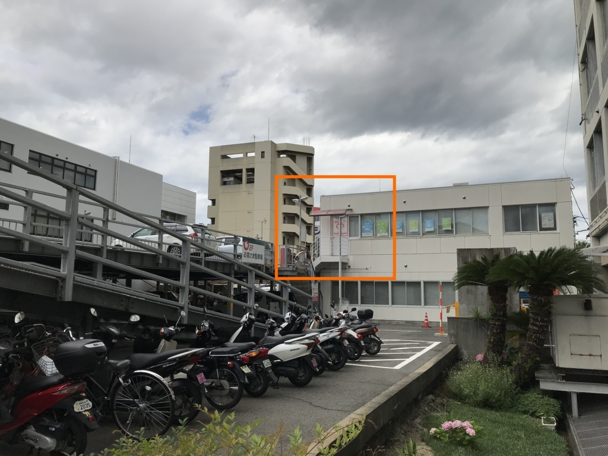

<ul>
<li>6月30日（土）：昼まで寝て、夕方まで少し仕事した</li>
<li>7月1日（日）：午前中 NHK で将棋みて、昼から少し仕事した。夕方、久万ノ台で温泉に浸かる。ウナギたべた。</li>
<li>7月2日（月）：お休みにした。</li>
</ul>
今日は無職の仕事をお休みにして、たまってた事務仕事を片づけた。役所、銀行、郵便局……平日じゃないとできないことって、まだまだ多い。しかも、日曜の夜、なんか妙にやる気が出て <a href="https://www.msc-ehime.jp/">&#x3048;&#x3072;&#x3081;&#x7D50;&#x5A5A;&#x652F;&#x63F4;&#x30BB;&#x30F3;&#x30BF;&#x30FC;</a> なんかに登録しちゃったのだけど、たまたまその翌日に予約が取れてしまった。それのための書類が追加されたうえ、わざわざセンターの事務局に出頭しなきゃいけない。9時に起きて、どの順番で、どの書類を集めるかを考えたのだけど、途中でめんどくさくなって、まぁ、なんとかなるだろうとバイクを引っ張り出して役所へ向かった。

役所でのミッションは、

<ol>
<li>住民票をもらう</li>
<li>マイナンバーカードをもらう（申請済み、あまり放置してると捨てられてしまう）</li>
<li>独身証明書をもらう</li>
</ol>
の3つ。あぁ、窓口のお姉さんが結婚してくれたらその場で婚活なんか終わるのに。「独身証明書もらって、このおっさんなにする気なんや」なんて思われてたらやだなーなんて思いながら、それは顔に出さないように「はい……」「うっす……」「そっす……」と（できるだけ）明るく応対した。

にもかかわらず、独身証明書はもらえなかった。別に結婚が発覚――ッ！とかではなく、あれって、要するに、戸籍抄本の結婚歴を抜き出した感じの書類なんだな。戸籍抄本に準ずるので、本籍地じゃないと発行してもらえないらしい。昨日の夜中11時、センターの入会方法を調べるまで独身証明書の存在自体知らなかったわけで、完全にリサーチ不足だった。まぁ、戸籍抄本は郵送で取り寄せたことがあるから、そのノリでなんとかできるだろう。

役所でのミッションは移動時間も含めて2時間を見ていたが、ちょうどよかった。11時15分ごろ、JR 松山駅の近くにある伊予銀行駅前支店に到着。センターはこの近くのどこかにあるらしい。さっぱりわからん。

駅前支店では、婚活の入会にかかるお金 ・1万円などを含め、今月の生活費・飲み代5万円を引き下ろした。通帳を見ると ｼｹﾝﾐﾝｾﾞｲ や ｹﾝｺｳﾎｹﾝﾘｮｳ でガッツリ残高が減っていて、少し眩暈がする。おなかも痛くなったきたので、銀行のお姉さんにトイレを聞いた。

トイレは店舗の外、ビルの共用部分にあった。古く、狭く、大便は和式が1つしかない。しかも占領されてる。ぐるぐる鳴るおなかを抑えながら、暗いビルの通路を抜けると、そこにはえひめ結婚支援センターがあった。

こんなところにあったんだな。わからんわ！　とにかく探す手間が省けたのはラッキーだ。

ちょっと安心したのか、ブリブリウェーブがヤバくなってくる。少し遠いけど、お尻の穴に力を全力で込めつつ JR 松山駅まで撤退した。松山駅も和式便所しか空いてなかったから、今日は和式便所の日だな。計算の上では、センターに行く前に喫茶店でのんびりできるはずだったのだけど、そんなこんなで時間が削られ、駅の待合室で小さな綾鷹のペットボトルを飲むのが精いっぱいだった。

予約時間の5分前、センターの事務所の扉を叩く。なかに招じ入れられると、そこには Hatena Anonymous Diary で語られていた情景が広がっていた。

<blockquote cite="https://anond.hatelabo.jp/20180620191142">

しかし案内された場所がすごく胡散臭い。

パーティションで区切られた2人が入れるギリギリの薄暗いスペースに、警察が尋問するかのようなライトがひとつ。

行ったことはないが、サラ金の申し込みみたいだと思った。

<cite><a href="https://anond.hatelabo.jp/20180620191142">&#x7D50;&#x5A5A;&#x76F8;&#x8AC7;&#x6240;&#x306E;&#x30C0;&#x30FC;&#x30AF;&#x30B5;&#x30A4;&#x30C9;&#x3092;&#x898B;&#x305F;</a></cite>
</blockquote>

すごい……ウソじゃなかったんだ！　「読める……読めるぞ……！」の大佐や、ラピュタを見つけた不死身小僧も、きっとこんな気分だったのだろう。3つあるパーティションのウチ、奥を案内されて、iPad に流れる案内動画をぼんやり見ながら、そんなことを思った。

（話は変わるが、前々職で間違ってヤクザの手先みたいなやつからお金借りそうになっちゃったことがあるんだけど、そのときもこんな感じの事務所だったなーってちょっと思い出した。この話はまた機会があればやってもいいけど、なんか先方の若い子と仲良くなっちゃって「こんなところで借りたらだめだよ」って送り出されたので、借りずに済んだ。会社の資金繰りのためだったけど、当時は自分もまだ20歳前半で、社会経験がなさ過ぎた……）

この日は入会だけなので、iPad でフォームにいろいろぷちぷち入力していくだけ。1万円を払い、スタッフのおばちゃんに独身証明書のことや、どんな写真を用意したらいいのかなどを少し聞いた。とくに写真な……3カ月以内に撮影したバストアップの写真を2枚、ファイルではなくプリントアウトしたもので用意しなくちゃいけないのだけど、よっぽどのナルシストでもない限り、独身無職のおっさんがそんなもんもってるはずがない。家族や友達に頼めば何枚かはあるだろうけど、どれもフリー素材にはなっても、婚活用の写真には使えないものばかりだ。どうしたもんか……。

これからは、平日に暇を見つけてはここに通うことになる。他にも会場があってそっちに行ってもいいらしいので、ツーリングがてら今治や東予、大洲あたりの会場に足を延ばしてもいいだろう。1万円の効力が切れる2年間の間は、それなりに婚活を頑張って、ダメだったら、まぁ、それはそれで仕方ない。お金を貯めて母ちゃんに楽させてあげたり、甥っ子、姪っ子の学費でも出してあげたい。それでもお金が余れば、大学に行ってもいいな。無職は老後が不安定だから、いくらあっても「余る」ことはないだろうけど。

そのあとは、エディオンによって壊れたソニーのヘッドフォンを受け取って、一旦家に戻った。途中、雨が少しぱらついていたけど、かえって涼しくて気持ちいい。

昼からは、日本ネットクリエイター協会への加入のための書類と、大阪市から独身証明書を取り寄せるための書類を作った。銀行へ行って口座引き落としの書類を出し、入会金を振り込んで、コンビニで封筒を買う。郵便局で独身証明書（めんどくさいから戸籍抄本）のための小為替を買い、返信用の封筒と切手、申請書を……っと、免許証（身分証明書）のコピーを忘れたのでコンビニに戻ってコピーし、全部封筒に入れてから普通郵便で大阪市へ出した（郵送の場合は区じゃないんだなぁ）。あぁ……めんどくせえ……。

でも、もし日本ネットクリエイター協会と、文芸美術国民健康保険組合に加入できたら、ｹﾝｺｳﾎｹﾝﾘｮｳ の引き落として眩暈と腹痛を起こすことも減るはず……加入できるかどうかわからないものに 34,000円 払うのはつらいけど。この文美ガチャについては、結果がでたらまた書こうと思う、

今日はとても頑張ったので、もうお酒を飲んで寝る。バイクの自賠責延長と税務署の仕事までは手が回らなかったけど、まぁ、これはまた今度やればいいや。今週の金曜日も、お休みだ。

