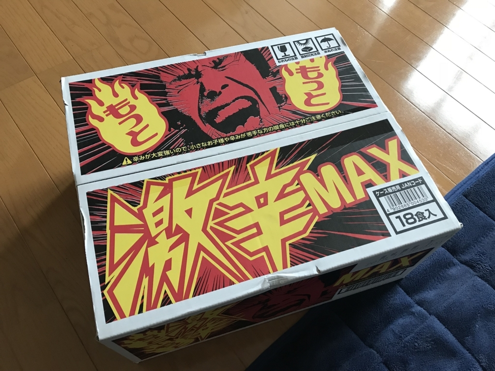
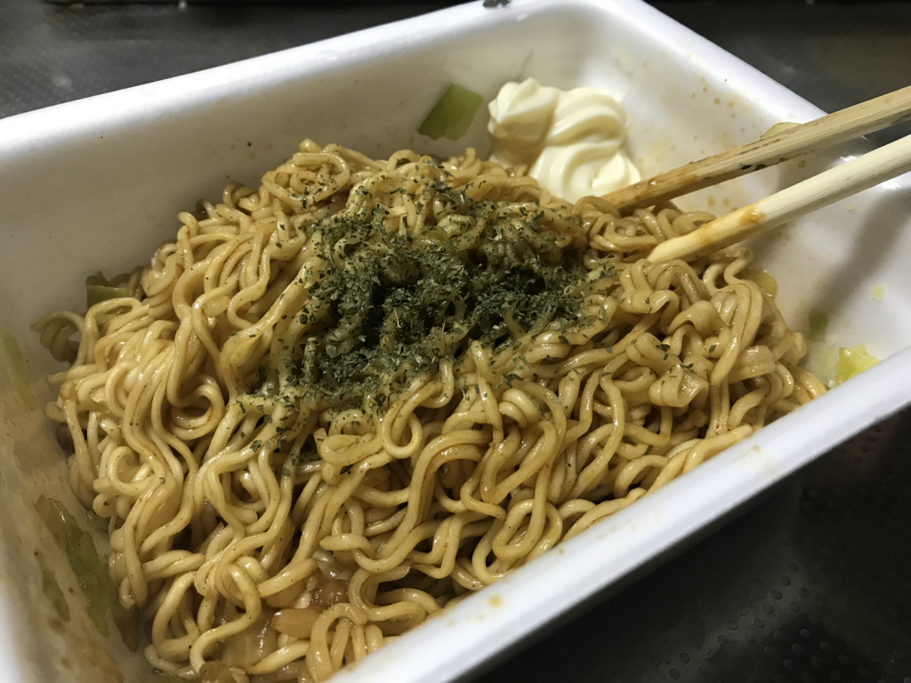

金曜日は半休。ちょっとだけ仕事してあとはダルダルし……ていたところ、心当たりのない荷物がクロネコヤマトで送られてきた。心なしか、いつもは愛想のいいクロネコヤマトのお兄さんの機嫌が悪そう。そら、記録的大雨の中、Amazon が無駄にデカく梱包した荷物を運ばされたらキレると思う。大変申し訳なかった。

ちなみに、なかみは電子レンジでパスタ作る箱とペヤングだった。

パッケージのおっさんの顔が、辛そうで嫌だ。見ていて辛い。でも、この雨の中、外に買い物に出かけるのはもっとつらかったので、しかたなく夕ご飯はこれにお湯を入れることにした。

パッケージはシンプルで、かやくとソースだけ。まぁ、ペヤングだしな。

とくに工夫の余地もなく、お湯を入れて3分で完成。

青のりがなかったので、瓶に入った色の変わり掛けのパセリをふりかけ、辛くて死にそうになった時の箸休めとして、隅にマヨネーズを少し入れておいた。

ただ、辛さに関しては完全な杞憂だったかもしれない。さまざまな辛辛食品で慣らされているせいか、食べたあとにくる時間差の辛さはあったけど（慣れない人だとむせるかもしれない）、3口目ぐらいからはとくに辛いとも感じることなく完食。次の日、肛門から燃えるようなウンコがでてくることもなかった。その前日に辛辛魚（まだ1袋余ってる）を食べて悶絶してたのとはえらい違いだ。

<a href="http://www.amazon.co.jp/exec/obidos/ASIN/B077S4RNH2/bestylesnet-22/">ペヤング もっともっと激辛MAXやきそば 118g×18個</a>
<ul><li>出版社/メーカー: まるか商事</li><li>発売日: 2017/12/04</li><li>メディア: 食品&飲料</li><li><a href="http://d.hatena.ne.jp/asin/B077S4RNH2/bestylesnet-22" target="_blank">この商品を含むブログを見る</a></li></ul>

首謀者には心当たりはあるが、その狙いは完全に空を切った。残り17箱は、おなかすいたけど料理する気が起きないときにいただいていくことにする( ^)o(^ )

