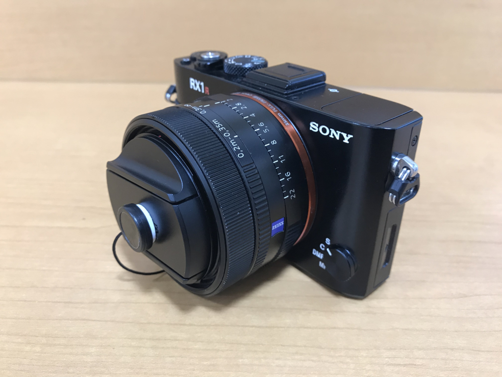
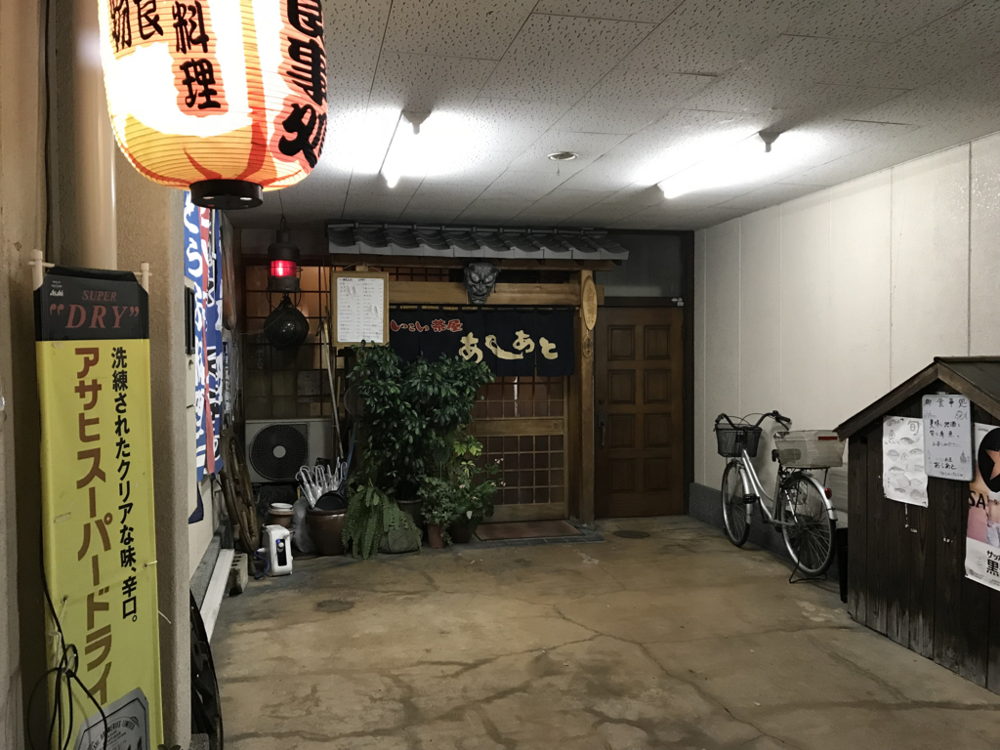

久万ノ台のカメラのキタムラで <b>RX1RM2</b> を買った。フルサイズレンズを搭載したコンパクトデジカメ。最近は Df ＋ Nikon 1 V3 の出番がめっきり減っていたので、この際バッサリうっぱらって、コンパクトだけど最上級なデジカメ1本に統一しようと思ったわけ。カメラのキタムラは買取がしょっぱくて、本体トレンズを一式売り払って <b>RX1RM2</b> の中古（40万 → 25万）の下取りにしても10万円ぐらい持ち出しになったけど、最近はヤフオクとかメルカリとか頑張る気力がないし、それはそれで仕方ないかな。

外観は AB 品とのことで、ぱっと見悪くない。ダイヤルに若干のスレは見受けられるけど、これぐらいの瑕であれば自分だってつけると思う。レンズのホコリ混入などもなく、なかなか満足のいく品質だと思う。性能に関してはまだ実感できていない……ダイヤルでグリグリいじれるのは気に入ったけど、自分の腕でポテンシャルを引き出せるのかどうか。Wi-Fi での写真転送は便利だけどちょっと面倒くさかった。SONY のアプリのデキがあまりよくない気がする……追加で有料パックが買えるっぽいんだけど、その導線が悪いせいかごちゃっとして取っつきづらい。

ついでに、替えのバッテリーとレンズキャップの落下を防止する紐も買った。 <b>RX1RM2</b> のレンズキャップはなんかズッシリとしていて、ちょっと高そうだったから落とすと勿体ない。

<a href="http://www.amazon.co.jp/exec/obidos/ASIN/B00I8H8QBW/bestylesnet-22/">アルミ削り出しレンズキャップホルダー/フードホルダー マットブラック（ツヤ消し黒）#16600</a>
<ul><li>出版社/メーカー: BLaKPIXEL（ブラックピクセル）</li><li>メディア: Camera</li><li><a href="http://d.hatena.ne.jp/asin/B00I8H8QBW/bestylesnet-22" target="_blank">この商品を含むブログを見る</a></li></ul>

あとはグリップが悪いのでそれを補って、ちょっとぐらい雑に扱っても壊れないようにレンズフードを買い足そうと思う。

そのあとは、衣山から電車に乗って古町へでて、@ramusara 君と居酒屋探検した。今回の収穫は2軒目かな？　おじいさんが一人でやってるお店だったけど、なすび美味しかった。お魚が食べられるのも個人的にポイント高いかなー。ちょっとウチからは距離があるけど、また行こうと思う。

