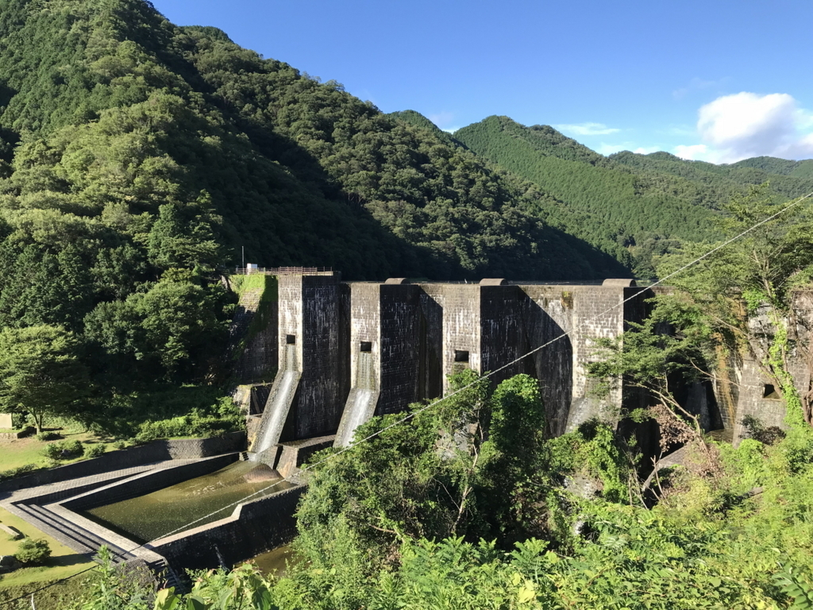

土曜日。朝3時に目が覚めたので、じゃらんで宿を予約してバイクを出した。行き先は適当だけど、とりあえず早朝でも楽しめそうな金毘羅さんを目指すことに。

途中まではナビどおりに走っていたけど、途中で飽きた。松山道を川之江 IC で降りて、下道を適当に走っていたら県道9号線というのに出る。行き先表示板によると観音寺まで行けるみたいなので、これをたどればよかろう。

そう思って走ってたら、やたら山深いところに連れていかれた。つづら折りの道は走っていて楽しいけど、これ、どこまで上に連れていかれるんや……キンタマがヒュンッってなるぐらい高いんですけど。愛媛県から香川県の境目がこんなにヤバいところだとは思ってなかった。

途中、面白そうな史跡を見つけたので寄ってみた。よくわかんないんだけど、屋島で敗れた平家の落ち武者が切り開いた里で、重要文化財の古民家があるのだという。

<blockquote cite="http://www.shikochu-kankou.jp/?page_id=95">

平家落人伝説が残る切山地区。安徳帝の守護に当たった五士の一人、平清房(平清盛8男)を始祖とする家系と伝えられ、真鍋家住宅は桃山時代後期に建築された寄棟造りの木造茅葺住宅です。

<cite><a href="http://www.shikochu-kankou.jp/?page_id=95">&#x771F;&#x934B;&#x5BB6;&#x4F4F;&#x5B85; | &#x6587;&#x5316;&#x30FB;&#x6B74;&#x53F2; | &#x56DB;&#x56FD;&#x4E2D;&#x592E;&#x5E02;&#x89B3;&#x5149;&#x5354;&#x4F1A; &#xFF5E;&#x611B;&#x5A9B;&#x770C;&#x56DB;&#x56FD;&#x4E2D;&#x592E;&#x5E02;&#x306E;&#x89B3;&#x5149;&#x60C5;&#x5831;&#x3092;&#x3054;&#x7D39;&#x4ECB;&#xFF5E;</a></cite>
</blockquote>

目指す古民家までの道はあまり日が差さない上に狭く、落ち武者感がある。あまり整備されているとはいいがたいけれど、両脇がアジサイで彩られいて美しい。

小道を抜けると、質素だけど立派な民家が一軒。まだ6時半ぐらいだったかな？　なのに、おじさん（管理人さん？　もしかしたら当主の方？）が打ち水をしたり、箒で中を掃いていた。囲炉裏には薪がくべられ、煙をもくもくと吐いている。<i>「別に火事じゃないんですよ」</i>

ちょっとだけお話も聞けて、「早起きは三文の徳」とはこのことだなと感じた。

そこから少し、自転車の兄ちゃんを何人か追い抜きながら走ると、やっとこさ香川県に出た（山のなかだけだけど、香川の方が道悪いな？　なんでじゃ）。しばらくすると、豊稔池というところにでたので、ここでもバイクを止めてみた。

<blockquote cite="https://ja.wikipedia.org/wiki/%E8%B1%8A%E7%A8%94%E6%B1%A0%E3%83%80%E3%83%A0">

豊稔池ダム（ほうねんいけダム）は、香川県観音寺市にある現存する日本最古の石積式マルチプルアーチダム。2006年（平成18年）、国の重要文化財（建造物）に指定されている（指定名称は「豊稔池堰堤」）。

命名は、香川県出身で大蔵大臣などを歴任した三土忠造による。

讃岐山脈から流れ出る柞田川を上流で堰き止め、柞田川の左岸に広がる水田を潤している豊稔池ダムは、度重なる大旱魃への対策として1926年（大正15年）に着工され、1930年（昭和5年）に完成した。このとき、地元住民による組合が部分請負が工事にあたり、延べ15万人による人海戦術により約4年の短期完成を実現するという地元一体となって成遂げられた公共事業であった。ダム補修工事により上流部はコンクリート補強されているが、下流部には当時の古い石積みが現存している。

多連式アーチダムとしては、宮城県仙台市の大倉ダム（二連式）を含め、全国に二つしかなく、当時米国で最新技術であったマルチプルアーチが適用されるなど土木史、ダム技術史を語る上においても貴重な建造物である。

<cite><a href="https://ja.wikipedia.org/wiki/%E8%B1%8A%E7%A8%94%E6%B1%A0%E3%83%80%E3%83%A0">&#x8C4A;&#x7A14;&#x6C60;&#x30C0;&#x30E0; - Wikipedia</a></cite>
</blockquote>

こんな予備知識なしでも、見た感じ素晴らしいダムだと感じられる。

なんだかんだで、この道は気に入った。結局観音寺に抜けるまではだいぶかかっちゃったけど、時間はたっぷりあるし、それもまたよし。たまには寄り道をしてみるもんだなーと思った。

 

<h3>次回予告</h3>

やめて！金毘羅さんの石段を、ライディングブーツを履いたまま上ったら、ペットボトルのお茶1本しか装備していない だるやなぎ が干からびちゃう！

お願い、死なないで だるやなぎ！あんたが今ここで倒れたら、今晩の宿の予約はどうなっちゃうの？ ライフはまだ残ってる。ここを耐えれば、温泉に行けるんだから！

次回、「だるやなぎ死す」。デュエルスタンバイ！

