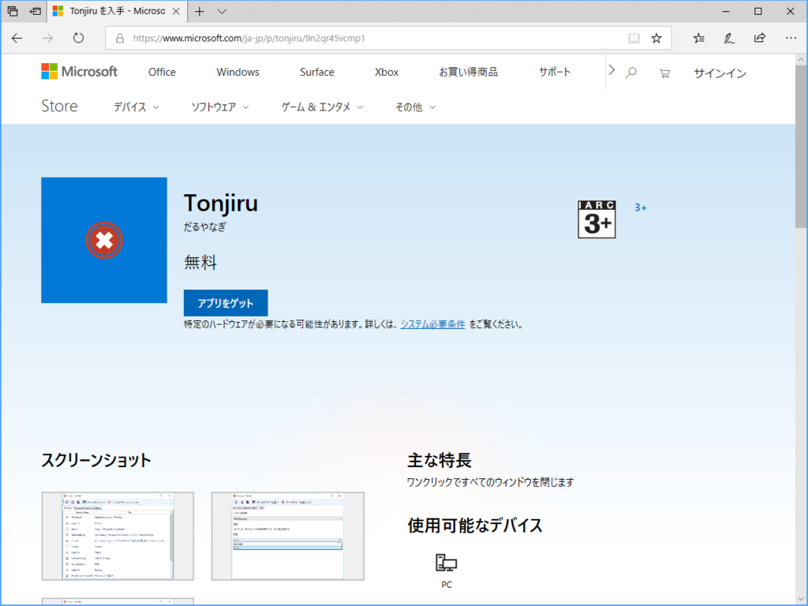
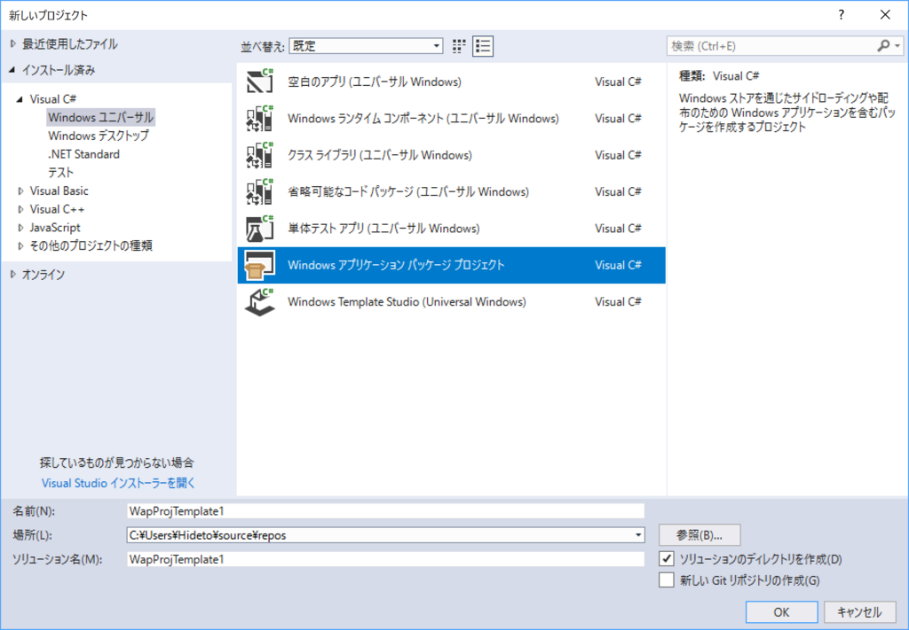
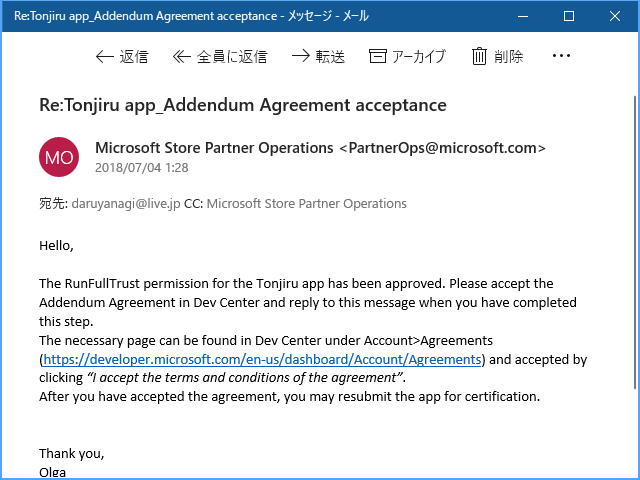

ワンクリックでアプリをまとめて閉じ、デスクトップをスッキリさせるアプリ「Tonjiru」が Microsoft Store で公開されました。まったく大したアプリではないのですが、WPF アプリをストアに掲載するフローを体験したかったので満足です。

<iframe src="https://hatenablog-parts.com/embed?url=https%3A%2F%2Fwww.microsoft.com%2Fja-jp%2Fp%2Ftonjiru%2F9n2qr45vcmp1" title="Tonjiru を入手 - Microsoft Store ja-JP" class="embed-card embed-webcard" scrolling="no" frameborder="0" style="display: block; width: 100%; height: 155px; max-width: 500px; margin: 10px 0px;"></iframe><cite class="hatena-citation"><a href="https://www.microsoft.com/ja-jp/p/tonjiru/9n2qr45vcmp1">www.microsoft.com</a></cite> 

<h3>APPX にパッケージングする</h3>

最近の Visual Studio には「Windows アプリケーション パッケージ プロジェクト」というテンプレートが用意されており、簡単に既存のアプリを APPX にパッケージングできます。

詳しいやり方については <a href="https://docs.microsoft.com/ja-jp/windows/uwp/porting/desktop-to-uwp-packaging-dot-net">Microsoft Docs</a> を参照してください。かいつまんで言うと、

<ul>
<li>アプリを作る（Tonjiru ソリューション -> Tonjiru プロジェクト）</li>
<li>ソリューションに「Windows アプリケーション パッケージ プロジェクト」を新規追加する（Tonjiru ソリューション -> WindowsAppPackageプロジェクト）</li>
<li>WindowsAppPackage プロジェクト → Tonjiru プロジェクトへの参照を張る</li>
<li>（必要であれば WindowsAppPackage プロジェクトでエントリーポイントを設定する）</li>
</ul>
みたいな流れです。できあがったパッケージは <code>WindowsAppPackage_1.4.4.0_AnyCPU_bundle.appxupload</code>のような名前になります。名前がイマイチですね……できればこれからは、

<ul>
<li>Tonjiru ソリューション
<ul>
<li>Tonjiru.WPF プロジェクト（アプリケーションプロジェクト）→ Tonjiru.WPF.exe</li>
<li>Tonjiru プロジェクト（パッケージプロジェクト）→ Tonjiru.appx</li>
</ul></li>
</ul>
という構成にしようかなって思います。もうめんどくさいので、新規開発するときの話になりますけど。

<h3>審査</h3>

パッケージができあがったら、それをストアに提出します。やり方はいつもと大して変わりませんが、ただ一点、Win32/WPF → UWP に変換したアプリは FullTrust 権限を必要とするので、その理由も書かなくてはいけない点には注意ですね。なんて書いていいのかよくわからなかったので、とりあえず内部で使ってる API を列挙して、なんのために使っているかを説明し、それ以外の用途には使ってないぜ、というのを英語でつらつらと主張してみました。

<blockquote class="twitter-tweet" data-lang="ja">
自分のデスクトップアプリを UWP にパッケージングしてストアに投げた！  最近のはウンコ簡単だな！！
&mdash; Daruyanagi Go（Office 付き） (@daruyanagi) <a href="https://twitter.com/daruyanagi/status/1005304363424681984?ref_src=twsrc%5Etfw">2018年6月9日</a></blockquote>

10日ぐらいたってストアを確認すると、起動しないといってリジェクトされていました……orz

この時点でやる気を失ってしまい、ほとんど放置状態だったのですが、忘れかけた頃に Microsoft からメールが届きました。

僕は英語を読めないのでよくわからんのですが、FullTrust 権限を許可するみたいなことが書いてあるみたいです。やる気がちょっと回復したので、申請に手を加えず再投稿。そしてまたリジェクトを食らいました。やる気ダダ下がり……。

ただ、これは自分のミスで、ターゲットプラットフォームのチェックに Windows 10 Mobile が入っていたからでした。Win32/WPF アプリは W10M で使えないのでむべなるかな。ってか、それぐらい気を利かして、チェックを外してくれてもよかろうモノですが……まぁ、あっちの審査部門はそういうお役所仕事が役割なわけで、仕方ないですね。そこだけちゃんと修正して再提出してら、ストアに掲載されました。

<blockquote class="twitter-tweet" data-lang="ja">
ぉ、わいの Desktop Bridge アプリがストアに上がったぞ。長かったー / “Tonjiru を入手 - Microsoft Store ja-JP” <a href="https://t.co/OGgtrbq4dy">https://t.co/OGgtrbq4dy</a>
&mdash; Daruyanagi Go（Office 付き） (@daruyanagi) <a href="https://twitter.com/daruyanagi/status/1019509591015448581?ref_src=twsrc%5Etfw">2018年7月18日</a></blockquote>

なんか1カ月以上かかったんですけど、まぁ、最初だし手際が悪いのは仕方ないね。次からはもっとすんなりいけそうな気がするので、またしょうもないアプリを作ってストアを賑わわせようかなって思います。

