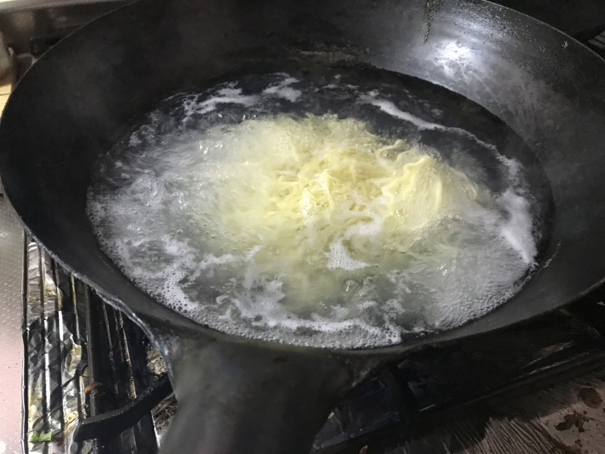

また辛いラーメンが送られてきました。炎麻湯麵？……東京の炎麻堂という中華屋さんのラーメンだそうですが……なんか嫌な予感しかしないなぁ。

<iframe src="https://hatenablog-parts.com/embed?url=http%3A%2F%2Fwww.enma-do.com%2F" title="本格麻婆豆腐店 炎麻堂(東京・赤坂・神田・三軒茶屋)" class="embed-card embed-webcard" scrolling="no" frameborder="0" style="display: block; width: 100%; height: 155px; max-width: 500px; margin: 10px 0px;"></iframe><cite class="hatena-citation"><a href="http://www.enma-do.com/">www.enma-do.com</a></cite>

ちなみに、薄い段ボールの中に麺と味噌が4セットはいっていました。食費が浮くのはありがたいけど……。

早速、麺をゆでてみました。最近はなんでも中華鍋でやるのが好きで、麺をゆでるのもたいていは中華鍋でやってます。麺が鍋のふちに引っ付いて焦げないようにするのがちと面倒ですが、寸胴を使うよりお水の量が節約できる感じ。

袋の味噌を、ぜんぶドンブリに絞り出してみました。邪悪な赤ですね。これは辛そう……具があれば絡みも多少和らぐかと思い、麺をゆでる鍋にキャベツやナス、くまもんウィンナーの薄切りなどを投入します。ダメになりかけのニラも最後の方に投入。ネギもたっぷり、ついでにノリも足してみました。

ドンブリが小さすぎたのか、具が多すぎたのか。少し失敗してしまい、なんだかスープの少ない、油そばのようなスタイルに……。

しょうがないので、具を食ってはお湯で割り、麺を食ってはお湯で割り、というスタイルで少しずつ食べ進めます。本当は感想の一つも書きたいのですが、ただひたすら辛く、ほっぺがビリビリして、挙句の果てには頭が痛くなる。遅々として食が進まないので、麺が伸び、具が膨れ、なかなかドンブリの中身が減りません。辛い……からいじゃなくて、つらい……。

敗因は味噌を全部入れたことですね……好みに応じて調整すればよかったのですが、チャレンジ精神が旺盛すぎて、つい全部ぶち込んでしまいました。

それでも根性でスープまで飲み切りました。胃袋を突き刺す辛さが、スープの居場所を強烈に主張している。あとはベッドで丸くなったり、便座に腰かけてうんうんうなったりするうちに、仕事で疲れていたこともあり、次第に気が遠くなっていきます。途中、電話で叩き起こされたのですが、その後のことは覚えていません。

<blockquote class="twitter-tweet" data-lang="ja">
リアルに <a href="https://twitter.com/daruyanagi?ref_src=twsrc%5Etfw">@daruyanagi</a> が逝ったかと思ったから電話して生存確認をした
&mdash; しばやん (@shibayan) <a href="https://twitter.com/shibayan/status/1022052050077503488?ref_src=twsrc%5Etfw">2018年7月25日</a></blockquote>

翌朝――といってもまだ夜中ですが――は、産卵するウミガメのような眼をしながら便所にこもり、火の玉のようなウンチを排出。肛門が焼けるようでしたが、どうやらそれでカラダの危機は去ったようです。あぁ、生きてるって素晴らしい。その日はなんと12時間も仕事ができました。なんか40度越えの猛暑に耐えたあとだと、33度程度は涼しく感じるじゃない？　あの辛さを絶えたあとだと、12時間労働なんて屁でもないですよ。むしろカローシしてしまえば、この苦しみから解脱できる……なんて思ったり思わなかったり。きっと、辛さで脳みそがやられたんですね。

あぁ……あと3つセットも残っているんだけど、これ、どうしよう。とりあえず次からは味噌を半分ぐらいにして食べようと思います。

