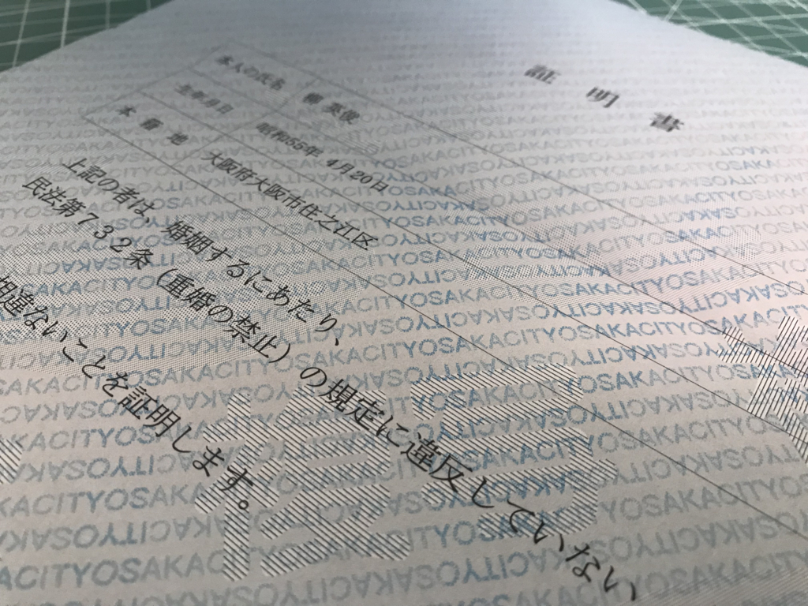
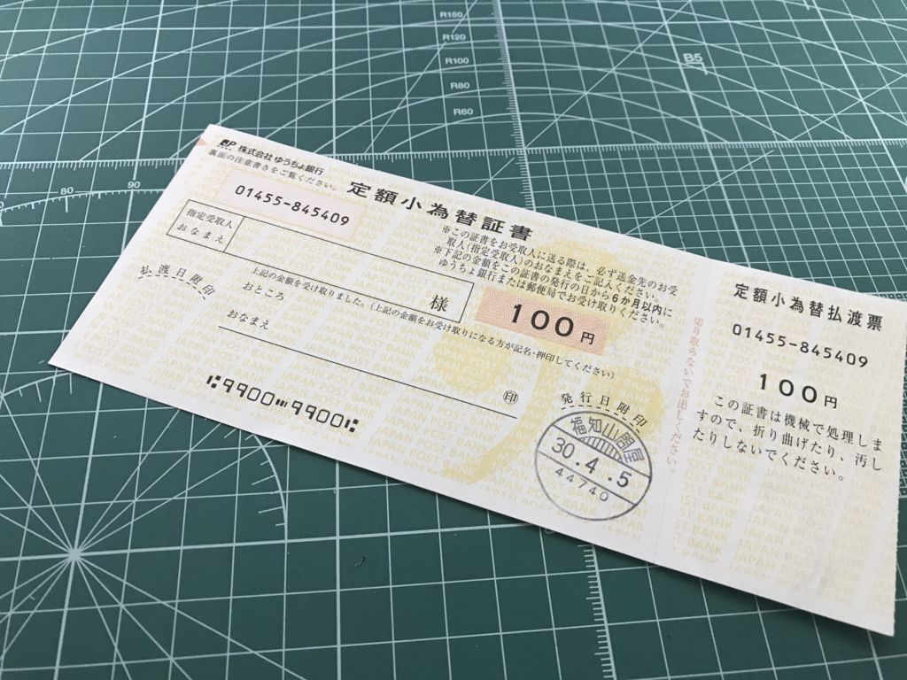
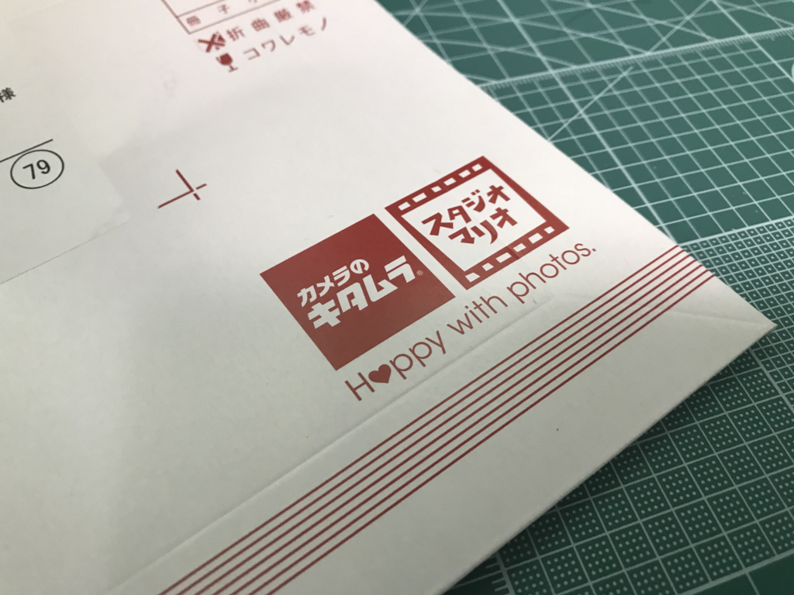

大阪市役所から<b>独身証明書</b>が届きました――そんな証明書がこの世に存在したんやな、わいは今まで知らんかったで。結婚しても民法第732条（重婚の禁止）に抵触しない独身であることが証明されて、とっても嬉しいです（震え声

<blockquote>

（重婚の禁止） 
第732条　配偶者のある者は、重ねて婚姻をすることができない。

</blockquote>

この独身証明書ってのは、要するに戸籍抄本から余計な情報を抜いたモノみたいな扱い（？）みたいで、<b>発行は本籍地にお願いしないといけない</b>。ウチの場合は大阪市住之江区なんだけど、郵送でお願いするときは、市の郵送事務処理センター（〒530-8346 大阪市北区中之島1-3-20 大阪市役所内）というところに

<ul>
<li><a href="http://www.city.osaka.lg.jp/shimin/page/0000369852.html#11-3">戸籍全部事項証明書（戸籍謄本）等交付請求書（郵送請求用）</a></li>
<li>定額小為替（こがわせ）証書：350円（郵便局で買える。なにも書かずに送っていい）</li>
<li>返信用封筒（定型なら82円切手を貼る）</li>
</ul>
一式を送る。戸籍抄本の場合は小為替を 450円 にするだけ。直接取りに行くときは区役所に行くんだけど、郵送は市役所で受け付けるらしい。知らなかった。

実は今回、生みの親の名前を忘れていたので戸籍抄本の方をもらおうかなぁ<a href="#f-41a34447" name="fn-41a34447" title="ぶっちゃけていうと、親父が海外の方とお作りになったのが僕で、今の母親は継母。実の母親の名前は……覚えにくいのと、あんまり興味がなかったこともあって、実はよく知らない……けど、戸籍にはちゃんと書いてある。これは中学の頃、パスポートをもらうために戸籍抄本をもらったときに確認した。ってことは、自分はハーフなのか？　一応">*1</a>、と思って書類を整えて送ったのだけど、取得理由に「独身の証明のため」と書いておいたら市役所から電話があり、<i>「独身証明書ってのがあるんですよ、こっちの方がお勧め」</i>って言われた。いつもは事務的なのに、こういうときは親切なのな……いや、気を使ってくれるのはありがたいんだが、いちいち理由を説明して<i>「いやぁ、抄本でいいんスよ……」</i>と言うのもめんどくさい。そんなわけで今、独身証明書と<b>100円の小為替</b>（お釣り）を手にしているわけ――わざわざ郵便局で換金しろってか！！　めんどくさいし、仏壇にでも供えておこうかと思う。

――それはともかく。これで、書類は整った。めんどくさがりで、いろいろ後回しにしてしまっていたおかげで、いつのまにか1カ月近くかかってしまったけど……すごく頑張ったと思う。

ほかにも、自分の写真を二枚用意しろというので、生まれて初めての自撮りもやって<a href="#f-500384ba" name="fn-500384ba" title="1枚は @ramusara さんに和服姿を撮ってもらった！　ありがと">*2</a>、キタムラのオンラインプリントで写真を焼いてもらった（データではダメなんだってさ！）。ぜんぶオンラインで設定できて、できあがりはポストに投函される……初めて使ったけど、めっちゃ便利で結構気に入った。ただ、5枚以上頼まないと「ゆうメール」で送ってくれなかったので、適当に甥っ子と姪っ子の写真も焼いちゃった。これはどこかに飾っておくかねぇ。

あとはこれを結婚支援センターに提出すればいいんだが……なんか最近暑いし、めんどくさいな。夏が終わって、ちょっと涼しくなってからでもいいんじゃないかって思い始めてる。

<a href="#fn-41a34447" name="f-41a34447" class="footnote-number">*1</a>:ぶっちゃけていうと、親父が海外の方とお作りになったのが僕で、今の母親は継母。実の母親の名前は……覚えにくいのと、あんまり興味がなかったこともあって、実はよく知らない……けど、戸籍にはちゃんと書いてある。これは中学の頃、パスポートをもらうために戸籍抄本をもらったときに確認した。ってことは、自分はハーフなのか？　一応

<a href="#fn-500384ba" name="f-500384ba" class="footnote-number">*2</a>:1枚は @ramusara さんに和服姿を撮ってもらった！　ありがと

