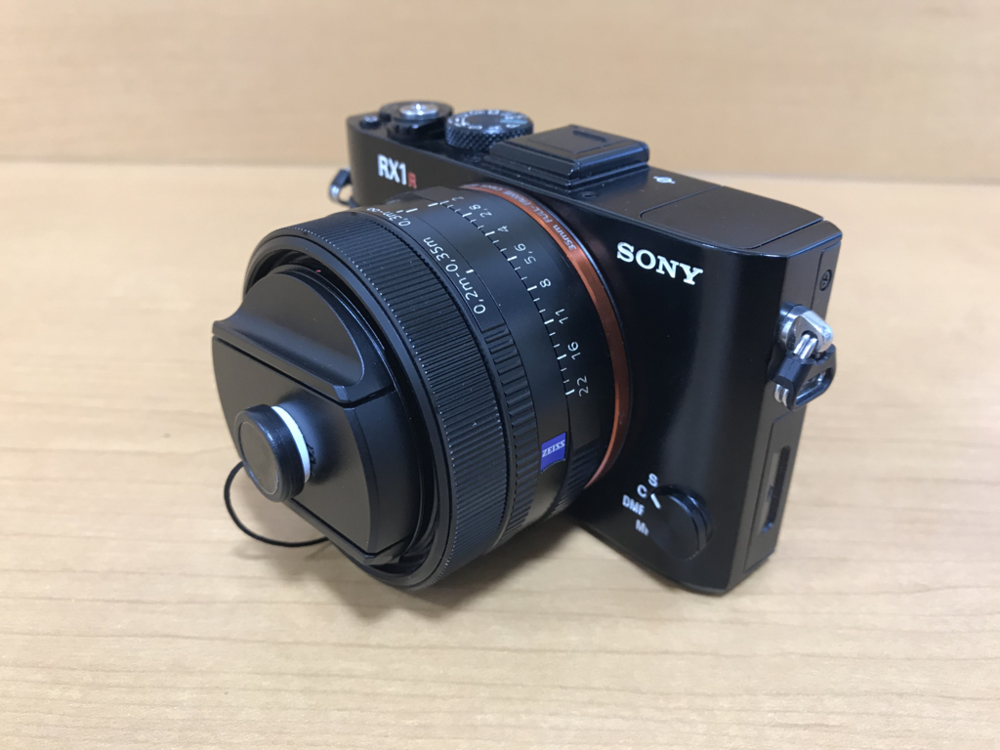

これが……

こうじゃ！　一応 25万円 ぐらいするから、落として壊したりしたら困る。それなりに投資して、不測の事態が起こらないように予防しないと。

<h3>ストラップ</h3>

<a href="http://www.amazon.co.jp/exec/obidos/ASIN/B00ON9KD06/bestylesnet-22/">6号帆布 ハンドストラップ (ブラック×ナチュラル)　一眼レフ用（取り付け部：幅10mm）</a>
<ul><li>出版社/メーカー: 203 Camera Straps.</li><li>メディア: エレクトロニクス</li><li><a href="http://d.hatena.ne.jp/asin/B00ON9KD06/bestylesnet-22" target="_blank">この商品を含むブログを見る</a></li></ul>

持ち運ぶときはポーチに入れるので、カメラに着けるストラップは短く、手にちゃんと絡むハンドストラップが好み。ちなみに、ポーチはだいぶ昔（まだ東京にいる頃だから、5年以上）に買ったナショジオのやつを愛用してる。

<a href="http://www.amazon.co.jp/exec/obidos/ASIN/B0060FNSLW/bestylesnet-22/">NATIONAL GEOGRAPHIC ショルダーバッグ Earth Exploreコレクション 1.3L 撥水加工 グリーン(カーキキャンバス) NG 2342</a>
<ul><li>出版社/メーカー: ナショナルジオグラフィック</li><li>発売日: 2011/10/17</li><li>メディア: 付属品</li><li><a href="http://d.hatena.ne.jp/asin/B0060FNSLW/bestylesnet-22" target="_blank">この商品を含むブログを見る</a></li></ul>

RX1RM2 にもまぁまぁ、フィットする。

<h3>グリップ</h3>

ぶっちゃけ RX1RM2 はホールドしにくいのでグリップも買った。

<a href="http://www.amazon.co.jp/exec/obidos/ASIN/B01JJHE4AG/bestylesnet-22/">Fotodiox Pro All Metal Black Camera Hand Grip for Sony RX1 DSC-RX1 & RX1R Cyber-Shot Cameras w/ Battery Access [並行輸入品]</a>
<ul><li>出版社/メーカー: Fotodiox</li><li>メディア: エレクトロニクス</li><li><a href="http://d.hatena.ne.jp/asin/B01JJHE4AG/bestylesnet-22" target="_blank">この商品を含むブログを見る</a></li></ul>

今回のドレスアップでは一番カネがかかった（7,500円）けど、がっちり掴めるようになって結構満足。

厳密にいうと RM2 向けじゃないせいか、若干隙間があるのが気になるけど……底面のバッテリー＆メモリーカードへのアクセスは良好だし、割といいと思う。

<h3>フード</h3>

<a href="http://www.amazon.co.jp/exec/obidos/ASIN/B00ASHXWD2/bestylesnet-22/">【F-Foto】 クラシックメタルレンズフード　ブラック 49mm 各社対応ライカ風メタルフード</a>
<ul><li>出版社/メーカー: F-Foto(F-Foto)</li><li>メディア: Camera</li><li> クリック: 1回</li><li><a href="http://d.hatena.ne.jp/asin/B00ASHXWD2/bestylesnet-22" target="_blank">この商品を含むブログを見る</a></li></ul>

純正のは1万円以上したと思うが、さすがにそんなの買えない。グリップにお金使っちゃって貧乏なのもあり、サードパーティー製品で我慢した。値段は 1/10 だけど、ちゃんと金属製で防御力高そう。スタイルも純正とほぼ同じ感じなのかな、違和感ない。こうしたタイプのフードにロマンを感じる人種ではないのだけど、これは買ってよかったと思う。

今回はどれもあたりだったけど、費用対効果的には

ハンドストラップ＋フード → グリップ

という順番で買うべきかな。グリップは最悪なくても……でもストラップとフードは絶対あった方がいいと思う。

<h3>おまけ</h3>

<a href="http://www.amazon.co.jp/exec/obidos/ASIN/B00NW5WAUI/bestylesnet-22/">【エーポケ】SONY NP-BX1 対応USB充電器デジカメ　ﾊﾞｯﾃﾘｰチャージャーDSC-RX100</a>
<ul><li>出版社/メーカー: FUJIYAMA</li><li>メディア: Camera</li><li><a href="http://d.hatena.ne.jp/asin/B00NW5WAUI/bestylesnet-22" target="_blank">この商品を含むブログを見る</a></li></ul>

ビックリするほどバッテリーが持たないので、予備は必須だと思った。自分はキタムラでバッテリーを買ったが、Amazon だと互換品も含め、安いのがいっぱいで回ってる。自分はチャージャーだけを足しておいた。グリップで USB ポートがふさがるので、チャージャーは必須だ。

