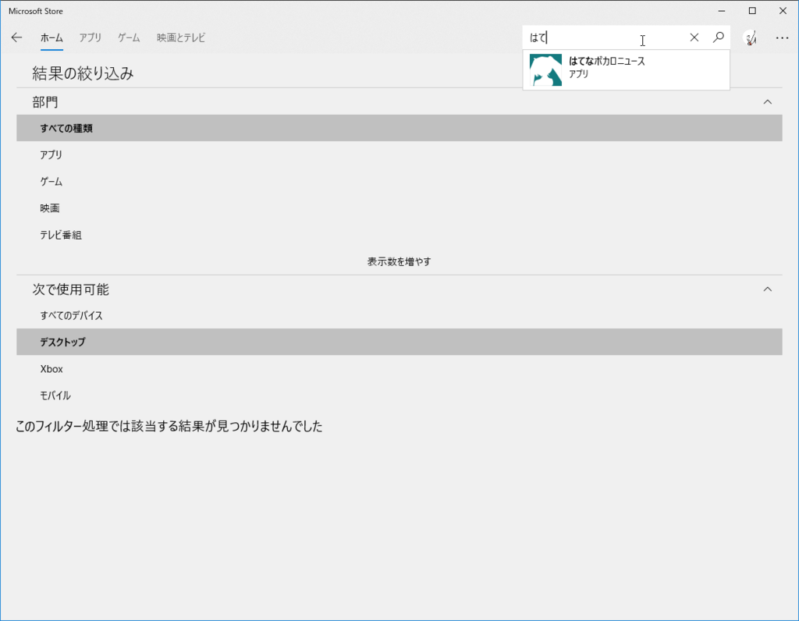
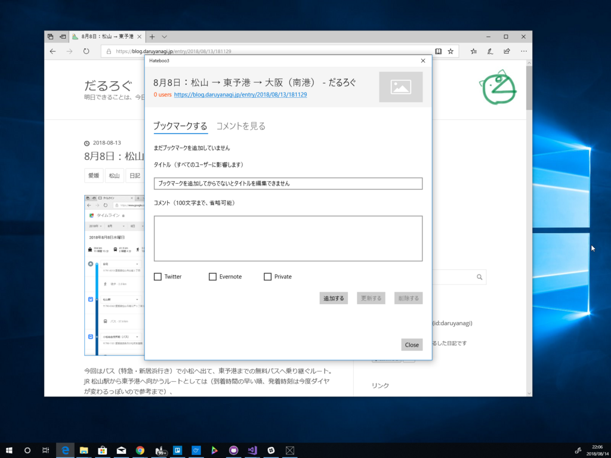

13日は、昼前に目が覚めた。盆の旅行の疲れもようやく癒えたので、今日は OS のクリーンアップでもするかと思いたつ。Windows Update をのぞいてみるとファームウェアのアップデートが降ってきている。そのままクリーンアップするのも少しキモチ悪いので、これだけ適用してからユーザーデータを消去するかなーなどと思い、プチっと［更新して再起動］メニューをクリックすると――

<blockquote class="twitter-tweet" data-lang="ja">
Surface Book 2 のファームウェアをアップデートしたらこれですわ <a href="https://t.co/zvebXFP1xp">pic.twitter.com/zvebXFP1xp</a>
&mdash; だるやなぎ准将 (@daruyanagi) <a href="https://twitter.com/daruyanagi/status/1028858694027505664?ref_src=twsrc%5Etfw">2018年8月13日</a></blockquote>

BitLocker の回復キーを探すのにあたふた……ほんと、勘弁してほしい。こういうのにこそ QR コードとかつけて、キーをサクッと探せるようにしてほしいのだけど……それはそれでいろいろセキュリティ的にやばいのかな。よくわからん。

結局、その日は OS の復旧や環境構築で終わってしまった。まぁ、スーツケースを解いて、下着やら作務衣やら長襦袢を洗濯できたから、それなりの達成感はあったけど……ほぼ何もしなかった。

それはともかく、愛用しているストアアプリ版「はてなブックマーク」が検索しても出てこない。サポート終了ってのは聞いていたけれど、インストールできないのは少々困る。

<iframe src="https://hatenablog-parts.com/embed?url=https%3A%2F%2Fforest.watch.impress.co.jp%2Fdocs%2Fnews%2F1132115.html" title="Windows ストアアプリ/Chrome アプリ版「はてなブックマーク」アプリのサポートが終了／利用者が少なかったため、今後はスマートフォン版とWeb版の改善に注力" class="embed-card embed-webcard" scrolling="no" frameborder="0" style="display: block; width: 100%; height: 155px; max-width: 500px; margin: 10px 0px;"></iframe><cite class="hatena-citation"><a href="https://forest.watch.impress.co.jp/docs/news/1132115.html">forest.watch.impress.co.jp</a></cite>

直接リンクはまだ生きていてなんとかセットアップはできたけれど、いつなくなるか知れたもんじゃないなぁ。

<iframe src="https://hatenablog-parts.com/embed?url=https%3A%2F%2Fwww.microsoft.com%2Fja-jp%2Fp%2F%25E3%2581%25AF%25E3%2581%25A6%25E3%2581%25AA%25E3%2583%2596%25E3%2583%2583%25E3%2582%25AF%25E3%2583%259E%25E3%2583%25BC%25E3%2582%25AF%2F9wzdncrdr0zh" title="はてなブックマーク を購入 - Microsoft Store ja-JP" class="embed-card embed-webcard" scrolling="no" frameborder="0" style="display: block; width: 100%; height: 155px; max-width: 500px; margin: 10px 0px;"></iframe><cite class="hatena-citation"><a href="https://www.microsoft.com/ja-jp/p/%E3%81%AF%E3%81%A6%E3%81%AA%E3%83%96%E3%83%83%E3%82%AF%E3%83%9E%E3%83%BC%E3%82%AF/9wzdncrdr0zh">www.microsoft.com</a></cite>

ってわけで、14日は以前作っていたアプリを掘り起こした。今は亡き Windows 10 Mobile 向けに作られていた上、ソースコードの見通しが悪かったので、一から作り直し。とりあえず1日でブックマークの閲覧、追加・編集・削除まではできるようになった。

もう飽きつつあるけど、週末の大三島もくもくで完成させられたらいいなーっと思ってる。

<h3>追伸</h3>

<iframe src="https://hatenablog-parts.com/embed?url=https%3A%2F%2Fblog.daruyanagi.jp%2Fentry%2F2017%2F07%2F03%2F001442" title="［共有］機能で「はてブ」を見るアプリ「Hateboo」を作ってみました。 - だるろぐ" class="embed-card embed-blogcard" scrolling="no" frameborder="0" style="display: block; width: 100%; height: 190px; max-width: 500px; margin: 10px 0px;"></iframe><cite class="hatena-citation"><a href="https://blog.daruyanagi.jp/entry/2017/07/03/001442">blog.daruyanagi.jp</a></cite>

あれ……このアプリってもう公開してたんだっけ……完全に忘れてた。しかもちゃんと動くし？　ヤバい、痴呆が入ってる……

