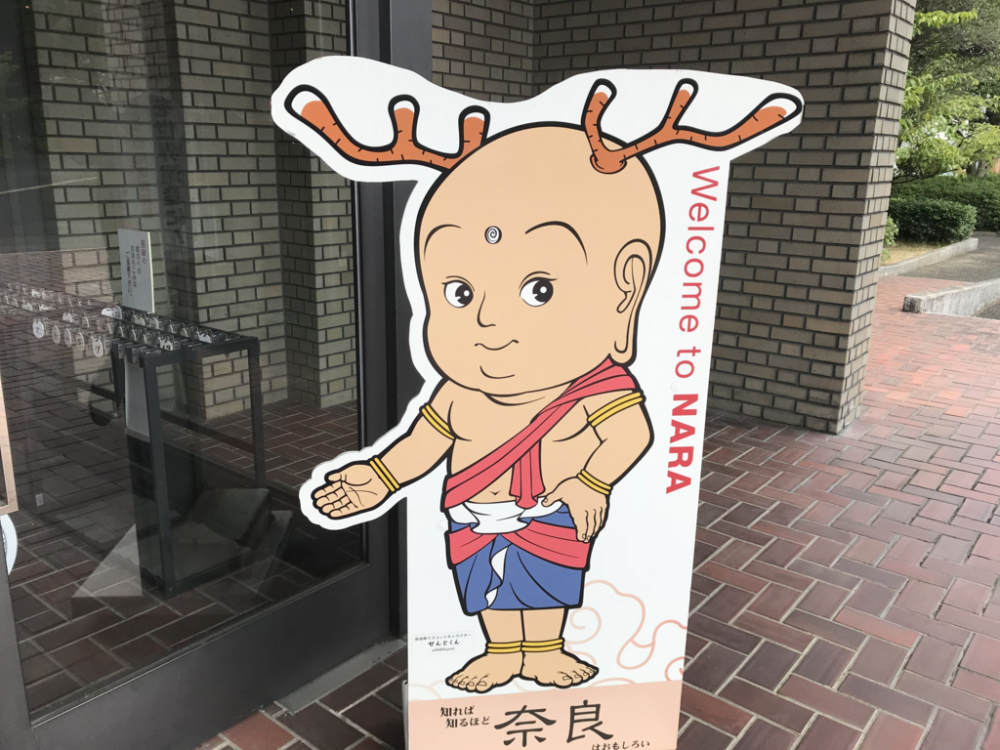
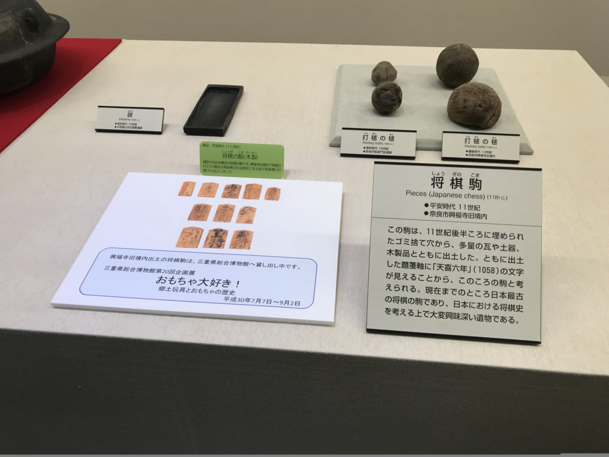
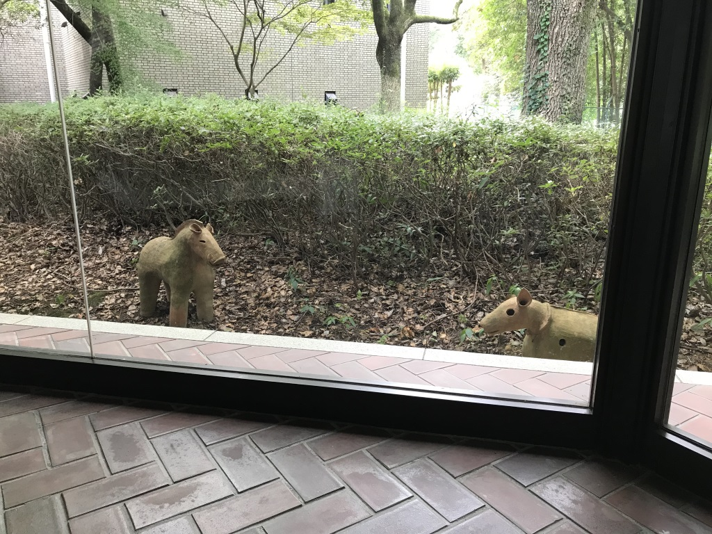
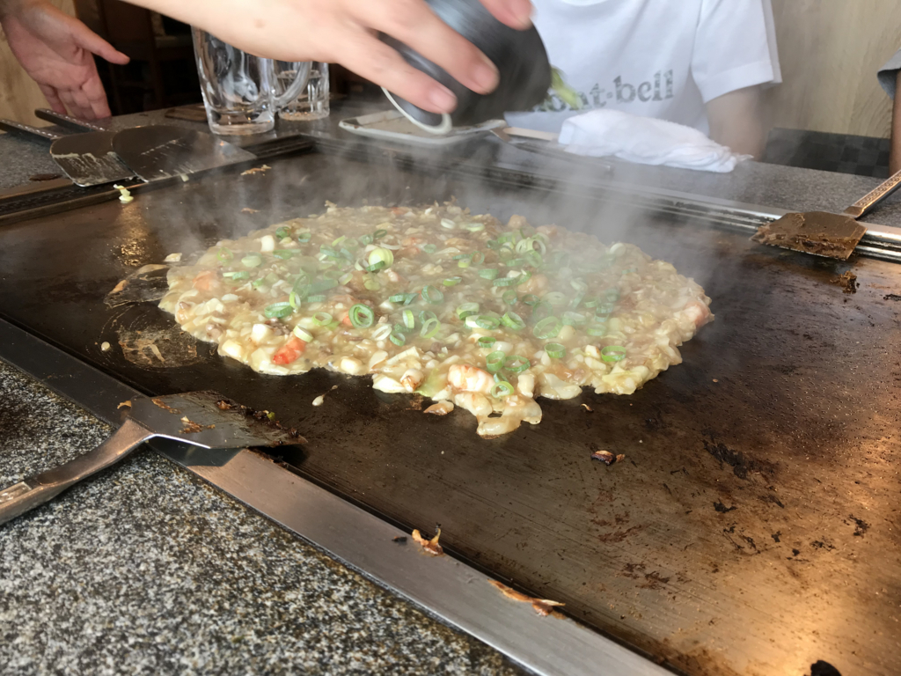
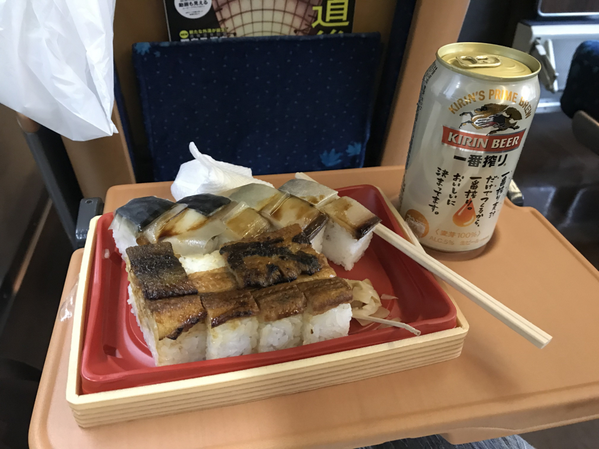

奈良・桜井の宿をでて、愛媛・松山へ帰る。途中、友人と少しあちこち寄った。

<h3>橿原考古学研究所付属博物館</h3>

まずは、橿原の古学研究所付属博物館へ。中学生か、高校生の頃以来かな？　ちょっと懐かしいかも。学校が奈良だったせいもあって、昔はこういうのが好きで、本当は歴史学者になれたらいいなぁ、なんて思ってたのだけど、まぁ、周囲の期待とか将来食っていけるかとか、そういうのに簡単に流されちゃうぐらいの弱い希望だったわけで。大学に進んでからは、奈良のこういうところを見手回ることも絶えてなくなった。飛鳥で自転車借りて回って、鬼の雪隠の上で弁当食べたのとか懐かしい。

ここは基本的に古墳時代から奈良時代までの展示が主だけど、それ以外のもちょくちょくある。

日本最古の将棋の駒って、ここ収蔵だっけ？　でも、残念ながら貸し出し中で見られなかった。

あと、ここではときどき野生の埴輪をみることができる。展示に飽きたら、探してみるといいと思うよ。

ちなみに、おみやげは「古墳タオル」にしました。暑い日だったので、その日から大活躍。肌触りもよくて、古墳時代のぬくもりを感じる。

<h3>まん房</h3>

お昼ご飯は、新ノ口の「まん房」でお好み焼きを食べた。約一名、お好み焼きの汚いヤツを頼んだヤツがいたけど、それも含めてなかなか美味しかった。お昼だったので、ビールはジョッキ3杯で我慢。

<h3>特急しおかぜ</h3>

その日は午後4時台の関空発 Peach を2万円で予約していたのだけど、ちょうど予讃線の不通区間（観音寺のあたり）が復旧したそうなので、キャンセルして JR で帰った。開通記念だし、奮発してグリーン車だぜ！！

ただ、この日は帰省のラッシュだったみたいで……新幹線は指定席がとれず。1号車から3号車の自由席からあぶれた人が11号車のデッキまで占領していて、「うげぇ……これに乗るのかよ！」って感じだった。

もっとも、数本遅らせると割と空いていた。広島どまりだったからかな？　帰省ラッシュは避けるようにしてるのであまりハマったことはないんだけど、後々の教訓としよう。

岡山からはゆったりグリーン車で、バッテラ弁当とビールをやりました。不通だった区間は……うとうとしてる間に通り過ぎちゃったｗ　ちょっと見てみたかったけど、まぁ、いいや。

